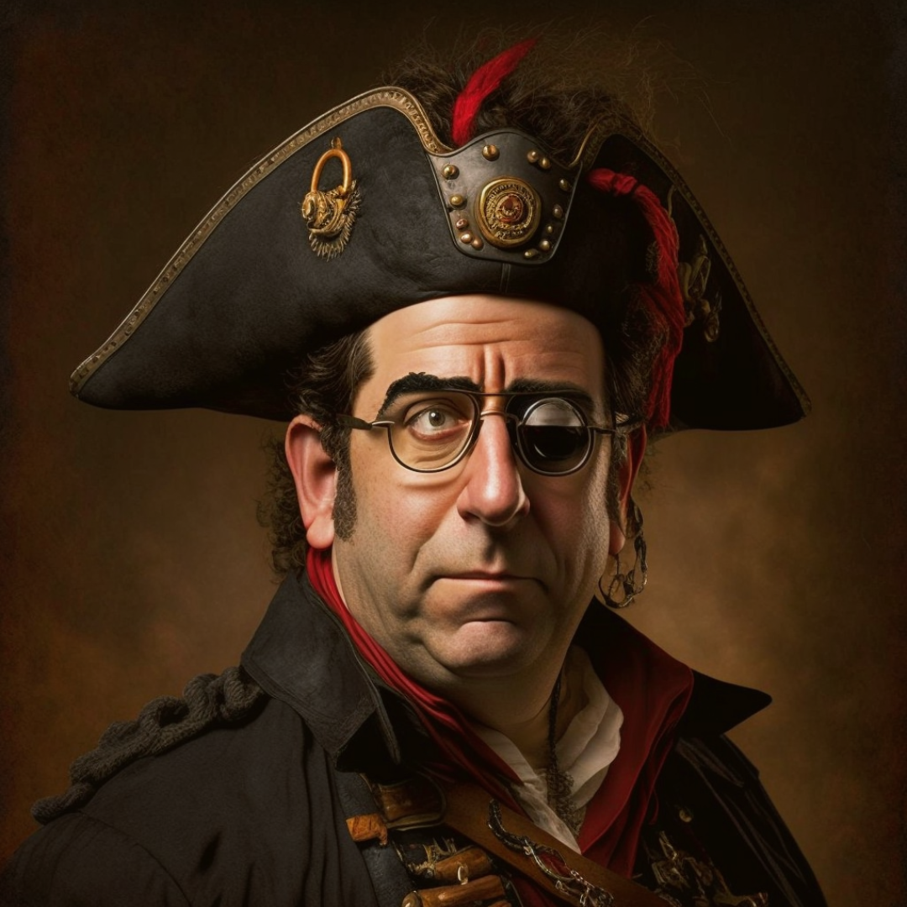

- [Cybersecurity](#cybersecurity)
    - [Kevin Mitnick](#kevin-mitnick)

## **Cybersecurity**

[Awesome Security](https://github.com/sbilly/awesome-security)

Arrr, ye landlubbers might be wonderin' what a cybersecurity analyst does. Let me tell ya, they be the protectors of yer digital treasure, keepin' yer network free from any cyber scallywags and their sneaky tricks. They be analyzin' and keepin' a watchful eye on yer network security, respondin' to any security breaches or attacks, implementin' security measures like firewalls and antivirus software, and workin' with other scallywags such as developers and legal to make sure yer network is shipshape and compliant with all the rules and regulations.

When it comes to network security, there be three types of teams that be playin' important roles in keepin' the ship afloat: blue, purple, and red teams.

The blue team be like the ship's navigator, chartin' the course to keep the ship out of harm's way. They be protectin' the network from any cyber threats and vulnerabilities.

The purple team be like the ship's surgeon, patchin' up any wounds and keepin' an eye out for any potential dangers. They be identifyin' and exploitin' vulnerabilities and reportin' their findings to the captain with recommendations on how to avoid them.

The red team be like the ship's enemy, testin' the ship's defenses and tryin' to sink it. They be simulating the tactics and techniques of a real enemy to test the effectiveness of the ship's security measures and reportin' their findings to the captain with recommendations on how to improve the ship's defenses.

All three teams be playin' important roles in keepin' the ship safe and sailin' smooth. So, hoist the anchor and set sail on the digital seas with a crew of cybersecurity scallywags by yer side!

A penetration tester be the scallywag that be responsible for findin' and exploitin' vulnerabilities in yer network. They be like treasure hunters, searchin' for any weak spots in yer digital defenses and takin' advantage of them to gain unauthorized access to yer sensitive information or systems. They be reportin' their findings to the captain and givin' recommendations on how to prevent similar attacks from happenin' in the future. They also be workin' closely with other scallywags such as developers and legal to ensure yer network is shipshape and compliant with all the rules and regulations.

But watch out for those sneaky phishermen, tryin' to trick ye into givin' up yer treasure with fake emails and malicious links. And don't be fallin' for any social engineering tricks, where scallywags use their charm and deception to steal yer sensitive information.

And remember the infamous Kevin Mitnick, a notorious hacker who was once one of the most wanted scallywags in the world. He be now a cybersecurity consultant and public speaker, and ye can even watch his story in the movie "Takedown".

In the realm of network security, there be three key roles that be playin' important roles in keepin' the ship afloat: security architecture, security compliance, and security engineering.

The security architect be like the ship's designer, creatin' and maintainin' the overall security of the network.

The security compliance analyst be like the ship's lawyer, ensurin' the network is compliant with all the rules and regulations.

The security engineer be like the ship's mechanic, implementin' and maintainin' the security controls of the network.

All three roles be playin' important roles in keepin' the ship safe and sailin' smooth. So, hoist the anchor and set sail on the digital seas with a crew of cybersecurity scallywags by yer side!

### **Kevin Mitnick**

Aye, Kevin Mitnick be a legendary figure in the world of cybersecurity. He was once known as one of the most notorious hackers, but after servin' time in prison, he turned his life around and now uses his skills and knowledge to help companies and organizations protect themselves from cyber threats. As a cybersecurity consultant and public speaker, he be sharin' his expertise and helpin' others to better understand the dangers of the digital world and how to defend against them.

A pirate might look up to Kevin Mitnick because of his reputation as a skilled and successful hacker. Just like how a pirate is known to be a skilled and successful looter in the sea, Mitnick's reputation as a successful hacker could be seen as admirable by someone who values those traits. Additionally, Mitnick's story of being a notorious hacker, serving time in prison, and then turning his life around to become a respected cybersecurity expert could also be seen as an inspiration for someone looking to change their ways.

**What exactly did Kevin Mitnick do?**

Aye, aye captain! Let me give ye all the juicy details about the infamous Kevin Mitnick and his wild journey through the digital seas.

It all began back in the early days of the internet, when Mitnick was just a young scallywag with a love for all things computer-related. He started off small, breakin' into the computer systems of local businesses and schools, but he quickly moved on to bigger and more valuable targets.

Mitnick be known as a master of "social engineering" - the art of trickin' people into givin' up sensitive information. He be known to use this skills to obtain passwords and other valuable information from unsuspecting victims, and he be always one step ahead of the authorities.

As his infamy grew, Mitnick be takin' on bigger and more powerful targets, causin' mischief and makin' off with valuable information from some of the biggest corporations in the world, including Motorola, Nokia, and even the US government. He be known as the "Black Hat Pirate" of the computer world, and the authorities be hot on his trail.

But just like many a pirate before him, Mitnick's luck eventually ran out and he be caught by the FBI in 1995. He be sentenced to five years in prison and be released in 2000.

But unlike many a pirate, Mitnick decided to change his ways and use his skills for good. After servin' his time, Mitnick rebranded himself as a "White Hat Pirate" and set sail on a new journey as a cybersecurity consultant and public speaker. He be now helping companies and organizations protect their digital treasure from the likes of himself and other cyber scallywags.

He be sharing his tales of adventure and the lessons he learned during his time as a notorious hacker, and he be helpin' others to understand the dangers of the digital seas and how to navigate them safely. He be also working with law enforcement and organizations to help them understand the mind of a hacker and help to prevent cybercrime.

Some may see him as a reformed scallywag, others as a cautionary tale, but one thing's for sure, Mitnick's story be one for the ages and a true testament to the fact that even the most notorious pirate can change their ways and become a valuable member of society. He's a true example that every one of us can learn from.

So, if ye ever find yerself sailin' the digital seas and come across the name Kevin Mitnick, remember that he be a true pirate of the cyber world, and his story be one for the ages.

The movie [Takedown](https://www.imdb.com/title/tt0159784/) is based on the life of Kevin Mitnick.