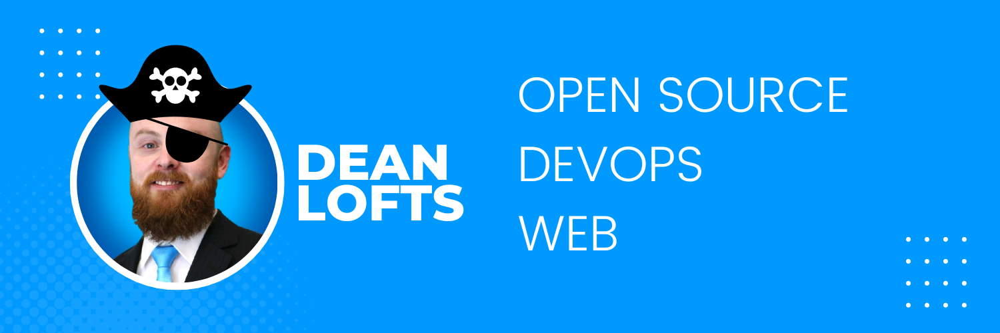

# Linux for Pirates


By [Dean Lofts](https://linkfree.eddiehub.io/loftwah) | [GitHub](https://github.com/loftwah)

<!-- START doctoc generated TOC please keep comment here to allow auto update -->
<!-- DON'T EDIT THIS SECTION, INSTEAD RE-RUN doctoc TO UPDATE -->
**Table of Contents**

- [In memory of Aaron Swartz](#in-memory-of-aaron-swartz)
- [What is Linux?](#what-is-linux)
  - [What is GNU?](#what-is-gnu)
  - [What is open source software?](#what-is-open-source-software)
    - [What are open source licenses?](#what-are-open-source-licenses)
    - [What is the GNU General Public License (GPL)?](#what-is-the-gnu-general-public-license-gpl)
    - [What is the MIT License?](#what-is-the-mit-license)
  - [What is free software?](#what-is-free-software)
    - [Free as in freedom](#free-as-in-freedom)
    - [Free as in beer](#free-as-in-beer)
  - [What is the Linux kernel?](#what-is-the-linux-kernel)
  - [Linus Torvalds](#linus-torvalds)
  - [Richard Stallman](#richard-stallman)
- [Before we begin](#before-we-begin)
- [About the author (This isn't on the test)](#about-the-author-this-isnt-on-the-test)
- [Chapter One - Getting Started](#chapter-one---getting-started)
  - [Ubuntu](#ubuntu)
    - [Kubuntu](#kubuntu)
    - [Arch Linux](#arch-linux)
  - [Setting up Ubuntu](#setting-up-ubuntu)
    - [What to do next?](#what-to-do-next)
      - [Checklist](#checklist)
  - [Where to go from here?](#where-to-go-from-here)
    - [Backend](#backend)
    - [Cloud Computing](#cloud-computing)
    - [Cybersecurity](#cybersecurity)
      - [Kevin Mitnick](#kevin-mitnick)
    - [Data analysis and interpretation](#data-analysis-and-interpretation)
    - [Database](#database)
      - [Graph](#graph)
      - [noSQL](#nosql)
      - [SQL](#sql)
    - [Design](#design)
      - [Figma](#figma)
      - [DaisyUI](#daisyui)
      - [Fluent Design](#fluent-design)
      - [Material Design](#material-design)
    - [Developer Advocacy and Developer Relations](#developer-advocacy-and-developer-relations)
    - [Finance](#finance)
    - [Frontend](#frontend)
    - [Management](#management)
    - [Marketing](#marketing)
    - [Network Engineering](#network-engineering)
    - [Operations](#operations)
    - [Sales](#sales)
    - [Software development and delivery](#software-development-and-delivery)
- [Chapter Two - The Fundamentals](#chapter-two---the-fundamentals)
  - [Handybilly](#handybilly)
  - [Linux filesystem](#linux-filesystem)
    - [Filesystem examples](#filesystem-examples)
    - [Permissions](#permissions)
      - [chmod](#chmod)
      - [chown](#chown)
  - [Networking](#networking)
    - [ip](#ip)
    - [Netcat](#netcat)
    - [nmap](#nmap)
    - [tcpdump](#tcpdump)
    - [Wireshark](#wireshark)
  - [Bash](#bash)
    - [.bashrc](#bashrc)
    - [Bash scripting](#bash-scripting)
    - [Bash history](#bash-history)
    - [Bash one-liners](#bash-one-liners)
  - [chroot](#chroot)
  - [Cron](#cron)
  - [Devices](#devices)
  - [Drivers](#drivers)
  - [Processes](#processes)
  - [cURL](#curl)
  - [Vim (Vi IMproved)](#vim-vi-improved)
    - [.vimrc](#vimrc)
    - [NeoVim](#neovim)
  - [VS Code](#vs-code)
  - [The Internet](#the-internet)
    - [Domain name](#domain-name)
      - [Domain Name Registrar](#domain-name-registrar)
      - [Buying a Domain Name](#buying-a-domain-name)
      - [Namecheap](#namecheap)
    - [IANA (Internet Assigned Numbers Authority)](#iana-internet-assigned-numbers-authority)
    - [ICAAN (Internet Corporation for Assigned Names and Numbers)](#icaan-internet-corporation-for-assigned-names-and-numbers)
    - [Internet Service Provider](#internet-service-provider)
    - [Web Browser](#web-browser)
      - [Document Object Model (DOM)](#document-object-model-dom)
      - [Virtual DOM](#virtual-dom)
      - [How do they work together?](#how-do-they-work-together)
    - [World Wide Web](#world-wide-web)
      - [Sir Tim Berners-Lee](#sir-tim-berners-lee)
    - [Web Server](#web-server)
      - [Apache](#apache)
      - [Nginx](#nginx)
      - [Ad-hoc Web Servers](#ad-hoc-web-servers)
  - [Amazon Web Services](#amazon-web-services)
  - [Cloudflare](#cloudflare)
  - [CI/CD](#cicd)
    - [Continuous Delivery](#continuous-delivery)
    - [Continuous Integration](#continuous-integration)
    - [CI/CD Tools](#cicd-tools)
      - [Argo CD](#argo-cd)
      - [CircleCI](#circleci)
      - [GitHub Actions](#github-actions)
      - [GitLab CI/CD](#gitlab-cicd)
      - [Jenkins](#jenkins)
      - [Portainer](#portainer)
      - [Travis CI](#travis-ci)
  - [DigitalOcean](#digitalocean)
  - [eBPF](#ebpf)
  - [DNS (Domain Name System)](#dns-domain-name-system)
    - [Types of DNS Records](#types-of-dns-records)
    - [Examples of DNS Records](#examples-of-dns-records)
    - [DNS servers](#dns-servers)
    - [DNSSEC](#dnssec)
    - [DNS over HTTPS (DoH)](#dns-over-https-doh)
    - [DNS over TLS (DoT)](#dns-over-tls-dot)
    - [DNS over QUIC (DoQ)](#dns-over-quic-doq)
    - [DNSCrypt](#dnscrypt)
    - [DNS Amplification Attacks](#dns-amplification-attacks)
    - [Hosts file](#hosts-file)
    - [AWS Route 53](#aws-route-53)
    - [Azure DNS](#azure-dns)
    - [Google Cloud DNS](#google-cloud-dns)
    - [DigitalOcean DNS](#digitalocean-dns)
    - [Cloudflare DNS](#cloudflare-dns)
    - [OpenDNS](#opendns)
    - [Bind](#bind)
  - [Docker](#docker)
    - [Install Docker](#install-docker)
      - [Docker Engine](#docker-engine)
    - [Docker Compose](#docker-compose)
      - [Install Docker Compose](#install-docker-compose)
    - [Docker Swarm](#docker-swarm)
  - [Git](#git)
    - [GitHub](#github)
      - [GitHub sounds a litttle overwhelming. What be the basics?](#github-sounds-a-litttle-overwhelming-what-be-the-basics)
    - [GitLab](#gitlab)
    - [Gitea](#gitea)
    - [Getting Started with Git and GitHub](#getting-started-with-git-and-github)
      - [What if I get stuck?](#what-if-i-get-stuck)
      - [Get involved in open-source projects](#get-involved-in-open-source-projects)
      - [Eddie Jaoude](#eddie-jaoude)
      - [EddieHub and LinkFree](#eddiehub-and-linkfree)
  - [Homebrew](#homebrew)
  - [HTML](#html)
    - [Meta tags](#meta-tags)
    - [Is HTML a programming language?](#is-html-a-programming-language)
    - [CSS](#css)
  - [HTTP](#http)
    - [HTTP error codes](#http-error-codes)
    - [HTTP methods](#http-methods)
    - [HTTP headers](#http-headers)
    - [HTTPS](#https)
    - [API (Application Programming Interface)](#api-application-programming-interface)
      - [GraphQL (Graph Query Language)](#graphql-graph-query-language)
      - [REST (Representational State Transfer)](#rest-representational-state-transfer)
      - [SOAP (Simple Object Access Protocol)](#soap-simple-object-access-protocol)
  - [JSON (JavaScript Object Notation)](#json-javascript-object-notation)
  - [ICMP (Internet Control Message Protocol)](#icmp-internet-control-message-protocol)
  - [Infrastructure as Code](#infrastructure-as-code)
    - [Ansible](#ansible)
      - [Install Ansible](#install-ansible)
      - [Jeff Geerling](#jeff-geerling)
      - [Jeff Geerling's Ansible for DevOps](#jeff-geerlings-ansible-for-devops)
      - [Ansible Galaxy](#ansible-galaxy)
      - [Ansible Tower](#ansible-tower)
      - [Ansible Vault](#ansible-vault)
      - [Ansible Molecule](#ansible-molecule)
      - [Ansible Container](#ansible-container)
      - [Ansible Network Automation](#ansible-network-automation)
      - [Ansible Cloud Automation](#ansible-cloud-automation)
      - [Ansible Container Orchestration](#ansible-container-orchestration)
      - [Ansible Service Broker](#ansible-service-broker)
    - [Terraform](#terraform)
      - [Install Terraform](#install-terraform)
      - [Terraform Cloud Development Kit (CDK)](#terraform-cloud-development-kit-cdk)
  - [IP Addresses](#ip-addresses)
    - [What is an IP made up of?](#what-is-an-ip-made-up-of)
  - [JavaScript](#javascript)
  - [Kubernetes](#kubernetes)
  - [Latency](#latency)
  - [Logging](#logging)
    - [Logrotate](#logrotate)
  - [Monitoring](#monitoring)
  - [OSI model](#osi-model)
  - [SSH](#ssh)
    - [SSH Agent](#ssh-agent)
    - [SSH Confguration](#ssh-confguration)
    - [SSH Keys](#ssh-keys)
      - [How to generate SSH keys](#how-to-generate-ssh-keys)
    - [SSH Port Forwarding](#ssh-port-forwarding)
  - [SSL/TLS](#ssltls)
    - [SSL Certificates](#ssl-certificates)
      - [Self-signed SSL Certificates](#self-signed-ssl-certificates)
    - [Let's Encrypt](#lets-encrypt)
    - [Certificate Authorities](#certificate-authorities)
    - [CAA Records](#caa-records)
    - [OCSP Stapling](#ocsp-stapling)
    - [OCSP Must-Staple](#ocsp-must-staple)
  - [Streaming](#streaming)
  - [Subnet](#subnet)
    - [Subnet mask](#subnet-mask)
    - [How to calculate a subnet mask](#how-to-calculate-a-subnet-mask)
    - [Subnetting Cheatsheet](#subnetting-cheatsheet)
      - [Subnet Mask](#subnet-mask-1)
      - [CIDR Notation](#cidr-notation)
      - [Subnetting a Network](#subnetting-a-network)
      - [Subnetting Examples](#subnetting-examples)
      - [Subnetting Practice](#subnetting-practice)
  - [TCP/IP](#tcpip)
  - [UDP](#udp)
  - [YAML (Yet Another Markup Language)](#yaml-yet-another-markup-language)
  - [Zsh](#zsh)
    - [Oh My Zsh](#oh-my-zsh)
- [Chapter Three: Your first day as a pirate](#chapter-three-your-first-day-as-a-pirate)
  - [Common problems](#common-problems)
  - [Initiation](#initiation)
    - [Question 1: Arrrrrgh](#question-1-arrrrrgh)
    - [Question 2: The Black Pearl](#question-2-the-black-pearl)
    - [Question 3: The Flying Dutchman](#question-3-the-flying-dutchman)
    - [Question 4: Operation Blackbeard](#question-4-operation-blackbeard)
  - [Is it YAML or YML?](#is-it-yaml-or-yml)
- [GitHub Actions in the wild](#github-actions-in-the-wild)
- [Chapter Four - Desktop Environments and Window Managers](#chapter-four---desktop-environments-and-window-managers)
  - [Desktop Environments](#desktop-environments)
    - [GNOME](#gnome)
    - [KDE](#kde)
    - [Xfce](#xfce)
    - [LXDE](#lxde)
  - [Window Managers](#window-managers)
    - [Openbox](#openbox)
    - [Fluxbox](#fluxbox)
    - [i3](#i3)
  - [Installing a Desktop Environment](#installing-a-desktop-environment)
  - [Configuring a Desktop Environment](#configuring-a-desktop-environment)
  - [Installing a Window Manager](#installing-a-window-manager)
  - [Configuring a Window Manager](#configuring-a-window-manager)
- [Chapter 5: Ruby on Rails and the Seven Seas](#chapter-5-ruby-on-rails-and-the-seven-seas)
- [A stern warning: The dangers of the high seas](#a-stern-warning-the-dangers-of-the-high-seas)
- [Jokes](#jokes)
  - [Check Yer Deployments](#check-yer-deployments)
  - [Late to the Party](#late-to-the-party)
- [Captain's Log](#captains-log)
- [Testemonials](#testemonials)

<!-- END doctoc generated TOC please keep comment here to allow auto update -->

## In memory of Aaron Swartz

[The Internet's Own Boy: The Story of Aaron Swartz](https://www.youtube.com/watch?v=M85UvH0TRPc)

> **Note** This is a **must** watch documentary.


[Aaron Swartz](https://en.wikipedia.org/wiki/Aaron_Swartz) was a computer programmer, entrepreneur, and internet activist who made significant contributions to the development of the internet and the open access movement.

Aaron was born in 1986, and became interested in computers and the internet at a young age. He was a brilliant and talented programmer, and was known for his ability to quickly grasp and master new technologies. He co-authored the RSS 1.0 specification at the age of 14, and went on to work on a variety of other projects, including the development of the Creative Commons license, the building of the first consumer web feed platform, and the creation of the social news site Reddit.


Aaron was also a strong advocate for open access, which is the movement to make knowledge and information freely available to all, rather than being locked behind paywalls and controlled by a few powerful corporations or institutions. He believed that access to knowledge and information was a fundamental right, and that it should be freely available to everyone.

Aaron's work had a major impact on the development of the internet and the open access movement, and he is remembered as a pioneer and a hero by many in the tech community. Tragically, Aaron took his own life in 2013, at the age of 26. His legacy lives on through the work of those who continue to fight for open access and the free flow of information. Arrr!

## What is Linux?

Linux is a free and open-source operating system that was created by Linus Torvalds in 1991. At the time, Linus was a computer science student at the University of Helsinki in Finland, and was interested in creating an operating system that would be more flexible and open than the proprietary operating systems that were available.

Linus began working on Linux as a hobby project, and released the first version of the operating system on the internet in 1991. He made the source code for Linux available to anyone who wanted it, and encouraged other pirates to contribute to the project by writing code and helping to debug and improve the operating system.

Linux is based on the Unix operating system, which was developed in the 1970s and 1980s by a group of pirates at AT&T's Bell Labs. Unix is a powerful and flexible operating system that is widely used by pirates for a variety of purposes, including running servers, developing software, and performing scientific and technical computing.

Linus's goal with Linux was to create an operating system that would be free and open, and that would allow pirates to freely modify and distribute the source code. This was in contrast to proprietary operating systems, such as Microsoft Windows, which were closed and required users to pay for a license.

Linux quickly gained popularity among pirates, and a large community of developers and users began to form around the project. Over time, Linux has evolved into a powerful and widely used operating system, with versions available for a wide variety of devices, including servers, desktop computers, laptops, smartphones, and smart TVs.

Today, Linux is an important part of the open source software movement, and is used by pirates around the world for a variety of purposes, including running servers, developing software, and as a platform for scientific and technical computing. It is known for its stability, security, and flexibility, and is an essential tool in the arsenal of any self-respecting pirate. Arrr!

### What is GNU?

GNU is a free and open-source operating system that was created by Richard Stallman in 1983. At the time, Stallman was a computer science student at the Massachusetts Institute of Technology (MIT), and was interested in creating an operating system that would be more flexible and open than the proprietary operating systems that were available.

Stallman began working on GNU as a hobby project, and released the first version of the operating system in 1983. He made the source code for GNU available to anyone who wanted it, and encouraged other pirates to contribute to the project by writing code and helping to debug and improve the operating system.

GNU is based on the Unix operating system, which was developed in the 1970s and 1980s by a group of pirates at AT&T's Bell Labs. Unix is a powerful and flexible operating system that is widely used by pirates for a variety of purposes, including running servers, developing software, and performing scientific and technical computing.

Stallman's goal with GNU was to create an operating system that would be free and open, and that would allow pirates to freely modify and distribute the source code. This was in contrast to proprietary operating systems, such as Microsoft Windows, which were closed and required users to pay for a license.

GNU quickly gained popularity among pirates, and a large community of developers and users began to form around the project. Over time, GNU has evolved into a powerful and widely used operating system, with versions available for a wide variety of devices, including servers, desktop computers, laptops, smartphones, and smart TVs.

Today, GNU is an important part of the open source software movement, and is used by pirates around the world for a variety of purposes, including running servers, developing software, and as a platform for scientific and technical computing. It is known for its stability, security, and flexibility, and is an essential tool in the arsenal of any self-respecting pirate. Arrr!

### What is open source software?

Open source software is software that is freely available to anyone who wants to use it, modify it, or distribute it. It is a model for software development that encourages collaboration and the sharing of ideas and code.

Open source software is often developed using a model called "open source development", which is a process that encourages collaboration and the sharing of ideas and code. In this model, the source code for the software is made available to the community, and anyone can contribute to the project by writing code, fixing bugs, or improving the software in some way.

#### What are open source licenses?

Open source licenses are legal documents that grant users the right to use, modify, and distribute open source software. They are used to protect the rights of the developers and users of open source software, and to ensure that the software remains free and open.

There are many different open source licenses, and each one has its own set of rules and requirements. The most popular open source licenses are the GNU General Public License (GPL) and the MIT License.

#### What is the GNU General Public License (GPL)?

The GNU General Public License (GPL) is a free and open-source software license that is used by many open source projects. It is a copyleft license, which means that derivative works can only be distributed under the same license terms.

The GPL was originally developed by Richard Stallman in 1989, and was released as open source software under the GNU General Public License. It is one of the most widely used open source licenses, and is used by many popular open source projects, including the Linux kernel, the GNU Compiler Collection (GCC), and the GNU C Library (glibc).

#### What is the MIT License?

The MIT License is a free and open-source software license that is used by many open source projects. It is a permissive license, which means that derivative works can be distributed under any license.

The MIT License was originally developed by the Massachusetts Institute of Technology (MIT) in 1980, and was released as open source software under the MIT License. It is one of the most widely used open source licenses, and is used by many popular open source projects, including the Node.js runtime, the jQuery JavaScript library, and the Angular web framework.

### What is free software?

Free software is software that is freely available to anyone who wants to use it, modify it, or distribute it. It is a model for software development that encourages collaboration and the sharing of ideas and code.

Free software is often developed using a model called "free software development", which is a process that encourages collaboration and the sharing of ideas and code. In this model, the source code for the software is made available to the community, and anyone can contribute to the project by writing code, fixing bugs, or improving the software in some way.

#### Free as in freedom

Free software is often referred to as "free as in freedom", which is a reference to the freedom that is granted to users of free software. Free software is free to use, modify, and distribute, and users are free to use it for any purpose, including commercial purposes.

#### Free as in beer

Free software is often referred to as "free as in beer", which is a reference to the fact that users are not required to pay for a license to use free software. Free software is free to use, modify, and distribute, and users are free to use it for any purpose, including commercial purposes.

### What is the Linux kernel?

The Linux kernel is the core component of the Linux operating system. It is a piece of software that acts as an interface between the hardware and the rest of the operating system, and is responsible for managing the resources of the computer and allocating them to the various applications and processes that are running.

The Linux kernel was originally developed by Linus Torvalds in 1991, and was released as open source software under the GNU General Public License. It is written in the C programming language, and is available for a wide variety of computer architectures, including x86, ARM, and PowerPC.

### Linus Torvalds


Linus Torvalds is the creator of the Linux operating system. He is a computer science student at the University of Helsinki in Finland, and was interested in creating an operating system that would be more flexible and open than the proprietary operating systems that were available.

### Richard Stallman


Richard Stallman is the creator of the GNU operating system. He is a computer science student at the Massachusetts Institute of Technology (MIT), and was interested in creating an operating system that would be more flexible and open than the proprietary operating systems that were available.

## Before we begin

Loftwah stood at the helm of his ship, staring out at the vast expanse of the ocean. He had been a pirate for as long as he could remember, and he loved nothing more than the thrill of the hunt and the rush of adrenaline that came with finding treasure.

But Loftwah was no ordinary pirate. He was a master of technology, using his advanced gadgets and devices to outsmart his enemies and outmaneuver them on the high seas. "Any sufficiently advanced technology is equivalent to magic," he thought to himself, smiling at the thought of all the treasure he had acquired through his clever use of technology.

But even Loftwah knew that technology was not always the answer. He had learned the hard way that "social engineering bypasses all technologies, including firewalls." He had lost more than one treasure to clever pirates who used their charm and charisma to manipulate him and his crew.

Loftwah was not one to accept defeat easily, though. "People said I should accept the world. Bullshit! I don't accept the world," he thought, determined to find a way to outsmart even the most clever of his rivals.

And so he set his sights on the greatest treasure of them all: the fabled Black Pearl, a ship that was said to be filled with unimaginable riches. Loftwah knew that he couldn't do it alone, though. He needed a crew of skilled pirates who were just as determined and clever as he was.

As he searched for the perfect crewmates, Loftwah couldn't help but think about the dangers of relying too much on technology. "The real danger is not that computers will begin to think like men, but that men will begin to think like computers," he thought, knowing that it was important to keep a balance between using technology and using one's own intelligence and creativity.

Finally, Loftwah found the perfect crew. They were a diverse group, each with their own unique skills and talents. Together, they set off on their quest for the Black Pearl, using all of their combined knowledge and expertise to outsmart their enemies and navigate the dangerous waters.

As they sailed closer and closer to their goal, Loftwah couldn't help but feel a sense of excitement and determination. "Patience, persistence and perspiration make an unbeatable combination for success," he thought, knowing that they would stop at nothing to claim the treasure that was rightfully theirs.

And in the end, their hard work paid off. They found the Black Pearl, and it was even more magnificent than they had imagined. "It doesn't matter what you know, what matters is when you know," Loftwah thought as he gazed at the treasure-filled ship, knowing that their knowledge and skills had been key to their success.

As they sailed back home, filled with treasure and stories to tell, Loftwah couldn't help but feel grateful for the diverse and skilled crew that he had assembled. He knew that it was their combined knowledge and creativity that had led them to victory, and he couldn't wait to see what other adventures they would have together in the future.

## About the author (This isn't on the test)



Once upon a time, in the golden age of piracy, there lived a fearless pirate by the name of Dean (Loftwah) Lofts. Loftwah was a notorious buccaneer, known throughout the seven seas for their technical expertise and programming prowess.

Loftwah commanded a fearsome crew of pirates, who sailed the high seas in search of treasure and adventure. They were a motley crew, made up of scallywags, scoundrels, and ne'er-do-wells from every corner of the globe, including the wild and untamed shores of Australia.

Together, Loftwah and their crew roamed the Caribbean, plundering and pillaging their way from island to island. They braved fierce storms and battled fierce foes, always coming out on top thanks to Loftwah's quick wit and sharp sword, as well as their formidable knowledge of Bash, PHP, Python, Ruby, HTML, JavaScript, and other programming languages.

One day, Loftwah and the crew set their sights on a rich Spanish galleon, loaded down with gold and jewels. They crept up on the ship under cover of darkness, and with a mighty roar, they boarded the vessel and took control.

The Spanish crew fought bravely, but they were no match for the fierce pirates led by Loftwah. In the end, Loftwah and their crew emerged victorious, the galleon was theirs for the taking.

As they sailed off into the sunset with their prize, Loftwah raised their fist to the sky and let out a mighty "YARGH!" It was a good day to be a pirate.

So if you ever find yourself sailing the high seas and you see a pirate flag with a Loftwah-shaped skull and crossbones on it, beware! You're in for a wild ride with the fearless Loftwah and their trusty crew. Ahoy, matey!

## Chapter One - Getting Started


Avast ye, landlubbers! Linux be a free and open-source operating system that be runnin' on the Linux kernel, a core component o' the operating system. It be used in a variety o' devices, from desktops to servers to smartphones to embedded systems.

There be many reasons why a scurvy dog might want to set sail with Linux, including:

- **It be free and open-source:** Linux be freely available to all who be wantin' to use it, and the source code be open for all to study, modify, and distribute.

- **It be highly customisable:** Linux allows users to customise almost every aspect o' the operating system, from the desktop environment to the window manager to the system utilities.

- **It be stable and reliable:** Linux be known for its stability and reliability, and it be often used in mission-critical systems where uptime be crucial.

- **It has a large user community:** Linux has a large and active user community, which means there be a wealth o' knowledge and support available online.

- **It be secure:** Linux be generally considered to be more secure than other operating systems, as it be less vulnerable to malware and other security threats.

- **It has a wide range o' software available:** Linux has a huge repository o' free and open-source software available, from office applications to media players to games.

All in all, Linux be a versatile and powerful operating system that be suitable for a wide range o' uses. Whether ye be a greenhorn or an experienced swashbuckler, Linux has something to offer for all.

### Ubuntu

[Awesome Ubuntu](https://github.com/bpearson/Awesome-Ubuntu-Linux)

For this book, we be usin' Ubuntu, a popular Linux distribution that be based on Debian. Ubuntu be a popular choice among pirates, as it be easy to use and comes with a wide range o' pre-installed applications.

Ubuntu be a free and open-source operating system that be based on Debian. It be developed and maintained by Canonical Ltd., a company founded by South African entrepreneur Mark Shuttleworth.

Ubuntu be named after the Southern African philosophy of ubuntu, which be translated as "humanity to others". The philosophy be based on the belief that all humans are equal and that we are all connected to each other.

Ubuntu be released in October 2004, and it be the first Linux distribution to use GNOME as its default desktop environment. It be also the first Linux distribution to use Upstart as its default init system.

Ubuntu be released in three editions: Ubuntu Desktop, Ubuntu Server, and Ubuntu Core. Ubuntu Desktop be a desktop operating system that be suitable for use on desktop computers, laptops, and other devices. Ubuntu Server be a server operating system that be suitable for use on servers and other devices that be runnin' headless. Ubuntu Core be a lightweight version o' Ubuntu that be designed for use on embedded devices.

#### Kubuntu

Kubuntu be a version o' Ubuntu that be based on KDE Plasma. It be developed and maintained by the KDE Community.

Aye, matie! KDE be a free and open-source desktop environment fer Linux and Unix-like operatin' systems. 'Tis known fer its customizable interface and a wide range o' features, such as a file manager, text editor, and multimedia player.

Kubuntu be a version o' the Ubuntu Linux operatin' system that uses the KDE desktop environment. 'Tis a community-supported version o' Ubuntu that be focused on providin' a polished and easy-to-use desktop experience with KDE.

#### Arch Linux

[Awesome Arch](https://github.com/PandaFoss/Awesome-Arch)

Arch Linux be a free and open-source Linux distribution that be based on the Linux kernel. It be developed and maintained by a community o' volunteers, and it be known for its simplicity and flexibility.

Although Arch Linux is worthy o' mention, it be not covered in this book. If ye be interested in learnin' more about Arch Linux, ye be welcome to check out the [Arch Wiki](https://wiki.archlinux.org/).

### Setting up Ubuntu

Ubuntu be available for download from the official website. There be two versions o' Ubuntu available for download: Ubuntu Desktop and Ubuntu Server. The desktop version be suitable for use on desktop computers, laptops, and other devices, while the server version be suitable for use on servers and other devices that be runnin' headless.

Ubuntu be available for download in two formats: a live image and an installation image. The live image be a bootable image that be suitable for tryin' out Ubuntu without installin' it. The installation image be a bootable image that be suitable for installin' Ubuntu on a computer.

To download Ubuntu, visit the [official website](https://ubuntu.com/download/desktop) and click on the "Download" button. Select the version o' Ubuntu that ye be wantin' to download, and then select the format o' the image. Click on the "Download" button to download the image.

Once the image be downloaded, use a tool like [Etcher](https://www.balena.io/etcher/) to create a bootable USB or DVD using the downloaded image. Set yer computer to boot from the bootable USB or DVD by changin' the boot order in the BIOS settings.

Some other tools that be suitable for creatin' bootable USBs and DVDs include [Rufus](https://rufus.ie/), [UNetbootin](https://unetbootin.github.io/), and [YUMI](https://www.pendrivelinux.com/yumi-multiboot-usb-creator/). Ventoy is also a good tool for creatin' bootable USBs and DVDs. It be easy to use and it be also able to boot ISO files. [Ventoy](https://www.ventoy.net/en/index.html) be available for download from the official website.

Once the computer be bootin' from the bootable USB or DVD, follow the on-screen instructions to install Ubuntu. Make sure to allocate enough space for the installation and create a user account.

Once the installation be complete, boot into yer newly installed Ubuntu system.

#### What to do next?

**Captain!** Here be a guide on what ye can do *after* installing Ubuntu:

- Familiarise yerself with the Ubuntu interface and try out the pre-installed applications.

- Learn more about Linux and Ubuntu, ye can refer to the official [documentation](https://help.ubuntu.com/) or take online courses or tutorials. There be also many forums and communities where ye can ask for help and guidance.

**Explore the interface:** Take some time to familiarise yerself with the Ubuntu interface, includin' the desktop, menu, and pre-installed applications.

**Customise the desktop:** Ye can change the desktop background, install new themes, and install new applications to customise yer Ubuntu experience.

**Connect to the internet:** If ye have an internet connection, ye can connect to the internet using the Network Manager applet in the top panel.

**Update the system:** It be a good idea to update yer system to the latest version by runnin' the "Software Updater" application. This will ensure that ye have the latest security updates and bug fixes.

**Learn the command line:** The command line be a powerful way to interact with yer Linux system, and it can be useful to learn some basic commands. Ye can access the command line by openin' a terminal window.

**Install additional software:** Ubuntu comes with a large repository o' free and open-source software, but ye can also install additional software from the internet. Ye can use the "Ubuntu Software" application to search for and install new software.

Overall, the best way to get started with Ubuntu be to explore and try out different features and applications. As ye become more comfortable with the operating system, ye can start learnin' more advanced topics and customizin' yer system to yer likin'.

So hoist the mainsail and set sail for the world o' Linux with Ubuntu!

##### Checklist

- [ ] Familiarise yerself with the Ubuntu interface.
- [ ] Customise the desktop.
- [ ] Connect to the internet.
- [ ] Update the system.
- [ ] Learn the command line.
- [ ] Install additional software.
- [ ] Explore and try out different features and applications.
- [ ] Learn more advanced topics and customise yer system.
- [ ] Explore the official documentation.
- [ ] Take online courses or tutorials.

### Where to go from here?

Aye, matey! If ye be interested in pursuin' a career in the field o' Linux, there be several steps ye can take to get started:

**Gain a solid understanding of the Linux operating system:** To be successful in a Linux-related career, it be important to have a strong understanding of the Linux operating system and its various components, including the kernel, shell, and system libraries. Ye can gain this understanding through online courses, books, or hands-on experience using Linux on yer own computer or in a virtual machine.

**Build up yer skills and knowledge:** There be many different areas in which ye can specialize within the Linux field, such as system administration, network engineering, or software development. To increase yer chances of landin' a job in one o' these areas, it be important to build up yer skills and knowledge in the specific technologies and tools that be used in that field. This might include learnin' programming languages, masterin' command-line utilities, or becomin' familiar with different Linux distributions.

**Get certified:** Many employers look for candidates who have formal certification in Linux or related technologies. There be several organizations that offer Linux certification exams, such as the Linux Professional Institute (LPI) and the Red Hat Certified Engineer (RHCE) program. Earning a certification can demonstrate yer expertise and commitment to the field, and can make ye a more competitive job candidate.

**Network and build relationships:** Networkin' and building relationships with others in the Linux community can be a valuable way to learn about job openings and get yer foot in the door at companies that be hirin'. Attend local meetups, participate in online forums and discussion groups, and consider joinin' a Linux user group or professional association.

**Look for entry-level positions:** If ye be just startin' out in yer Linux career, it might be helpful to look for entry-level positions that can provide ye with the opportunity to gain hands-on experience and build up yer skills. These might include internships, junior-level system administrator positions, or entry-level software development roles. As ye gain experience, ye can then look for more advanced positions that align with yer career goals.

- [freeCodeCamp](https://www.freecodecamp.org/) be a non-profit organisation that be dedicated to helpin' people learn to code for free. It be run by a community o' volunteers, and it be supported by donations from the community.

- [The Odin Project](https://www.theodinproject.com/) be a free online curriculum that be designed to teach web development. It be run by a community o' volunteers, and it be supported by donations from the community.

#### Backend

Backend developers are responsible for creating and maintaining the systems and infrastructure that power your network. Backend developers typically work on the "backend" of a website or application, which refers to the servers, databases, and other systems that support the frontend (the user-facing part of the site or application).

- Backend developers often work on tasks such as:

**Developing and maintaining server-side software:** This might include creating and managing databases, implementing server-side logic and business logic, and integrating with third-party systems.

**Designing and implementing APIs:** Backend developers might create APIs (Application Programming Interfaces) that allow different systems and applications to communicate with each other.

**Managing infrastructure:** Backend developers might be responsible for maintaining and scaling the servers, databases, and other infrastructure that support a website or application.

**Collaborating with frontend developers:** Backend developers often work closely with frontend developers to ensure that the backend systems and infrastructure support the needs of the user-facing part of the site or application.

You might imagine that backend developers are responsible for creating and maintaining the systems that power your network. They might work on tasks such as developing and maintaining server-side software, designing and implementing APIs, and managing infrastructure, all of which are important for keeping your network running smoothly and efficiently.

> **Note** Backend developers are sometimes referred to as "back-end developers" or "back end developers."

#### Cloud Computing

**Learn the basics of cloud computing:** Start by learnin' the fundamental concepts and technologies of cloud computing, such as virtualization, infrastructure as a service (IaaS), platform as a service (PaaS), and software as a service (SaaS). Ye can find a wealth of resources online, including tutorials, articles, and online courses.

**Gain hands-on experience:** The best way to learn cloud computing be to get hands-on experience workin' with it. Many cloud providers offer free tiers or discounted pricing for students, so ye can sign up for an account and start experimentin' with different cloud services. Ye can also use tools such as Docker to create and deploy cloud-based applications on yer own computer.

**Pursue additional education:** If ye want to further yer education in cloud computing, there be many online courses and certification programs that can help ye gain more in-depth knowledge and skills. For example, Amazon Web Services (AWS) offers a variety of trainin' and certification programs for students, as do other major cloud providers such as Microsoft Azure and Google Cloud Platform.

**Network and build relationships:** Networkin' and buildin' relationships with others in the cloud computing industry can be a valuable way to learn about job openings and get yer foot in the door at companies that be hirin'. Attend local meetups, participate in online forums and discussion groups, and consider joinin' a professional association or user group.

**Look for internships or entry-level positions:** If ye be just startin' out in yer career, it can be helpful to look for internships or entry-level positions that can provide ye with hands-on experience and help ye build up yer skills. These might include internships at cloud-based companies, or junior-level positions as a cloud developer or system administrator. As ye gain experience, ye can then look for more advanced positions that align with yer career goals.

#### Cybersecurity

[Awesome Security](https://github.com/sbilly/awesome-security)

Arrr, ye landlubbers might be wonderin' what a cybersecurity analyst does. Let me tell ya, they be the protectors of yer digital treasure, keepin' yer network free from any cyber scallywags and their sneaky tricks. They be analyzin' and keepin' a watchful eye on yer network security, respondin' to any security breaches or attacks, implementin' security measures like firewalls and antivirus software, and workin' with other scallywags such as developers and legal to make sure yer network is shipshape and compliant with all the rules and regulations.

When it comes to network security, there be three types of teams that be playin' important roles in keepin' the ship afloat: blue, purple, and red teams.

The blue team be like the ship's navigator, chartin' the course to keep the ship out of harm's way. They be protectin' the network from any cyber threats and vulnerabilities.

The purple team be like the ship's surgeon, patchin' up any wounds and keepin' an eye out for any potential dangers. They be identifyin' and exploitin' vulnerabilities and reportin' their findings to the captain with recommendations on how to avoid them.

The red team be like the ship's enemy, testin' the ship's defenses and tryin' to sink it. They be simulating the tactics and techniques of a real enemy to test the effectiveness of the ship's security measures and reportin' their findings to the captain with recommendations on how to improve the ship's defenses.

All three teams be playin' important roles in keepin' the ship safe and sailin' smooth. So, hoist the anchor and set sail on the digital seas with a crew of cybersecurity scallywags by yer side!

A penetration tester be the scallywag that be responsible for findin' and exploitin' vulnerabilities in yer network. They be like treasure hunters, searchin' for any weak spots in yer digital defenses and takin' advantage of them to gain unauthorized access to yer sensitive information or systems. They be reportin' their findings to the captain and givin' recommendations on how to prevent similar attacks from happenin' in the future. They also be workin' closely with other scallywags such as developers and legal to ensure yer network is shipshape and compliant with all the rules and regulations.

But watch out for those sneaky phishermen, tryin' to trick ye into givin' up yer treasure with fake emails and malicious links. And don't be fallin' for any social engineering tricks, where scallywags use their charm and deception to steal yer sensitive information.

And remember the infamous Kevin Mitnick, a notorious hacker who was once one of the most wanted scallywags in the world. He be now a cybersecurity consultant and public speaker, and ye can even watch his story in the movie "Takedown".

In the realm of network security, there be three key roles that be playin' important roles in keepin' the ship afloat: security architecture, security compliance, and security engineering.

The security architect be like the ship's designer, creatin' and maintainin' the overall security of the network.

The security compliance analyst be like the ship's lawyer, ensurin' the network is compliant with all the rules and regulations.

The security engineer be like the ship's mechanic, implementin' and maintainin' the security controls of the network.

All three roles be playin' important roles in keepin' the ship safe and sailin' smooth. So, hoist the anchor and set sail on the digital seas with a crew of cybersecurity scallywags by yer side!

##### Kevin Mitnick


Aye, Kevin Mitnick be a legendary figure in the world of cybersecurity. He was once known as one of the most notorious hackers, but after servin' time in prison, he turned his life around and now uses his skills and knowledge to help companies and organizations protect themselves from cyber threats. As a cybersecurity consultant and public speaker, he be sharin' his expertise and helpin' others to better understand the dangers of the digital world and how to defend against them.

A pirate might look up to Kevin Mitnick because of his reputation as a skilled and successful hacker. Just like how a pirate is known to be a skilled and successful looter in the sea, Mitnick's reputation as a successful hacker could be seen as admirable by someone who values those traits. Additionally, Mitnick's story of being a notorious hacker, serving time in prison, and then turning his life around to become a respected cybersecurity expert could also be seen as an inspiration for someone looking to change their ways.

**What exactly did Kevin Mitnick do?**

Aye, aye captain! Let me give ye all the juicy details about the infamous Kevin Mitnick and his wild journey through the digital seas.

It all began back in the early days of the internet, when Mitnick was just a young scallywag with a love for all things computer-related. He started off small, breakin' into the computer systems of local businesses and schools, but he quickly moved on to bigger and more valuable targets.

Mitnick be known as a master of "social engineering" - the art of trickin' people into givin' up sensitive information. He be known to use this skills to obtain passwords and other valuable information from unsuspecting victims, and he be always one step ahead of the authorities.

As his infamy grew, Mitnick be takin' on bigger and more powerful targets, causin' mischief and makin' off with valuable information from some of the biggest corporations in the world, including Motorola, Nokia, and even the US government. He be known as the "Black Hat Pirate" of the computer world, and the authorities be hot on his trail.

But just like many a pirate before him, Mitnick's luck eventually ran out and he be caught by the FBI in 1995. He be sentenced to five years in prison and be released in 2000.

But unlike many a pirate, Mitnick decided to change his ways and use his skills for good. After servin' his time, Mitnick rebranded himself as a "White Hat Pirate" and set sail on a new journey as a cybersecurity consultant and public speaker. He be now helping companies and organizations protect their digital treasure from the likes of himself and other cyber scallywags.

He be sharing his tales of adventure and the lessons he learned during his time as a notorious hacker, and he be helpin' others to understand the dangers of the digital seas and how to navigate them safely. He be also working with law enforcement and organizations to help them understand the mind of a hacker and help to prevent cybercrime.

Some may see him as a reformed scallywag, others as a cautionary tale, but one thing's for sure, Mitnick's story be one for the ages and a true testament to the fact that even the most notorious pirate can change their ways and become a valuable member of society. He's a true example that every one of us can learn from.

So, if ye ever find yerself sailin' the digital seas and come across the name Kevin Mitnick, remember that he be a true pirate of the cyber world, and his story be one for the ages.

The movie [Takedown](https://www.imdb.com/title/tt0159784/) is based on the life of Kevin Mitnick.

#### Data analysis and interpretation

Ahoy, me hearties! In the realm of data analysis and interpretation, there be three key roles that be playin' important roles in understandin' and utilizin' data: data science, artificial intelligence, and machine learnin'.

The data scientist be like the ship's cartographer, studyin' and interpretin' the data to chart a course for business decisions and solvin' problems.

The artificial intelligence (AI) engineer be like the ship's navigator, designin' and implementin' AI systems to guide the ship through the treacherous data seas.

The machine learnin' engineer be like the ship's quartermaster, designin' and implementin' machine learnin' systems to help the ship make sense of the data and find valuable treasure.

All three roles be playin' important roles in helpin' the ship navigate the data seas and find valuable insights and information. They be workin' closely with other scallywags such as business and IT teams to ensure that the data they be analyzin' is relevant and useful.

So, hoist the anchor and set sail on the data seas with a crew of data analysis scallywags by yer side!

#### Database

Aye, a DBA (Database Administrator) be responsible for managing and maintaining the databases that be used on yer network. DBAs be often workin' on tasks such as:

**Designin' and implementin' databases:** DBAs might design and implement databases to store and organize data in an efficient and secure manner, like a skilled shipwright buildin' a sturdy vessel to hold all yer valuable data.

**Maintainin' and optimizin' databases:** DBAs might be responsible for maintainin' and optimizin' the performance of databases, including tasks such as backups, recovery, and performance tuning, like a ship's captain keepin' the vessel in tip-top shape.

**Ensurin' data integrity:** DBAs might work to ensure the integrity and accuracy of the data in the databases, and to prevent data loss or corruption, like a ship's navigator keepin' the course true.

**Collaboratin' with other teams:** DBAs might work closely with other teams such as development, QA, and IT to ensure that the databases meet the needs and requirements of the organization, like a ship's crew workin' together to reach their destination.

You might imagine that a DBA be responsible for managing and maintaining the databases that be used on yer network. They be playin' a crucial role in ensurin' that the databases be efficient, secure, and accurate, and in supportin' the needs and requirements of the organization.

##### Graph

A graph database be a type of database that be designed to store and organize data in a way that be similar to a graph, like a treasure map leadin' to valuable data. Graph databases be often used to store and analyze data that be connected in some way, such as social networks or supply chains.

Some examples of graph databases be [Neo4j](https://neo4j.com/), [ArangoDB](https://www.arangodb.com/) , and [OrientDB](https://orientdb.org/).

##### noSQL

A noSQL database be a type of database that be designed to store and organize data in a way that be different from traditional relational databases, like a treasure chest full of unstructured data. noSQL databases be often used to store large amounts of data, and they be often more flexible and scalable than relational databases.

Some examples of noSQL databases be [MongoDB](https://www.mongodb.com/), [CouchDB](https://couchdb.apache.org/), and [Cassandra](https://cassandra.apache.org/).

##### SQL

A SQL database be a type of database that be designed to store and organize data in a way that be similar to a spreadsheet, like a treasure logbook of structured data. SQL databases be often used to store structured data, and they be often more efficient and reliable than noSQL databases.

Some examples of SQL databases be [MySQL](https://www.mysql.com/), [PostgreSQL](https://www.postgresql.org/), and [SQLite](https://www.sqlite.org/index.html).

#### Design

Ahoy mateys, A UX designer be responsible for designing the user experience of yer network, like a captain chartin' a course for a smooth journey. UX designers be often workin' on tasks such as:

**Researchin' and analyzin' user needs:** UX designers might research and analyze user needs, such as the tasks that users need to perform and the problems that they need to solve, like a treasure hunter gatherin' clues to find the treasure.

**Designin' user interfaces:** UX designers might design user interfaces that be easy to use and that meet the needs of users, like a mapmaker creatin' a easy to read map for a treasure hunt.

**Developin' prototypes:** UX designers might develop prototypes to test and validate their designs, like a treasure hunter testin' a map for accuracy before settin' sail.

**Collaboratin' with other teams:** UX designers might work closely with other teams such as development, QA, and marketing to ensure that the user experience of yer network be effective and meets the needs of users, like a ship's crew workin' together to reach their destination.

You might imagine that a UX designer be responsible for designing the user experience of yer network. They be playin' a crucial role in ensurin' that the user experience be effective and meets the needs of users.

##### Figma

[Figma](https://www.figma.com/login)

Aye, Figma be a web-based design tool that can be used to create and collaborate on designs, like a pirate sharin' treasure maps with their crew. Figma be often used by UX designers to create prototypes and mockups of user interfaces, like a pirate creatin' a map of a treasure island.

##### DaisyUI

[DaisyUI](https://daisyui.com/)

DaisyUI be a CSS framework that can be used to create user interfaces that be consistent with Fluent Design, like a compass that always points true north. DaisyUI be often used by UX designers to create user interfaces that be easy to use and that meet the needs of users, like a treasure map that be easy to read and leads to treasure.

##### Fluent Design

[Fluent UI](https://developer.microsoft.com/en-us/fluentui)

Fluent Design be a design system that be developed by Microsoft to create a consistent user experience across all of its products, like a treasure map that be the same for all the pirate crews. Fluent Design be often used by UX designers to create user interfaces that be easy to use and that meet the needs of users, like a treasure map that leads to the treasure easily.

##### Material Design

[Material Design](https://m3.material.io)

Material Design be a design system that be developed by Google to create a consistent user experience across all of its products, like a treasure map that be the same for all the pirate crews. Material Design be often used by UX designers to create user interfaces that be easy to use and that meet the needs of users, like a treasure map that leads to the treasure easily.

#### Developer Advocacy and Developer Relations

Arrrr, listen up me hearties! A developer advocate be like a swashbucklin' tech evangelist, promisin' the wares of their company or organization to other developers. They be writin' technical articles, creatin' demos and tutorials, and minglin' with developer communities. They be gatherin' feedback from other developers about the company's products or services and usin' it to guide product development and strategy. They be buildin' and maintainin' relationships with developers, and workin' closely with other teams like product management, marketin', and engineering to make sure the company's products and services be meetin' the needs and expectations of developers.

DevRel, or developer relations, be like a company or organization's way of engagin' and supportin' developers who use their products or services. DevRel professionals be buildin' and maintainin' relationships with developers, gatherin' and analyzin' feedback, promotin' the company's products or services, and workin' with other teams to make sure everything be meetin' the needs and expectations of developers. They be playin' a crucial role in ensurin' the company's products and services be meetin' the needs and expectations of developers and supportin' the needs of the organization. So, grab a tankard of grog and raise a cheer for the DevRel and developer advocate teams!

#### Finance

Aye, aye! Finance professionals be the ones responsible for keeping the treasure chests of a company full and organized. They be workin' on tasks such as:

Managing the company's booty: Finance professionals be keepin' track of all the company's riches, including payin' the bills, keepin' track of the payroll, and makin' sure the company pays its fair share of taxes.

Budgetin' and plannin' for future loot: Finance professionals be makin' sure the company has a plan for future riches, including preparin' financial reports and projections, and analyzin' data to find new ways to earn more treasure.

Stayin' compliant with the law: Finance professionals be makin' sure the company be followin' all the rules and regulations, including tax regulations and financial reportin' requirements.

Collaboratin' with other teams: Finance professionals be workin' closely with other teams such as operations, marketing, and sales to ensure the company be reachin' its goals and objectives.

You might imagine that finance professionals be the ones responsible for the financial health of a company. They play a crucial role in keepin' the company in compliance with regulations, and in supportin' the needs and requirements of the organization.

#### Frontend

Ahoy, ye landlubbers! Ye be lookin' fer a frontend developer, are ye? These scallywags be the ones responsible fer designing and building the user interface of yer network. Ye see, the frontend be the part of the website or application that users interact with, and these developers be the ones that make sure it looks shipshape and easy to navigate.

These salty dogs be workin' on tasks such as:

**Designin' and buildin' user interfaces:** These swashbucklers be creatin' wireframes, prototypes, and visual designs for websites and applications, and implementin' them usin' HTML, CSS, and JavaScript.

**Ensurin' user experience:** Frontend developers be makin' sure the user interface of a site or application be intuitive, responsive, and accessible fer users.

**Collaboratin' with backend developers:** Frontend developers often be workin' closely with backend developers to ensure that the user interface be supported by the backend systems and infrastructure.

So if ye be needin' someone to make yer website or application look as pretty as a mermaid's smile, ye best be callin' on a frontend developer. Avast!

> **Note** Frontend developers are often referred to as "front-end developers" or "front end developers".

#### Management

Arrrr me hearties! Ye best be listenin' up if ye wants to know 'bout the roles o' management! Ye see, management be responsibile fer the overall direction of an organization and makin' sure it's meetin' its goals and objectives. They be workin' on tasks like settin' the direction fer the organization, managin' its resources, and overseein' projects.

Now, when it comes to Product Management, these scallywags be responsible fer the development and success o' a company's products. They be definin' the product vision, overseein' the development process, gatherin' feedback from customers, and workin' with other teams to ensure the product be meetin' the needs o' customers.

And as fer Project Management, that be the practice o' plannin', organizin', and managin' resources to bring about the successful completion o' specific project goals and objectives. Project Managers be definin' project scope and goals, overseein' resources, managin' risks, and communicatin' with stakeholders to keep 'em informed on the progress o' the project.

So ye best be payin' attention to these management roles if ye wants yer organization to be sailin' smoothly. And remember, always keep an eye out fer any mutiny on the horizon!

#### Marketing

Ahoy, ye landlubbers! Marketing be the practice of shillin' and sellin' yer wares to the customers. Marketing professionals be workin' on tasks such as:

**Developin' marketing strategies:** Marketing professionals be developin' strategies to promote yer company's products or services to customers. This be includin' identifyin' the target audience, settin' marketing goals, and creatin' a plan to reach those goals.

**Conductin' market research:** Marketing professionals be conductin' research to gather information about customer needs, preferences, and behavior. This research be helpin' to inform marketing strategies and tactics.

**Creatin' marketing materials:** Marketing professionals be workin' on creatin' marketing materials such as brochures, advertisements, and social media posts to promote the company's products or services.

**Managin' social media and online marketing:** Marketing professionals be workin' on managin' the company's social media accounts and online presence, includin' creatin' and publishin' content, engagin' with customers, and analyzin' the effectiveness of marketing efforts.

**Analyzin' and improvin' marketing performance:** Marketing professionals be analyzin' data and customer feedback to identify areas for improvement, and then workin' to optimize the marketing efforts of the company.

You might imagine that marketing professionals be responsible for shillin' and sellin' yer wares to the customers. They play a crucial role in ensurin' that the company's products or services be meetin'

#### Network Engineering

Arrrr, network engineering be the practice of designing, building, and maintaining the digital high seas, if ye will. Network engineers, or "network swashbucklers" as we like to call 'em, often find themselves tackling tasks such as:

**Charting the course for network infrastructure:** Network engineers be responsible for charting the course for the network infrastructure, including selecting the best hardware and software, and determining the layout and configuration of the network.

**Manning the network infrastructure:** Network engineers be responsible for manning the network infrastructure, including installing and configuring hardware and software, and troubleshooting any issues that may arise.

**Protecting the network from scallywags:** Network engineers be responsible for ensuring the security of the network, including implementing security measures such as firewalls and intrusion detection systems, and monitoring for potential threats.

**Monitoring and optimizing the network's performance:** Network engineers be responsible for monitoring the performance of the network, and working to optimize it for the needs of the organization. This might include analyzing data and identifying areas for improvement, and implementing changes to improve network efficiency and reliability.

**Collaborating with other teams:** Network engineers often work closely with other teams such as development, IT, and security to ensure that the network is meeting the needs and requirements of the organization.

You might imagine that network engineers are responsible for designing, building, and maintaining the digital high seas. They play a crucial role in charting the course for network infrastructure, manning the network infrastructure, protecting the network from scallywags, monitoring and optimizing the network's performance

#### Operations

Ahoy Mateys! Ye be lookin' fer the scallywags in charge of keepin' the ship runnin' smoothly? Look no further, those be the operations professionals! They be the ones responsible for mangin' the day-to-day operations of the company, like a captain navigatin' the seas. Ye can find them optimizin' the business processes, like the supply chain and customer service, makin' sure everythin' runs like a well-oiled machine. They be workin' with other teams, like finance and marketing, to ensure the company be reachin' its treasure trove of goals. And ye best believe they be managing the resources of the company like a true pirate manages their loot. Without them, the ship would be sinkin' faster than a barrel of rum in a storm. So raise the anchor and set sail with the operations team!

#### Sales

Aye, sales professionals be like the captain of the ship, steerin' the course towards treasure and riches! They be responsible for takin' the goods and services of the company and sellin' 'em to the scallywags out there in the market. They be workin' on tasks such as:

**Promotin' the loot:** Sales professionals be settin' sail to find potential customers, buildin' relationships with 'em, and negotiatin' deals to make sure the treasure ends up in their hands.

**Ensurin' efficiency and effectiveness:** Sales professionals be makin' sure the sales process be runnin' smoothly, and if not, they be fixin' it up like patchin' a leaky hull.

**Collaboratin' with other teams:** Sales professionals be workin' closely with other teams such as finance, marketing, and operations to make sure the ship be stayin' afloat and reachin' its destination.

Yarr! Sales professionals be playin' a crucial role in makin' sure the treasure be flowin' in and the company be reachin' its goals and objectives.

#### Software development and delivery

Aye, aye Captain! Arrrr, there be four key roles in software development and delivery that be important for improving efficiency and effectiveness: DevOps, DevSecOps, GitOps, and Platform Engineering, Site Reliability Engineering (SRE).

DevOps be the practice of integrating development and operations to improve the efficiency and effectiveness of software development and delivery. To get started with DevOps, it be important to understand the principles of DevOps, choose the right tools, automate processes, collaborate with yer team, and monitor and measure performance.

DevSecOps be the practice of integrating security into the software development and delivery process. DevSecOps professionals work on tasks such as integrating security into the software development and delivery process and collaborating with other teams to ensure that security is integrated into the process.

GitOps be the practice of using Git as the source of truth for yer infrastructure. GitOps professionals work on tasks such as using Git as the source of truth for yer infrastructure and collaborating with other teams to ensure that Git is used as the source of truth.

And finally, Site Reliability Engineering (SRE) be the practice of ensuring that systems are reliable, secure, and scalable. SRE professionals work on tasks such as monitoring system performance, identifying potential issues, and implementing improvements to ensure that systems are running smoothly and effectively.

Arrrr, all these roles are crucial for making sure yer software development and delivery is smooth sailing, and yer ship stays afloat!

## Chapter Two - The Fundamentals


Ahoy mateys! If ye be lookin' to set sail on the Linux sea, here be some things ye'll need to know:

**Learn the command line:** The command line be the primary way to interact with a Linux system, so it be important to learn the basic commands and how to navigate the file system.

**Understand file permissions:** In Linux, each file and directory be owned by a specific user and group, and have permissions that control who can read, write, or execute them. It be important to understand how to set and manage these permissions.

**Install and manage software:** In Linux, software be installed and managed using package managers like apt or yum. Ye'll need to learn how to use these tools to install and update software on yer system.

**Work with users and groups:** In Linux, users and groups be used to control access to resources on the system. Ye'll need to learn how to create and manage users and groups, and how to set up user accounts and permissions.

**Customize yer system:** Linux be highly customizable, and ye can tweak yer system to suit yer needs and preferences. Ye'll need to learn how to customize yer system's settings, install and configure desktop environments, and more.

### Handybilly

A handybilly is a notebook that a pirate should carry with them at all times. It be used to keep track of important information, such as passwords, notes, and other useful tidbits. Ye can use yer handybilly to keep track of the information that ye learn in this book.

`ls`: This command be used to list the files and directories in a directory. Ye can use it to see what be in yer current directory or specify a different directory to list.

`cd`: This command be used to change the current directory ye be working in. Ye can use it to navigate to different directories on yer system.

`pwd`: This command be used to print the current working directory. Ye can use it to see where ye be in the file system.

`mkdir`: This command be used to create a new directory. Ye can use it to create directories to organize yer files.

`touch`: This command be used to create a new file. Ye can use it to create empty files or update the timestamp on an existing file.

`cp`: This command be used to copy files and directories. Ye can use it to make copies of yer files or move them to different locations on yer system.

`mv`: This command be used to move or rename files and directories. Ye can use it to rearrange yer files or change their names.

`rm`: This command be used to delete files and directories. Ye can use it to remove unwanted files from yer system.

### Linux filesystem

Ahoy matey! Welcome to the world of Linux filesystems, where we navigate through the vast ocean of data like pirates searching for buried treasure.

In the Linux filesystem, everything is organized into a single tree structure, starting at the root directory represented by a forward slash (/). This root directory contains all the other directories and files on the system, and can be thought of as the base of the tree.

Within the root directory, there are several subdirectories that serve important functions. For example, the "home" directory (/home) is where each user on the system has their own personal space to store their files and documents. The "etc" directory (/etc) contains configuration files for the system, while the "bin" directory (/bin) stores executable programs that are used by the system and its users.

Just like on a pirate ship, each member of the crew has their own designated areas to store their belongings. Similarly, in the Linux filesystem, each user has their own home directory where they can store their files and personalize their environment.

But be warned, matey! Just like how a pirate's treasure is guarded by treacherous traps and obstacles, the Linux filesystem also has its own set of permissions and ownership rules. Only certain users are allowed access to certain files and directories, and it's up to the system administrator (the captain of the ship) to set these permissions and make sure everything is running smoothly.

So set sail and explore the seas of data, but always remember to respect the rules of the Linux filesystem and the hierarchies of ownership and access. Arrr!

#### Filesystem examples

Aye aye, matey! Here are some examples of common tasks that a pirate (or a Linux user) might encounter when using the Linux filesystem:

**Navigating the filesystem:** Just like how a pirate navigates the open seas, a Linux user can navigate the filesystem using the `cd` command to change directories and the `ls` command to list the contents of a directory. For example, to navigate to the root directory, a pirate might type `cd /`, and to see a list of the files and directories within the current directory, they might type `ls`.

**Creating and deleting files and directories:** A pirate might need to create a new file or directory to store their loot or maps. To do this, they can use the `touch` command to create a new file or the `mkdir` command to create a new directory. For example, to create a new file called `treasure_map.txt` within the current directory, a pirate might type `touch treasure_map.txt`. To delete a file or directory, they can use the `rm` command. For example, to delete the file `treasure_map.txt`, a pirate might type `rm treasure_map.txt`.

**Copying and moving files and directories:** A pirate might need to copy or move a file or directory from one location to another, just like how they might need to move their treasure chest from one part of the ship to another. To copy a file or directory, a pirate can use the `cp` command, and to move a file or directory, they can use the `mv` command. For example, to copy the file `treasure_map.txt` from the current directory to the home directory, a pirate might type `cp treasure_map.txt /home`. To move the file `treasure_map.txt` from the current directory to the home directory, a pirate might type `mv treasure_map.txt /home`.

**Viewing and editing files:** A pirate might need to view the contents of a file or edit it to update their treasure map. To view the contents of a file, a pirate can use the `cat` command, and to edit a file, they can use a text editor like `nano` or `vi`. For example, to view the contents of the file `treasure_map.txt`, a pirate might type `cat treasure_map.txt`, and to edit the file `treasure_map.txt` using the `nano` text editor, they might type `nano treasure_map.txt`.

I hope these examples give you a better understanding of how the Linux filesystem works and how a pirate might use it to complete common tasks. Arrr!

#### Permissions

Ahoy matey! In the world of Linux, file permissions are like the rules and regulations that govern access to a pirate's treasure. Just like how a pirate might only allow certain members of their crew to access their treasure, in Linux, file permissions control who is allowed to read, write, and execute specific files and directories.

Each file and directory in the Linux filesystem has an owner and a group associated with it. The owner is the user who created the file or directory, and the group is a collection of users that the owner can assign permissions to. File permissions can be set for the owner, the group, and everyone else (referred to as "others").

There are three types of permissions that can be set for each file or directory: read (`r`), write (`w`), and execute (`x`). The read permission allows a user to view the contents of a file or list the contents of a directory. The write permission allows a user to modify or delete a file or add or remove files from a directory. The execute permission allows a user to execute a file as a program or to enter a directory and access its contents.

File permissions can be displayed using the `ls -l` command, which shows a list of files and directories along with their permissions. For example, the output might look something like this:

```bash
drwxr-xr-x 2 pirate pirate 4096 Jan 1 00:00 treasure_chest
```

The first character (d) indicates that this is a directory. The next three characters (`rwx`) represent the permissions for the owner, the next three (r-x) represent the permissions for the group, and the final three (`r-x`) represent the permissions for others.

To change the permissions of a file or directory, a pirate can use the `chmod` command. For example, to give the owner and the group read and write permissions for the file `treasure_map.txt`, but only read permission for others, a pirate might type `chmod 640 treasure_map.txt`.

I hope this helps you understand how file permissions work in Linux and how a pirate might use them to control access to their treasures. Arrr!

##### chmod

Ahoy matey! The `chmod` command is used to change the permissions of a file or directory. Ye can use it to give or remove read, write, and execute permissions for the owner, the group, and others.

```bash
# Add execute for all (treasurehunter.sh)
chmod a+x treasurehunter.sh
# Set user to read/write/execute, group/global to read only (treasurehunter.sh), symbolic mode
chmod u=rwx, go=r treasurehunter.sh
# Remove write from user/group/global (treasurehunter.sh), symbolic mode
chmod a-w treasurehunter.sh
# Remove read/write/execute from user/group/global (treasurehunter.sh), symbolic mode
chmod = treasurehunter.sh
# Set user to read/write and group/global read (treasurehunter.sh), octal notation
chmod 644 treasurehunter.sh
# Set user to read/write/execute and group/global read/execute (treasurehunter.sh), octal notation
chmod 755 treasurehunter.sh
# Set user/group/global to read/write (treasurehunter.sh), octal notation
chmod 666 treasurehunter.sh
```

##### chown

Ahoy matey! The `chown` command is used to change the owner and group of a file or directory. Ye can use it to change the owner and group of a file or directory to a specific user or group.

```bash
# Change owner to pirate (treasure_map.txt)
chown pirate treasure_map.txt
# Change owner to pirate and group to pirates (treasure_map.txt)
chown pirate:pirates treasure_map.txt
# Change owner to pirate recursively (treasure_chest)
chown -R pirate treasure_chest
# Change owner to pirate and group to pirates recursively (treasure_chest)
chown -R pirate:pirates treasure_chest
```

### Networking

[PacketLife](https://packetlife.net/)

`arp`: This command be used to display and manipulate the system's ARP cache. Ye can use it to view the ARP cache, add or delete entries, and more.

`ip`: This command be used to configure network interfaces on yer system. Ye can use it to view information about yer network interfaces, set their IP addresses, and more.

`ping`: This command be used to test the connectivity between two devices on a network. Ye can use it to check if yer system be able to reach another device on the network.

`traceroute`: This command be used to trace the route between yer system and another device on the network. Ye can use it to see the path that packets be taking between yer system and the destination.

`netstat`: This command be used to display information about yer system's network connections and routing tables. Ye can use it to view information about active connections and network routes.

`route`: This command be used to view and modify the routing table on yer system. Ye can use it to add, delete, or modify routes on yer system.

#### ip

Ahoy matey! The `ip` command is used to configure network interfaces on yer system. Ye can use it to view information about yer network interfaces, set their IP addresses, and more.

```bash
# To display all interfaces with addresses:
ip addr
# To take down / up the wireless adapter:
ip link set dev wlan0 {up|down}
# To set a static IP and netmask:
ip addr add 192.168.1.100/32 dev eth0
# To remove a IP from an interface:
ip addr del 192.168.1.100/32 dev eth0
# To remove all IPs from an interface:
ip address flush dev eth0
# To display all routes:
ip route
# To display all routes for IPv6:
ip -6 route
# To add default route via gateway IP:
ip route add default via 192.168.1.1
# To add route via interface:
ip route add 192.168.0.0/24 dev eth0
# To get the route used for an destination
ip route get to 8.8.8.8
# To change your mac address :
ip link set dev eth0 address aa:bb:cc:dd:ee:ff
# To view neighbors (using ARP and NDP):
ip neighbor show
```

#### Netcat

Ahoy matey! Netcat, or `nc`, is a command-line utility for reading from and writing to network connections using TCP or UDP. Just like how a pirate might use a telescope to spy on their enemies, `nc` can be used to spy on network connections and send data to and receive data from network services.

```bash
# To open a TCP connection from <src-port> to <dest-port> of <dest-host>, with a timeout of <seconds>
nc -p <src-port> -w <seconds> <dest-host> <dest-port>   # "Open a TCP connection from <src-port> to <dest-port> on <dest-host>, with a deadline of <seconds>"
# To open a UDP connection to <dest-port> of <dest-host>:
nc -u <dest-host> <dest-port>   # "Open a UDP connection to <dest-port> on <dest-host>"
# To open a TCP connection to port 42 of <host> using <source-host> as the IP for the local end of the connection:
nc -s <source-host> <dest-host> <port>   # "Open a TCP connection to port 42 on <dest-host> using <source-host> as the IP for the local end"
# To create and listen on a UNIX-domain stream socket:
nc -lU /var/tmp/dsocket   # "Create and listen on a UNIX-domain stream socket at /var/tmp/dsocket"
# To connect to <dest-port> of <dest-host> via an HTTP proxy at <proxy-host>,
# <proxy-port>. This example could also be used by ssh(1); see the ProxyCommand
# directive in ssh_config(5) for more information.
nc -x<proxy-host>:<proxy-port> -Xconnect <dest-host> <dest-port>   # "Connect to <dest-port> on <dest-host> via an HTTP proxy at <proxy-host>:<proxy-port>"
# The same example again, this time enabling proxy authentication with username "ruser" if the proxy requires it:
nc -x<proxy-host>:<proxy-port> -Xconnect -Pruser <host> <port>   # "Connect to <dest-port> on <dest-host> via an HTTP proxy at <proxy-host>:<proxy-port>, enabling proxy authentication with username 'ruser' if necessary"
# To choose the source IP for the testing using the -s option
nc -zv -s source_IP target_IP Port   # "Choose the source IP for the testing using the -s option to connect to <target_IP> on <Port>"
```

#### nmap

Ahoy matey! Nmap, or the Network Mapper, is a command-line utility for network exploration and security auditing. Just like how a pirate might use a telescope to spy on their enemies, `nmap` can be used to spy on network connections and send data to and receive data from network services.

```bash
# Single target scan:
nmap [target]   # "Scour the horizon for signs of [target]"
# Scan from a list of targets:
nmap -iL [list.txt]   # "Scour the horizon for signs of all the scallywags on our hit list"
# Scan port for all available A records
# (useful when multiple A records are returned by the DNS server)
nmap --script resolveall \
    --script-args newtargets,resolveall.hosts=[target] -p [port]   # "Search for any sign of [target] on all available channels"
# iPv6:
nmap -6 [target]   # "Look for any trace of [target] on the open sea"
# OS detection:
nmap -O --osscan_guess [target]   # "Attempt to identify [target]'s flag"
# Save output to text file:
nmap -oN [output.txt] [target]   # "Record all findings on [target] in our log book"
# Save output to xml file:
nmap -oX [output.xml] [target]   # "Record all findings on [target] in our secret code"
# Scan a specific port:
nmap -p [port] [target]   # "Search [target]'s port for any hidden treasure"
# Do an aggressive scan:
nmap -A [target]   # "Launch a full-blown attack on [target]"
# Speedup your scan:
# -n => disable ReverseDNS
# --min-rate=X => min X packets / sec
nmap -T5 --min-parallelism=50 -n --min-rate=300 [target]   # "Hasten the search for [target] by any means necessary"
# Traceroute:
nmap -traceroute [target]   # "Trace [target]'s path through the treacherous waters"
# Ping scan only: -sP
# Don't ping:     -PN <- Useful if a host doesn't reply to a ping.
# TCP SYN ping:   -PS
# TCP ACK ping:   -PA
# UDP ping:       -PU
# ARP ping:       -PR
# Example: Ping scan all machines on a class C network
nmap -sP 192.168.0.0/24   # "Ping all scallywags in this area to see who's about"
# Force TCP scan: -sT
# Force UDP scan: -sU
# Use some script:
nmap --script default,safe   # "Employ our default and safe scripts to search for [target]"
# Loads the script in the default category, the banner script,
# and all .nse files in the directory /home/user/customscripts.
nmap --script default,banner,/home/user/customscripts   # "Employ our default and banner scripts, as well as all custom scripts in /home/user/customscripts to search for [target]"
# Loads all scripts whose name starts with http-,
# such as http-auth and http-open-proxy.
nmap --script 'http-*'   # "Employ all scripts starting with 'http-' to search for [target]"
# Loads every script except for those in the intrusive category.
nmap --script "not intrusive"   # "Employ all scripts except those in the intrusive category to search for [target]"
# Loads those scripts that are in both the default and safe categories.
nmap --script "default and safe"   # "Employ all scripts in the default and safe categories to search for [target]"
# Loads scripts in the default, safe, or intrusive categories,
# except for those whose names start with http-.
nmap --script "(default or safe or intrusive) and not http-*"   # "Employ all scripts in the default, safe, or intrusive categories, except for those starting with 'http-', to search for [target]"
# Scan for the heartbleed
# -pT:443 => Scan only port 443 with TCP (T:)
nmap -T5 --min-parallelism=50 -n --script "ssl-heartbleed" -pT:443 127.0.0.1   # "Scan for the heartbleed on port 443 using TCP to search for [target]"
# Show all information (debug mode)
nmap -d ...   # "Show all information in debug mode to search for [target]"
# Discover DHCP information on an interface
nmap --script broadcast-dhcp-discover -e eth0   # "Discover DHCP information on the interface to search for [target]"
```

#### tcpdump

Ahoy matey! Tcpdump, or the packet sniffer, is a command-line utility for network traffic analysis. Just like how a pirate might use a telescope to spy on their enemies, `tcpdump` can be used to spy on network connections and send data to and receive data from network services.

```bash
# Capture all packets and save them to a file:
tcpdump -w [capture.pcap]   # "Gather all packets and save them to a file for later review"
# Capture only TCP packets:
tcpdump 'tcp'   # "Gather only TCP packets"
# Capture only packets to or from a specific host:
tcpdump host [hostname]   # "Gather only packets bound for or coming from [hostname]"
# Capture only packets to or from a specific network:
tcpdump net [network]   # "Gather only packets bound for or coming from [network]"
# Capture only packets to or from a specific port:
tcpdump port [port]   # "Gather only packets bound for or coming from [port]"
# Capture only packets with a specific payload:
tcpdump 'payload'   # "Gather only packets with a specific payload"
# Capture packets and display them in ASCII:
tcpdump -A   # "Gather packets and display them in ASCII"
# Capture packets and display them in hexadecimal:
tcpdump -xx   # "Gather packets and display them in hexadecimal"
# Capture packets and display the timestamp:
tcpdump -tttt   # "Gather packets and display the timestamp"
# Capture packets and display the link-level header:
tcpdump -e   # "Gather packets and display the link-level header"
# Capture packets and display the IP and/or TCP header:
tcpdump -n   # "Gather packets and display the IP and/or TCP header"
# Capture packets and display the protocol:
tcpdump -nn   # "Gather packets and display the protocol"
# Capture packets and display the packet summary line:
tcpdump -S   # "Gather packets and display the packet summary line"
# Capture packets and display the interface and packet length:
tcpdump -i [interface]   # "Gather packets and display the interface and packet length"
# Capture packets and display the packet length:
tcpdump -s [length]   # "Gather packets and display the packet length"
# Capture packets and apply a BPF filter:
tcpdump '[filter]'   # "Gather packets and apply a BPF filter"
# Capture packets and stop after [count] packets:
tcpdump -c [count]   # "Gather packets and stop after [count] packets"
# Capture packets and stop after [duration] seconds:
tcpdump -G [duration]   # "Gather packets and stop after [duration] seconds"
# Capture packets and print statistics:
tcpdump -C [size]   # "Gather packets and print statistics"
# Capture packets and rotate the capture file after [size] kilobytes:
tcpdump -W [count] -C [size]   # "Gather packets and rotate the capture file after [size] kilobytes"
# Capture packets and specify a file prefix:
tcpdump -C [size] -Z [user]   # "Gather packets and specify a file prefix"
# Capture packets and print packet info, excluding data:
tcpdump -v   # "Gather packets and print packet info, excluding data"
# Capture packets and print packet info, including data:
tcpdump -vv   # "Gather packets and print packet info, including data"
# Capture packets and print packet info, including data and hex dumps:
tcpdump -vvv   # "Gather packets and print packet info, including data and hex dumps"
# Capture packets and print the raw packets, including link-level headers:
tcpdump -vvvv   # "Gather packets and print the raw packets, including link-level headers"
# Capture packets and don't translate protocol addresses:
tcpdump -nnnn   # "Gather packets and don't translate protocol addresses"
# Capture packets and don't convert flags to human-readable form:
tcpdump -cccc   # "Gather packets and don't convert flags to human-readable form"
# Capture packets and print the relative timestamp, seconds since previous packet:
tcpdump -ttttt   # "Gather packets and print the relative timestamp, seconds since previous packet"
# Capture packets and print the absolute timestamp, including the date:
tcpdump -tttttt   # "Gather packets and print the absolute timestamp, including the date"
```

#### Wireshark

[Wireshark](https://www.wireshark.org/)

Ahoy matey! Wireshark, or the network protocol analyzer, is a graphical utility for network traffic analysis. Just like how a pirate might use a telescope to spy on their enemies, Wireshark can be used to spy on network connections and send data to and receive data from network services.

### Bash

Ahoy matey! Bash, or the Bourne-Again Shell, is a command-line interpreter for Linux and other Unix-like operating systems. Just like how a pirate might use a compass to navigate through the open seas, Bash helps users navigate and interact with their operating system by allowing them to enter commands and execute programs.

Bash is a powerful tool that allows users to perform a wide variety of tasks, including running programs, creating and editing files and directories, and managing system processes. It also provides features like command history, tab completion, and shell scripting, which allow users to automate tasks and customize their environment.

To use Bash, a pirate would open a terminal window and type commands at the prompt. The prompt is a symbol that indicates that Bash is ready to accept commands, and it usually looks something like this:

```bash
pirate@cove:~$
```

The prompt includes the username (pirate), the hostname (cove), and the current working directory (indicated by the tilde character).

Bash supports a wide variety of commands, including built-in commands like `ls` (list the contents of a directory) and `cd` (change the current working directory), as well as external programs like `grep` (search for patterns in text) and `awk` (process text).

I hope this helps you understand what Bash is and how a pirate might use it to interact with their operating system. Arrr!

#### .bashrc

Ahoy matey! In the world of Linux, the `.bashrc` file is a configuration file that contains commands that are executed when a user logs in to their system. Just like how a pirate might use a treasure map to find their way to their treasure, the `.bashrc` file can be used to customize a user's environment and make it easier for them to perform common tasks.

An example `.bashrc` file might look something like this:

```bash
# Set the prompt to include the current time
PS1="\[\e[32m\]\u@\h \[\e[33m\]\w\[\e[35m\] \t\[\e[m\]\$ "

# Set the default editor to Vim
export EDITOR=vim

# Set an alias for the ls command
alias ls='ls --color=auto'
```

The first line sets the prompt to include the current time. The second line sets the default editor to Vim. The third line sets an alias for the `ls` command, which is a shortcut that can be used to run the command. For example, a pirate could type `ls` instead of `ls --color=auto`.

#### Bash scripting

Ahoy matey! In the world of Linux, Bash scripting is a powerful tool that allows pirates (and users) to automate tasks and customize their environment. Just like how a pirate might use a treasure map to find their way to their treasure, Bash scripts can be used to automate common tasks and make it easier for users to perform repetitive operations.

A Bash script is a plain text file that contains a series of commands that are executed in order. For example, a pirate might create a script that backs up their important documents to a USB drive. The script might look something like this:

```bash
#!/bin/bash

# Backup important documents to a USB drive
cp -r /home/pirate/Documents /media/usb
```

The first line of the script is called the shebang, and it tells the system which program should be used to execute the script. In this case, the shebang tells the system to use the Bash interpreter to execute the script.

The second line is a comment, which is a line that is ignored by the system. Comments are useful for providing information about the script, such as what it does and how it should be used.

The third line is the actual command that is executed by the script. In this case, the command copies the `Documents` directory from the user's home directory to the USB drive.

I hope this helps you understand what Bash scripting is and how a pirate might use it to automate tasks and customize their environment. Arrr!

#### Bash history

Ahoy matey! In the world of Linux, the Bash history is a list of commands that have been executed in the current session. Just like how a pirate might use a treasure map to find their way to their treasure, the Bash history can be used to view a list of commands that have been executed in the current session.

The Bash history is a list of commands that have been executed in the current session. For example, a pirate might use the `ls` command to view a list of files in the current directory. If the pirate then uses the `cd` command to change the current directory, the `ls` command will be added to the Bash history.

The Bash history can be viewed by using the `history` command. The `history` command will display a list of commands that have been executed in the current session, along with the line number of each command. The line number can be used to re-execute a command.

I hope this helps you understand what the Bash history is and how a pirate might use it to view a list of commands that have been executed in the current session. Arrr!

#### Bash one-liners

Ahoy matey! In the world of Linux, a Bash one-liner is a command that can be used to perform a single task. Just like how a pirate might use a treasure map to find their way to their treasure, Bash one-liners can be used to perform a single task.

A Bash one-liner is a command that can be used to perform a single task. For example, a pirate might use the `ls` command to view a list of files in the current directory. If the pirate then uses the `grep` command to search for a specific file, the `ls | grep` command will be a Bash one-liner.

Bash one-liners can be used to perform a wide variety of tasks, including searching for files, counting lines, and sorting text. The `man` command can be used to view the manual page for a command, which will provide information about how the command can be used.

I hope this helps you understand what a Bash one-liner is and how a pirate might use it to perform a single task. Arrr!

- "I be needin' to list all the files in this folder, arrr!"

`ls`

- "I be needin' to see the contents of this file, arrr!"

`cat [filename]`

- "I be needin' to search for a specific string in all the files in this folder, arrr!"

`grep "[search string]" *`

- "I be needin' to see all the processes runnin' on this machine, arrr!"

`ps aux`

- "I be needin' to see the available disk space on this machine, arrr!"

`df -h`

- "I be needin' to see the network connections on this machine, arrr!"

`netstat -tulpn`

- "I be needin' to see the system logs, arrr!"

`tail -f /var/log/syslog`

### chroot

Ahoy matey! The `chroot` command is used to change the root directory for the current shell session. Ye can use it to run a command or shell with a different root directory.

```bash
# Change root directory to /tmp (bash)
chroot /tmp bash
# Change root directory to /tmp (sh)
chroot /tmp sh
# Change root directory to /tmp (zsh)
chroot /tmp zsh
# Change root directory to /tmp (fish)
chroot /tmp fish
```

### Cron

[Crontab.guru](https://crontab.guru)

Ahoy matey! In the world of Linux, cron is a powerful tool that allows pirates (and users) to schedule tasks to be automatically executed at a specific time or interval. This can be useful for tasks that need to be run regularly, such as backing up important documents or cleaning up temporary files.

Cron uses a configuration file called the `crontab` to specify the tasks that it should execute. Each line in the crontab file represents a single task, and consists of six fields separated by spaces:

Minute (0-59)
Hour (0-23)
Day of the month (1-31)
Month of the year (1-12)
Day of the week (0-6, with 0 representing Sunday)
Command to execute
For example, to schedule a task to be executed every day at midnight, a pirate might add the following line to their crontab file:

```bash
0 0 * * * /path/to/task
```

To edit the crontab file, a pirate can use the `crontab -e` command. This will open the file in a text editor, where they can add, modify, or delete tasks as needed.

It's important to note that cron tasks are executed with the permissions of the user who owns the crontab file, so it's important to make sure that the tasks have the necessary permissions to run correctly.

I hope this helps you understand how cron works and how a pirate might use it to automate tasks on their Linux system. Arrr!

### Devices

Ahoy matey! In the world of Linux, a device is a piece of hardware that is connected to the system. Just like how a pirate might use a treasure map to find their way to their treasure, devices can be used to interact with the operating system.

A device can be thought of as a piece of hardware that is connected to the system. For example, a pirate might use a USB drive to store their treasure map. The USB drive can be thought of as a device that is connected to the system.

The `lsblk` command can be used to view a list of all the devices that are currently connected to the system. The `lsblk` command will display a list of devices, along with information about each device, such as the device name, size, and type.

I hope this helps you understand what a device is and how a pirate might use it to interact with the operating system. Arrr!

### Drivers

Ahoy matey! In the world of Linux, a driver is a program that allows a device to interact with the operating system. Just like how a pirate might use a treasure map to find their way to their treasure, drivers can be used to interact with the operating system.

A driver can be thought of as a program that allows a device to interact with the operating system. For example, a pirate might use a USB drive to store their treasure map. The USB drive can be thought of as a device that is connected to the system. The driver for the USB drive allows the device to interact with the operating system.

The `lsmod` command can be used to view a list of all the drivers that are currently loaded on the system. The `lsmod` command will display a list of drivers, along with information about each driver, such as the driver name, size, and type.

I hope this helps you understand what a driver is and how a pirate might use it to interact with the operating system. Arrr!

### Processes

Ahoy matey! In the world of Linux, a process is a program that is currently running on the system. Just like how a pirate might use a treasure map to find their way to their treasure, processes can be used to perform tasks and interact with the operating system.

A process can be thought of as an instance of a program. For example, a pirate might run a program called `treasure_hunt` to search for their treasure. If the pirate runs the program again, a new process will be created to run the program. The pirate can use the `ps` command to view a list of all the processes that are currently running on the system.

A process can be thought of as a program that is currently running on the system. For example, a pirate might run a program called `treasure_hunt` to search for their treasure. If the pirate runs the program again, a new process will be created to run the program. The pirate can use the `ps` command to view a list of all the processes that are currently running on the system.

An example of how to kill a process using the `kill` command:

```bash
kill 1234
```

To find the process ID of a process, a pirate can use the `ps` command. The `ps` command will display a list of processes, along with information about each process, such as the process ID, name, and status.

I hope this helps you understand what a process is and how a pirate might use it to perform tasks and interact with the operating system. Arrr!

### cURL

cURL be a command line tool for transferring data using various network protocols. It be a powerful tool that be widely used by systems administrators and developers for a variety of tasks, such as testing APIs, downloading files, and more. Here be some basics ye should know to use cURL:

**Syntax:** The basic syntax for using cURL be `curl [options] [URL]`. Ye can specify various options to control how cURL be behavior, and then specify the URL of the resource ye be requesting.

**Protocols:** cURL support a wide range of network protocols, including HTTP, HTTPS, FTP, SFTP, and more. Ye can specify the protocol ye be using by including it in the URL, or ye can use the -P option to specify the protocol.

**HTTP methods:** cURL support all of the HTTP methods, including `GET`, `POST`, `PUT`, `DELETE`, and more. Ye can use the `-X` option to specify the method ye be using.

Request headers: cURL allow ye to specify custom request headers to be sent with yer request. Ye can use the `-H` option to specify a header, such as `-H "Content-Type: application/json"` to specify the content type of yer request.

Request data: cURL allow ye to specify data to be sent with yer request, such as form data or a `JSON` payload. Ye can use the -d option to specify the data ye be sending.

> **Note** If ye be sending JSON data, ye should use the `--data-raw` option instead of the `-d` option. The `-d` option will escape the JSON payload, which will cause the request to fail.

Response headers: cURL allow ye to view the response headers that be returned with yer request. Ye can use the `-i` option to view the response headers.

Response body: cURL allow ye to view the response body that be returned with yer request. Ye can use the `-o` option to save the response body to a file, or ye can use the `-O` option to save the response body to a file with the same name as the file on the server.

I hope this helps you understand how cURL works and how a pirate might use it to make HTTP requests. Arrr!

> **Note** if ye ever get stuck use `curl cht.sh/:help` to get help

A typical cURL `GET` request would look like this:

```bash
curl -X GET -H "Content-Type: application/json" -d '{"name": "Pirate"}' https://example.com
```

A typical cURL `POST` request would look like this:

```bash
curl -X POST -H "Content-Type: application/json" -d '{"name": "Pirate"}' https://example.com
```

### Vim (Vi IMproved)

Vim be a text editor that be widely used by developers and systems administrators for editing files in the command line. It be a powerful tool that be highly customizable, and it be known for its steep learning curve. Here be some things ye should know to use Vim effectively:

Modes: Vim be operated in different modes, including normal mode, insert mode, and command mode. Ye'll need to understand these modes and how to switch between them in order to effectively use Vim.

Movement: In normal mode, ye can use movement commands to navigate around yer document. These include commands like `h`, `j`, `k`, `l` to move left, down, up, and right, respectively.

Editing: In insert mode, ye can enter text and make changes to yer document. To enter insert mode, ye can use the `i` command.

Saving and quitting: To save yer changes and quit Vim, ye can use the :wq command in command mode. To save yer changes and continue editing, ye can use the :w command. To quit without saving, ye can use the `:q!` command.

Customization: Vim be highly customizable, and ye can configure it to suit yer needs and preferences. Ye can customize Vim by editing the .vimrc configuration file or by using Lua to create custom plugins.

#### .vimrc

Ahoy matey! In the world of Linux, the `.vimrc` file is a configuration file that contains commands that are executed when a user starts Vim. Just like how a pirate might use a treasure map to find their way to their treasure, the `.vimrc` file can be used to customize a user's Vim environment and make it easier for them to perform common tasks.

An example `.vimrc` file might look like this:

```vim
" Set the color scheme to material
colorscheme material
" Enable syntax highlighting
syntax on
" Enable line numbers
set number
" Enable relative line numbers
set relativenumber
" Enable auto-indenting
set autoindent
" Enable smart indenting
set smartindent
" Enable line wrapping
set wrap
" Enable spell checking
set spell
" Enable spell checking for comments
set spelllang=en_us
```

#### NeoVim

[NeoVim Website](https://neovim.io) | [Awesome NeoVim](https://github.com/rockerBOO/awesome-neovim)

Arr matey, ye be askin' about NeoVim, a fork of Vim that be makin' it easier for ye to write, debug, and collaborate on code.

NeoVim be a fork of Vim that be designed to be more extensible and customizable than Vim. It be also designed to be more performant and reliable than Vim, and it be compatible with Vim plugins and scripts.

To work with NeoVim, ye simply need to open up the editor and start writin' or editin' your code. Ye can also use the integrated terminal to run command-line tools, such as compilers or test runners.

NeoVim be available on a variety of platforms, including Windows, Mac, and Linux, so ye can use it on the operating system of your choosin'.

So there ye have it, a brief overview of NeoVim and how ye might be usin' it as a developer. I hope this be helpin' ye to understand this powerful code editor and all that it be capable of. Ah

### VS Code

[VS Code Website](https://code.visualstudio.com) | [Awesome VS Code](https://github.com/viatsko/awesome-vscode)

Arr matey, ye be askin' about Visual Studio Code, a popular and powerful code editor that be makin' it easier for ye to write, debug, and collaborate on code.

VS Code be packin' a lot of useful features for developers, such as syntax highlighting, code completion, and built-in support for version control systems like Git. Ye can also extend VS Code with plugins and extensions to add even more functionality, such as debugging tools, linting, and code formatting.

To work with VS Code, ye simply need to open up the editor and start writin' or editin' your code. Ye can also use the integrated terminal to run command-line tools, such as compilers or test runners.

VS Code be available on a variety of platforms, including Windows, Mac, and Linux, so ye can use it on the operating system of your choosin'.

So there ye have it, a brief overview of Visual Studio Code and how ye might be usin' it as a developer. I hope this be helpin' ye to understand this powerful code editor and all that it be capable of. Ahoy!

### The Internet

The internet be a global network of interconnected computer networks that be used to share information and resources. It be a vast network that be made up of millions of computers, servers, and other devices that be connected together using a variety of technologies and protocols. The internet be used by people all over the world to communicate, access information, and perform a wide range of tasks.

In simpler terms, ye can think of the internet as a vast ocean of data and information that be accessible from anywhere in the world. Just like a ship be able to sail the oceans and explore new lands, ye can use the internet to explore a vast world of information and resources.

So hoist the mainsail and set course for the internet! With the internet at yer fingertips, ye'll be able to explore a vast and ever-expanding world of information and resources. Arrrr!

#### Domain name

A domain name is a human-readable name that can be used to identify a website or other online resource. Domain names are typically made up of two or more labels, separated by periods. For example, the domain name "example.com" is made up of two labels: "example" and "com".

##### Domain Name Registrar

A domain name registrar be a company that be responsible for registering domain names. Domain name registrars be responsible for maintaining a database of domain names and ensuring that they be unique and available for registration.

In a pirate theme, ye can think of a domain name registrar as a ship that be used to explore the internet. Just like a ship be able to sail the oceans and explore new lands, a domain name registrar be able to explore a vast world of information and resources.

##### Buying a Domain Name

To buy a domain name, ye can use a domain name registrar to register a domain name. Ye can then use the domain name to identify a website or other online resource.

##### Namecheap

[Namecheap Website](https://namecheap.com)

Arr matey, ye be askin' about Namecheap, a domain name registrar that be makin' it easier for ye to buy a domain name.

Namecheap be a domain name registrar that be makin' it easier for ye to buy a domain name. Ye can use Namecheap to register a domain name, and then use the domain name to identify a website or other online resource.

Namecheap be available on a variety of platforms, including Windows, Mac, and Linux, so ye can use it on the operating system of your choosin'.

So there ye have it, a brief overview of Namecheap and how ye might be usin' it to buy a domain name. I hope this be helpin' ye to understand this powerful domain name registrar and all that it be capable of. Ahoy!

#### IANA (Internet Assigned Numbers Authority)

The Internet Assigned Numbers Authority (IANA) be a nonprofit organization that be responsible for coordinating the global internet. It be responsible for assigning domain names and IP addresses, and it be also responsible for maintaining the infrastructure that be used to provide internet access.

In a pirate theme, ye can think of IANA as a ship that be used to explore the internet. Just like a ship be able to sail the oceans and explore new lands, IANA be able to explore a vast world of information and resources.

#### ICAAN (Internet Corporation for Assigned Names and Numbers)

The Internet Corporation for Assigned Names and Numbers (ICANN) be a nonprofit organization that be responsible for coordinating the global internet. It be responsible for assigning domain names and IP addresses, and it be also responsible for maintaining the infrastructure that be used to provide internet access.

In a pirate theme, ye can think of ICANN as a ship that be used to explore the internet. Just like a ship be able to sail the oceans and explore new lands, ICANN be able to explore a vast world of information and resources.

#### Internet Service Provider

An internet service provider (ISP) be a company that be responsible for providing internet access to its customers. ISPs be responsible for connecting their customers to the internet, and they be also responsible for maintaining the infrastructure that be used to provide internet access.

In a pirate theme, ye can think of an ISP as a ship that be used to explore the internet. Just like a ship be able to sail the oceans and explore new lands, an ISP be able to explore a vast world of information and resources.

#### Web Browser

A web browser be a software application that be used to access and view web resources. It be a powerful tool that be used by billions of people every day to access information, communicate, and perform a wide range of tasks.

In a pirate theme, ye can think of a web browser as a ship that be used to explore the internet. Just like a ship be able to sail the oceans and explore new lands, a web browser be able to explore a vast world of information and resources.

The first web browser, WorldWideWeb, be created by Tim Berners-Lee in 1990. It be a simple text-based browser that be used to view web pages. Since then, web browsers have evolved into powerful tools that be used by billions of people every day.

Today, there be a wide variety of web browsers available, including Google Chrome, Mozilla Firefox, Microsoft Edge, and Apple Safari. Each browser be different, and they be optimized for different platforms and use cases. For example, Google Chrome be optimized for speed and performance, while Mozilla Firefox be optimized for customization and extensibility.

So hoist the mainsail and set course for the internet! With a web browser at yer fingertips, ye'll be able to explore a vast and ever-expanding world of information and resources. Arrrr!

##### Document Object Model (DOM)

The Document Object Model (DOM) be a programming interface for HTML and XML documents. It be a powerful tool that be used by web developers to create interactive web pages and web applications.

In a pirate theme, ye can think of the Document Object Model as a ship that be used to explore the internet. Just like a ship be able to sail the oceans and explore new lands, the Document Object Model be able to explore a vast world of information and resources.

##### Virtual DOM

The Virtual DOM be a programming interface for HTML and XML documents. It be a powerful tool that be used by web developers to create interactive web pages and web applications.

In a pirate theme, ye can think of the Virtual DOM as a ship that be used to explore the internet. Just like a ship be able to sail the oceans and explore new lands, the Virtual DOM be able to explore a vast world of information and resources.

##### How do they work together?

Arrr matey! The DOM be a hierarchy of objects that be representin' the structure of a web page. It be like a map of the elements on the page, allowin' ye to access and manipulate them.

The DOM be made up of objects called nodes, which be representin' the various elements on the page, such as the HTML tags, the text within those tags, and the attributes of those tags. These nodes be arranged in a tree-like structure, with the root node bein' the `<html>` element and the branches bein' the various elements nested within it.

Ye can think of the DOM as a treasure chest full o' gold doubloons, each doubloon representin' a node on the page. Ye can use DOM methods and properties to search through the chest, addin' or removin' doubloons as needed.

The virtual DOM be a lightweight copy of the DOM that be used to speed up changes to the actual DOM. When ye make a change to the DOM, the virtual DOM be updated first, and then a comparison be made between the virtual DOM and the actual DOM. If any changes be detected, the actual DOM be updated with those changes, savin' ye time and effort.

So ye see, the DOM be a powerful tool for manipulatin' the elements on a web page, and the virtual DOM be there to help ye do it more efficiently. Just watch out for those pesky DOM-based cross-site scriptin' attacks!

#### World Wide Web

The World Wide Web (WWW) be a system of interlinked hypertext documents that be accessed via the internet. It be a vast collection of resources that be accessible from anywhere in the world, and it be used by billions of people every day to access information, communicate, and perform a wide range of tasks.

In a pirate theme, ye can think of the World Wide Web as a vast ocean of information and resources that be accessible from anywhere in the world. Just like a ship be able to sail the oceans and explore new lands, ye can use the World Wide Web to explore a vast world of information and resources.

The creators of the World Wide Web, Tim Berners-Lee and Robert Cailliau, be inspired by the concept of a hypertext system that be accessible from anywhere in the world. They be envisionin' a system that be accessible from anywhere in the world, and they be inspired by the concept of a hypertext system that be accessible from anywhere in the world.

So hoist the mainsail and set course for the World Wide Web! With the World Wide Web at yer fingertips, ye'll be able to explore a vast and ever-expanding world of information and resources. Arrrr!

##### Sir Tim Berners-Lee


Sir Tim Berners-Lee be a British computer scientist and engineer who be best known as the inventor of the World Wide Web. He be a pioneer in the field of computer science, and he be the founder of the World Wide Web Consortium (W3C), which be a standards organization that be responsible for the development of web standards.

#### Web Server

A web server be a computer that be used to host web resources, such as web pages, images, and videos. It be a powerful tool that be used by billions of people every day to access information, communicate, and perform a wide range of tasks.

In a pirate theme, ye can think of a web server as a ship that be used to explore the internet. Just like a ship be able to sail the oceans and explore new lands, a web server be able to explore a vast world of information and resources.

The first web server, WorldWideWeb, be created by Tim Berners-Lee in 1990. It be a simple text-based browser that be used to view web pages. Since then, web servers have evolved into powerful tools that be used by billions of people every day.

Some examples of popular web servers include Apache, Nginx, and Microsoft IIS. Each web server be different, and they be optimized for different platforms and use cases. For example, Apache be optimized for speed and performance, while Nginx be optimized for customization and extensibility.

##### Apache

[Apache Website](https://www.apache.org) | [Apache Server Configs](https://github.com/h5bp/server-configs-apache)

Apache be a popular web server that be used to host web resources, such as web pages, images, and videos. It be a powerful tool that be used by billions of people every day to access information, communicate, and perform a wide range of tasks.

In a pirate theme, ye can think of Apache as a ship that be used to explore the internet. Just like a ship be able to sail the oceans and explore new lands, Apache be able to explore a vast world of information and resources.

`.htaaccess` be a file that be used to configure the behavior of the Apache web server. It be a powerful tool that be used by billions of people every day to access information, communicate, and perform a wide range of tasks.

Apache modules be a set of functions that be used to extend the functionality of the Apache web server. It be a powerful tool that be used by billions of people every day to access information, communicate, and perform a wide range of tasks.

##### Nginx

[Nginx Website](https://www.nginx.com) | [Awesome Nginx](https://github.com/agile6v/awesome-nginx) | [NGINXConfig](https://www.digitalocean.com/community/tools/nginx)

Nginx be a popular web server that be used to host web resources, such as web pages, images, and videos. It be a powerful tool that be used by billions of people every day to access information, communicate, and perform a wide range of tasks.

In a pirate theme, ye can think of Nginx as a ship that be used to explore the internet. Just like a ship be able to sail the oceans and explore new lands, Nginx be able to explore a vast world of information and resources.

A reverse proxy server be a server that be used to forward client requests to one or more backend servers. It be a powerful tool that be used by billions of people every day to access information, communicate, and perform a wide range of tasks.

##### Ad-hoc Web Servers

Here are some one-liner examples of simple web servers written in various programming languages. Note that these examples are meant to serve as a starting point, and may not be suitable for production use without further modification.

**Python:**

`python3 -m http.server`

This command will start a web server using Python's built-in `http.server` module. No additional dependencies are required.

**Node.js:**

`npx http-server`

This command will start a web server using the `http-server` package, which can be installed by running `npm install -g http-server`.

**Ruby:**

`ruby -run -ehttpd . -p8000`

This command will start a web server using Ruby's built-in `WEBrick` library. No additional dependencies are required.

**PHP:**

`php -S localhost:8000`

This command will start a web server using PHP's built-in development server. No additional dependencies are required.

**Go:**

`go run $(go env GOPATH)/src/github.com/golang/example/outyet/main.go`

This command will start a web server using the Go programming language. To install Go on Ubuntu run the following:

`sudo apt-get install golang -y`

### Amazon Web Services

[Amazon Web Services](https://aws.amazon.com/)

Amazon Web Services (AWS) be a cloud computing platform that be used to host web resources, such as web pages, images, and videos. It be a powerful tool that be used by billions of people every day to access information, communicate, and perform a wide range of tasks.

Ahoy, matey! As an AWS professional, ye should be well-versed in the ways of the cloud. This means having a strong understanding of Amazon Web Services and all its nooks and crannies. Ye should be able to navigate the AWS Management Console with ease and know how to set up and configure various services such as EC2 instances, S3 buckets, and RDS databases.

In addition to having a broad knowledge of the various AWS services, it be important for ye to be able to deploy and manage applications in the cloud. This means being able to write scripts and code to automate tasks and processes, as well as being able to troubleshoot and debug issues that may arise.

Finally, as a true AWS professional, ye should be able to keep yer head in a crisis and be able to think on yer feet. Whether it be dealing with a sudden influx of traffic to yer application or a network outage, ye should be able to think quickly and come up with solutions to keep yer ship sailing smoothly. So shiver me timbers and get to work, matey!

### Cloudflare

[Cloudflare](https://www.cloudflare.com/)

Cloudflare is a content delivery network (CDN) and DNS service that can be used to improve the performance and security of a website. It does this by caching content on its global network of servers, which can help to reduce the load on the origin server. It also provides a number of security features, such as DDoS protection, bot management, and TLS encryption.

Ahoy, matey! For Cloudflare, ye should be well-versed in the ways of the web. This means having a strong understanding of how to use Cloudflare's various services to protect and optimize websites.

Ye should be able to set up and configure Cloudflare's services such as its content delivery network (CDN), DDoS protection, and SSL/TLS certificates. Ye should also be familiar with Cloudflare's Web Application Firewall (WAF) and know how to use it to protect websites from malicious traffic and attacks.

In addition to these technical skills, it be important for ye to be able to communicate with clients and stakeholders about the benefits of using Cloudflare. Ye should be able to explain how Cloudflare can improve website performance, security, and reliability in a way that is easy for non-technical folks to understand.

Finally, as a true Cloudflare professional, ye should be able to keep yer head in a crisis and be able to think on yer feet. Whether it be dealing with a sudden influx of traffic to a client's website or a network outage, ye should be able to think quickly and come up with solutions to keep yer ship sailing smoothly. So hoist the mainsail and get to work, matey!

### CI/CD

CI/CD be a software development practice where code changes be automatically built, tested, and deployed to production. It allow for faster and more frequent updates to a software application, as code changes be automatically deployed as soon as they pass testing. This can help to reduce the risk of deployments, as well as speed up the time it take for new features or bug fixes to reach users.

#### Continuous Delivery

Continuous delivery is a software development practice where code changes are automatically built, tested, and deployed to production. It allows for faster and more frequent updates to a software application, as code changes can be automatically deployed as soon as they pass testing. This can help to reduce the risk of deployments, as well as speed up the time it takes for new features or bug fixes to reach users.

In a pirate theme, you could think of continuous delivery as a way to quickly and efficiently get your ship (the software application) ready for battle. Instead of spending a lot of time preparing and repairing the ship before each voyage (deployment), continuous delivery allows you to make small, incremental changes to the ship as needed, so that it is always ready to set sail. This way, you can respond more quickly to new threats (bug fixes and feature requests) and be better prepared for whatever the seas (your users) might throw your way.

#### Continuous Integration

Continuous integration (CI) is a software development practice where developers regularly integrate their code changes into a shared repository, typically several times a day. Each integration is then automatically built and tested to ensure that the code changes do not introduce any new bugs or regressions.

In a pirate theme, you could think of continuous integration as a way to keep your ship (the software application) in good repair. Instead of waiting until the end of a long voyage to fix any problems with the ship, continuous integration allows you to make small repairs and improvements as you go. By regularly integrating and testing code changes, you can catch and fix problems early, before they become bigger issues that could sink the ship. This helps to ensure that your ship is always ready to set sail, and that you can respond more quickly to new threats (bug fixes and feature requests) as they arise.

#### CI/CD Tools

Here are some popular CI/CD tools that can be used to automate the build, test, and deployment of software applications.

##### Argo CD

[Argo CD](https://argoproj.github.io/argo-cd/)

Argo CD is a popular CI/CD tool that can be used to automate the build, test, and deployment of software applications. It can be used to build and test code changes, as well as deploy code changes to production. It can also be used to automate many other aspects of the software development process, such as sending notifications when code changes are merged, or automatically deploying code changes to a staging environment.

##### CircleCI

[CircleCI](https://circleci.com/)

CircleCI is a popular CI/CD tool that can be used to automate the build, test, and deployment of software applications. It can be used to build and test code changes, as well as deploy code changes to production. It can also be used to automate many other aspects of the software development process, such as sending notifications when code changes are merged, or automatically deploying code changes to a staging environment.

##### GitHub Actions

[GitHub Actions](https://github.com/features/actions) | [Awesome GitHub Actions](https://github.com/sdras/awesome-actions)

GitHub Actions is a popular CI/CD tool that can be used to automate the build, test, and deployment of software applications. It can be used to build and test code changes, as well as deploy code changes to production. It can also be used to automate many other aspects of the software development process, such as sending notifications when code changes are merged, or automatically deploying code changes to a staging environment.

##### GitLab CI/CD

[GitLab CI/CD](https://docs.gitlab.com/ee/ci/)

GitLab CI/CD is a popular CI/CD tool that can be used to automate the build, test, and deployment of software applications. It can be used to build and test code changes, as well as deploy code changes to production. It can also be used to automate many other aspects of the software development process, such as sending notifications when code changes are merged, or automatically deploying code changes to a staging environment.

##### Jenkins

[Jenkins](https://www.jenkins.io/)

Jenkins is a popular open source CI/CD tool that can be used to automate the build, test, and deployment of software applications. It can be used to build and test code changes, as well as deploy code changes to production. It can also be used to automate many other aspects of the software development process, such as sending notifications when code changes are merged, or automatically deploying code changes to a staging environment.

##### Portainer

[Portainer](https://www.portainer.io/)

Portainer is a popular open source CI/CD tool that can be used to automate the build, test, and deployment of software applications. It can be used to build and test code changes, as well as deploy code changes to production. It can also be used to automate many other aspects of the software development process, such as sending notifications when code changes are merged, or automatically deploying code changes to a staging environment.

##### Travis CI

[Travis CI](https://travis-ci.org/)

Travis CI is a popular CI/CD tool that can be used to automate the build, test, and deployment of software applications. It can be used to build and test code changes, as well as deploy code changes to production. It can also be used to automate many other aspects of the software development process, such as sending notifications when code changes are merged, or automatically deploying code changes to a staging environment.

### DigitalOcean

[DigitalOcean](https://www.digitalocean.com/)

DigitalOcean is a cloud computing platform that is used to host web resources, such as web pages, images, and videos. It is a powerful tool that is used by billions of people every day to access information, communicate, and perform a wide range of tasks.

Ahoy, matey! With DigitalOcean, ye should be well-versed in the ways of the cloud. This means having a strong understanding of DigitalOcean's various services and how to use them to host and manage applications and websites.

Ye should be able to set up and configure DigitalOcean's services such as its virtual private servers (Droplets), object storage (Spaces), and managed databases. Ye should also be familiar with tools such as Docker and Kubernetes and know how to use them to deploy and manage applications in the cloud.

In addition to these technical skills, it be important for ye to be able to communicate with clients and stakeholders about the benefits of using DigitalOcean. Ye should be able to explain how DigitalOcean's services can improve the performance, security, and scalability of applications and websites in a way that is easy for non-technical folks to understand.

Finally, as a true DigitalOcean professional, ye should be able to keep yer head in a crisis and be able to think on yer feet. Whether it be dealing with a sudden influx of traffic to a client's website or a network outage, ye should be able to think quickly and come up with solutions to keep yer ship sailing smoothly. So hoist the mainsail and get to work, matey!

### eBPF

[Awesome eBFP](https://github.com/zoidbergwill/awesome-ebpf)

eBPF (extended Berkeley Packet Filter) is a technology that allows for the dynamic insertion of BPF programs into the Linux kernel at various hook points. It allows for the creation of powerful, flexible, and efficient tracing and monitoring tools, as well as the ability to write custom kernel modules without having to write any C code.

In a pirate theme, you could think of eBPF as a way to add new features to your ship (the Linux kernel). Instead of having to modify the ship's hull (the Linux kernel) to add new features, eBPF allows you to add new features by inserting new code into the ship's hull (the Linux kernel). This allows you to add new features without having to modify the ship's hull, which can be a time-consuming and error-prone process.

### DNS (Domain Name System)

In the context of the internet, the Domain Name System (DNS) is a decentralized system that maps human-readable domain names (such as "example.com") to the numerical IP addresses that computers use to communicate with each other. DNS helps to make it easier for people to access websites and other online resources, as it allows us to use easy-to-remember names instead of having to remember complex numerical addresses.

In a pirate theme, you could think of DNS as a way to navigate the vast and often-treacherous seas of the internet. Just as a map helps a pirate to find their way from one island to another, DNS helps to guide internet users to the websites and online resources they are looking for. Instead of having to remember the exact location of each island (website), a pirate can simply consult their map (DNS) to find the right route.

DNS also helps to ensure that internet users can reach their destination even if the underlying landscape (IP addresses) changes. Just as a pirate might need to adjust their course if the winds or currents shift, DNS can automatically route internet users to the correct location even if the underlying IP addresses change. This helps to make the internet more reliable and accessible, even in the midst of constantly-changing conditions.

#### Types of DNS Records

There are several different types of DNS records that can be used to map domain names to IP addresses. The most common types of DNS records are A records, which map a domain name to a single IP address, and CNAME records, which map a domain name to another domain name. Other types of DNS records include MX records, which map a domain name to an email server, and TXT records, which can be used to store arbitrary text data.

#### Examples of DNS Records

**A record:**

`pirate.com.      IN A      127.0.0.1`

This A record maps the domain name "pirate.com" to the IP address `127.0.0.1`.

**CNAME record:**

`pirateship.pirate.com.      IN CNAME      pirate.com.`

This CNAME record maps the domain name "pirateship.pirate.com" to the domain name "pirate.com".

**MX record:**

`pirate.com.      IN MX      10 mail.pirate.com.`

This MX record specifies that the mail server for the domain "pirate.com" is located at "mail.pirate.com". The number "10" is the preference value, which determines the priority of the mail server.

**NS record:**

`pirate.com.      IN NS      ns1.pirate.com.
pirate.com.      IN NS      ns2.pirate.com.`

These NS records specify the name servers for the domain "pirate.com".

#### DNS servers

Ahoy there! DNS servers be the computers that store the DNS records for a given domain. When a user tries to access a website, their computer will first query a DNS server to find the IP address for the requested domain. The DNS server will then return the IP address to the user's computer, which can then use the IP address to connect to the requested website.

#### DNSSEC

DNSSEC (Domain Name System Security Extensions) be a set of extensions to the DNS protocol that help to ensure that DNS queries and responses be secure and authentic. It does this by adding digital signatures to DNS records, which can be used to verify that the DNS records have not been tampered with. It also adds a mechanism for verifying that the DNS server that is responding to a query be the correct DNS server for the requested domain.

#### DNS over HTTPS (DoH)

DNS over HTTPS (DoH) be a protocol that allows DNS queries to be sent over HTTPS instead of the traditional DNS protocol. This allows DNS queries to be sent over an encrypted connection, which helps to ensure that DNS queries and responses be secure and private.

#### DNS over TLS (DoT)

DNS over TLS (DoT) be a protocol that allows DNS queries to be sent over TLS instead of the traditional DNS protocol. This allows DNS queries to be sent over an encrypted connection, which helps to ensure that DNS queries and responses be secure and private.

#### DNS over QUIC (DoQ)

DNS over QUIC (DoQ) be a protocol that allows DNS queries to be sent over QUIC instead of the traditional DNS protocol. This allows DNS queries to be sent over an encrypted connection, which helps to ensure that DNS queries and responses be secure and private.

#### DNSCrypt

DNSCrypt be a protocol that allows DNS queries to be sent over an encrypted connection, which helps to ensure that DNS queries and responses be secure and private. It does this by encrypting DNS queries and responses using the NaCl (Networking and Cryptography library) encryption library.

#### DNS Amplification Attacks

DNS amplification attacks be a type of denial-of-service (DoS) attack that can be used to flood a target server with large amounts of traffic. They work by sending a large number of DNS queries to a DNS server, which will then respond to each query with a large amount of data. This can be used to flood a target server with large amounts of traffic, which can cause the server to become overloaded and crash.

#### Hosts file

The hosts file be a file that can be used to map domain names to IP addresses. It be typically located at `/etc/hosts` on Linux systems, but the exact location may vary depending on the operating system. The hosts file can be used to override the DNS records for a given domain, which can be useful for testing purposes.

#### AWS Route 53

[AWS Route 53](https://aws.amazon.com/route53/)

AWS Route 53 be a DNS service that can be used to route traffic to AWS resources such as EC2 instances and S3 buckets. It also provides a number of additional features, such as health checks, failover, and geolocation routing.

#### Azure DNS

[Azure DNS](https://azure.microsoft.com/en-us/services/dns/)

Azure DNS be a DNS service that can be used to route traffic to Azure resources such as Virtual Machines and Storage Accounts. It also provides a number of additional features, such as health checks, failover, and geolocation routing.

#### Google Cloud DNS

[Google Cloud DNS](https://cloud.google.com/dns)

Google Cloud DNS be a DNS service that can be used to route traffic to Google Cloud resources such as Compute Engine instances and Cloud Storage buckets. It also provides a number of additional features, such as health checks, failover, and geolocation routing.

#### DigitalOcean DNS

[DigitalOcean DNS](https://www.digitalocean.com/products/dns/)

DigitalOcean DNS be a DNS service that can be used to route traffic to DigitalOcean resources such as Droplets and Spaces. It also provides a number of additional features, such as health checks, failover, and geolocation routing.

#### Cloudflare DNS

[Cloudflare DNS](https://www.cloudflare.com/dns/)

Cloudflare DNS be a DNS service that can be used to route traffic to Cloudflare resources such as websites and APIs. It also provides a number of additional features, such as DDoS protection, CDN, and caching.

#### OpenDNS

[OpenDNS](https://www.opendns.com/)

OpenDNS be a DNS service that can be used to route traffic to websites and other internet resources. It also provides a number of additional features, such as content filtering, security, and analytics.

#### Bind

[Bind](https://www.isc.org/bind/)

Bind be a DNS server software that can be used to host DNS records for a domain. It be commonly used on Linux and Unix systems, and can be configured to provide a variety of DNS services, including caching, authoritative, and recursive.

### Docker

Arr matey, ye be askin' about Docker, the popular containerization software that be makin' it easier to ship, run, and manage applications.

Docker be usin' containers to package up an application with all of the parts it be needin' to run, such as libraries and dependencies, and ship it as one package. This be makin' it easier to run the application on any other machine, regardless of the specific environment or configuration.

To work with Docker, ye might be usin' the Docker Engine to build, run, and manage containers. Ye can build your own containers or use ones that other scallywags have built and shared. Ye can also use Docker Compose to define and run multi-container applications, makin' it easier to scale and manage them.

In terms of practical use, ye might be usin' Docker to set up a development environment for your application, or to package and deploy your application to production. Ye can also use Docker to run databases or other services that your application relies on.

So there ye have it, a brief overview of Docker and how ye might be workin' with it. I hope this be helpin' ye to understand this powerful tool for managing and running applications. Shiver me timbers!

#### Install Docker

To install Docker, ye can follow the instructions on the Docker website. Ye can also use the Docker Toolbox to install Docker on Windows and Mac.

##### Docker Engine

Docker Engine be a client-server application that be used to build, run, and manage Docker containers. The Docker Engine be made up of two parts: the Docker daemon and the Docker client.

The Docker daemon be a background service that be runnin' on yer computer. It be responsible for building, runnin', and distributing yer Docker containers. The Docker client be the command line tool that ye use to interact with the Docker daemon.

```bash
curl -fsSL https://get.docker.com -o get-docker.sh
sh get-docker.sh
```

Once Docker be installed, ye can verify that it be workin' by runnin' the docker version command in a terminal window.

#### Docker Compose

[Awesome Compose](https://github.com/docker/awesome-compose)

Docker Compose be a tool for defining and runnin' multi-container Docker applications. With Compose, ye can use a YAML file to configure your application's services. Then, with a single command, ye can create and start all the services from yer configuration.

##### Install Docker Compose

To install Docker Compose, ye can follow the instructions on the Docker Compose website. Ye can also use the Docker Toolbox to install Docker Compose on Windows and Mac.

```bash
COMPOSE_VERSION=`git ls-remote https://github.com/docker/compose | grep refs/tags | grep -oE "[0-9]+\.[0-9][0-9]+\.[0-9]+$" | sort --version-sort | tail -n 1`
sudo sh -c "curl -L https://github.com/docker/compose/releases/download/${COMPOSE_VERSION}/docker-compose-`uname -s`-`uname -m` > /usr/local/bin/docker-compose"
sudo chmod +x /usr/local/bin/docker-compose
sudo sh -c "curl -L https://raw.githubusercontent.com/docker/compose/${COMPOSE_VERSION}/contrib/completion/bash/docker-compose > /etc/bash_completion.d/docker-compose"
```

#### Docker Swarm

[Docker Swarm Rocks](https://dockerswarm.rocks/)

Docker Swarm be a native clustering tool for Docker. It be used to deploy and manage a cluster of Docker Engines.

### Git

Git be a free and open-source version control system that be used by developers to track changes to their code and collaborate with other developers on software projects. It be a way to keep a record of the history of a project, so ye can go back and see what be changed and when.

Git be a distributed version control system, which means that each copy of the code be a complete repository of the project, with all its history. This be different from a centralized version control system, where ye have a single "master" copy of the code that everyone else be working off of.

To use Git, ye first need to install it on yer computer. Then, ye can create a new repository for a project by running the git init command in a terminal window. Ye can then add files to the repository and commit those changes to the repository's history, using the git add and git commit commands.

Git be a powerful tool that be widely used by developers around the world, and it be particularly useful for working on large, complex software projects with multiple contributors. I hope this helps ye understand what Git be and how it can be used!

#### GitHub

[GitHub](https://github.com)

GitHub be a web-based platform that be used by developers to host and share their code repositories, as well as collaborate with other developers on software projects. It be built on top of Git, the version control system that I described in me previous message.

GitHub be a great place for developers to store their code and track changes to it over time. It be also a great place to share code with other developers and collaborate on projects together. Ye can use GitHub to create new repositories for yer own projects, or ye can contribute to other people's projects by forking their repositories and submitting pull requests.

GitHub be a valuable resource for developers, as it be a place to find and share code, as well as collaborate with other developers on projects. It be also a great place to find open-source projects and contribute to them. I hope this helps ye understand what GitHub be and how it can be used by developers!

##### GitHub sounds a litttle overwhelming. What be the basics?

Ahoy, matey! As for GitHub, ye should be well-versed in the ways of version control and collaboration. This means having a strong understanding of Git and the GitHub platform, and being able to use them effectively to manage and track code changes.

Ye should be able to create and clone repositories, create branches, and make and merge pull requests. Ye should also be familiar with GitHub's collaboration features such as issues and projects, and know how to use them to work with other developers on a project.

In addition to these technical skills, it be important for ye to be able to communicate with clients and stakeholders about the benefits of using GitHub. Ye should be able to explain how GitHub can improve the collaboration and workflow of a development team in a way that is easy for non-technical folks to understand.

Finally, as a true GitHub professional, ye should be able to keep yer head in a crisis and be able to think on yer feet. Whether it be dealing with a sudden influx of pull requests or a merge conflict, ye should be able to think quickly and come up with solutions to keep yer ship sailing smoothly. So hoist the mainsail and get to work, matey!

#### GitLab

[GitLab](https://gitlab.com)

GitLab be a web-based platform that be used by developers to host and share their code repositories, as well as collaborate with other developers on software projects. It be built on top of Git, the version control system that I described in me previous message.

GitLab be a great place for developers to store their code and track changes to it over time. It be also a great place to share code with other developers and collaborate on projects together. Ye can use GitLab to create new repositories for yer own projects, or ye can contribute to other people's projects by forking their repositories and submitting merge requests.

GitLab be a valuable resource for developers, as it be a place to find and share code, as well as collaborate with other developers on projects. It be also a great place to find open-source projects and contribute to them. I hope this helps ye understand what GitLab be and how it can be used by developers!

#### Gitea

[Gitea](https://gitea.io)

Gitea be a web-based platform that be used by developers to host and share their code repositories, as well as collaborate with other developers on software projects. It be built on top of Git, the version control system that I described in me previous message.

Gitea be a great place for developers to store their code and track changes to it over time. It be also a great place to share code with other developers and collaborate on projects together. Ye can use Gitea to create new repositories for yer own projects, or ye can contribute to other people's projects by forking their repositories and submitting pull requests.

Gitea be a valuable resource for developers, as it be a place to find and share code, as well as collaborate with other developers on projects. It be also a great place to find open-source projects and contribute to them. I hope this helps ye understand what Gitea be and how it can be used by developers!

#### Getting Started with Git and GitHub

Here be a few basic commands ye can use to get started with Git and GitHub:

You will need to have `git` configured on yer local machine. If ye don't have it installed, ye can install it from [here](https://git-scm.com/downloads).

To configure yer local machine, ye can use the following commands:

```bash
git config --global user.name "[name]"
git config --global user.email "[email address]"
```

- "I be needin' to initialize a new Git repository on me local machine, arrr!"

`git init`

- "I be needin' to add me changes to the Git staging area, arrr!"

`git add [file]`

- "I be needin' to commit me changes to the Git repository, arrr!"

`git commit -m "[commit message]"`

- "I be needin' to see the commit history of me repository, arrr!"

`git log`

- "I be needin' to clone a repository from GitHub to me local machine, arrr!"

`git clone [repository URL]`

- "I be needin' to push me changes to the remote repository on GitHub, arrr!"

`git push origin [branch]`

- "I be needin' to pull the latest changes from the remote repository on GitHub, arrr!"

`git pull origin [branch]`

These be just a few of the basic commands ye can use to get started with Git and GitHub, matey. There be many more commands and features available, so don't be afraid to explore and learn more. Just watch out for those scurvy Git merge conflicts!

##### What if I get stuck?

Ye might find yerself stuck in a few common scenarios from time to time. Here are a few examples and how ye might be able to get yerself out of them:

- **Merge conflicts:** If ye are trying to merge two branches and there are conflicts between the code in each branch, GitHub will not allow the merge to go through. To resolve this, ye will need to manually edit the code to resolve the conflicts. Once ye have done so, ye can commit the changes and try merging the branches again.

- **Accidentally deleted a file:** If ye have accidentally deleted a file from a repository, ye can try using GitHub's "Restore this file" feature to restore it. This will only work if the file has not been permanently deleted from the repository's history.

- **Accidentally committed sensitive information:** If ye have accidentally committed sensitive information such as a password or an API key to a repository, ye will need to remove it as soon as possible. To do this, ye can use the "git filter-branch" command to remove the sensitive information from the repository's history.

**Collaborator is not responding:** If ye are working with a collaborator on a project and they are not responding to your requests or pull requests, ye can try reaching out to them through other channels such as email or a messaging app. If that doesn't work, ye can try reaching out to a mutual contact or the repository owner to see if they can help resolve the issue.

I hope these tips help ye navigate the choppy waters of GitHub, matey!

##### Get involved in open-source projects

[EddieHub](https://eddiehub.org)

If ye be interested in getting involved with open source software, there be many ways ye can do so. Here are a few ideas:

Find a project that interests ye and start using it. As ye use the software, ye may come across bugs or have ideas for improvements. If so, ye can submit an issue or pull request to the project's repository on GitHub to let the maintainers know.

Contribute to an existing project. Many open source projects are always looking for new contributors. Ye can look for projects that are looking for help on websites such as GitHub, OpenCollective, or UpForGrabs.

Start yer own open source project. If ye have an idea for a project that ye would like to see exist, ye can start yer own open source project and invite others to contribute. Ye can host yer project on a platform such as GitHub and use a license such as the MIT or Apache License to make it open source.

Join a community. There are many open source communities ye can join to connect with other like-minded individuals and learn more about open source. Ye can find communities on websites such as GitHub, Reddit, or Meetup.

I hope these ideas help ye set sail on yer open source journey, matey!

##### Eddie Jaoude


[Eddie Jaoude](https://eddiejaoude.io)

Eddie Jaoude be a software engineer and open source enthusiast. He be the founder of EddieHub, a community of open source contributors. He be also the host of the "Open Source Show" podcast, where he interviews open source contributors and maintainers.

##### EddieHub and LinkFree

[EddieHub](https://www.eddiehub.org) | [LinkFree](https://linkfree.eddiehub.io)

Avast ye, open source software be a type of software that be freely available for any scurvy dog to use, modify, and distribute. This be in contrast to proprietary software, which be owned by a company or individual and be not freely available for modification or distribution.

There be several benefits to using open source software. One of the main benefits be that it allows any pirate to access and modify the source code. This means that individuals and organizations can use the software for their own purposes, and if they have the technical skills, they can also make changes to the software to suit their specific needs. This flexibility be not possible with proprietary software, which be typically closed off and not available for modification.

Another benefit of open source software be that it often has a strong community of scallywags who contribute to the project. These contributors can include developers, users, and enthusiasts who collaborate on the project and share their knowledge and expertise. This can be a great learning opportunity for those who be just starting out in tech, as they can gain valuable experience by contributing to an open source project and working with others in the community.

Supporting open source projects like LinkFree be important because it helps to ensure that the project can continue to be maintained and developed. It can also help to foster a strong and vibrant community of pirates around the project, which can lead to more collaboration and innovation.

Joining a community like EddieHub can also be a great way to get involved in the tech world and connect with other salty dogs who have similar interests. It can provide opportunities to learn from others, share your own knowledge and experiences, and potentially find job opportunities or collaborate on projects. Overall, participating in a community like EddieHub can be a valuable and rewarding experience for those just starting out in tech. So hoist up the mainsail and join the crew at EddieHub, matey!

### Homebrew

[Homebrew](https://brew.sh)

Homebrew is a free and open-source package management system for macOS and Linux that simplifies the installation of software on those operating systems. It allows users to install and manage software packages written in a variety of programming languages, such as Python, Ruby, and Go, as well as libraries and other dependencies needed to run those programs.

Linuxbrew is a fork of Homebrew that is designed to run on Linux systems. It provides the same functionality as Homebrew, but is specifically tailored for use on Linux systems. It is written in Ruby and can be used to install and manage software packages on a wide range of Linux distributions, including Debian, Ubuntu, CentOS, and Fedora.

To install Homebrew on macOS, you can open a terminal window and run the following command:

```bash
/bin/bash -c "$(curl -fsSL https://raw.githubusercontent.com/Homebrew/install/master/install.sh)"
```

To install Linuxbrew on a Linux system, you can run the following command in a terminal window:

```bash
sh -c "$(curl -fsSL https://raw.githubusercontent.com/Linuxbrew/install/master/install.sh)"
```

Both Homebrew and Linuxbrew use a command-line interface to install and manage packages. Once installed, you can use the brew command to search for and install packages, as well as manage and update the packages you have installed.

For example, to search for a package called "treasuremap," you can run the following command:

```bash
brew search treasuremap
```

To install a package called "treasuremap," you can run the following command:

```bash
brew install treasuremap
```

### HTML

Ahoy matey! HTML, or Hypertext Markup Language, is a standardized system for marking up text files to indicate how they should be displayed in a web browser. Just like how a pirate might use a map to navigate through the open seas, HTML helps web browsers interpret and display the content of a web page.

HTML uses a set of predefined tags to structure and format the content of a web page. These tags are enclosed in angle brackets and are used to mark the beginning and end of an element. For example, the "p" tag is used to define a paragraph, and the "h1" tag is used to define a level 1 heading.

Here's an example of some basic HTML code:

```html
<!DOCTYPE html>
<html>
  <head>
    <title>Pirate's Cove</title>
  </head>
  <body>
    <h1>Welcome to Pirate's Cove</h1>
    <p>Ahoy matey! Welcome to the finest pirate's hideout on the internet.</p>
  </body>
</html>
```

This code defines a simple web page with a level 1 heading and a paragraph of text. The "html" tag indicates the start and end of the HTML document, the "head" tag contains information about the document, and the "body" tag contains the visible content of the page.

HTML is just one part of the puzzle when it comes to building a website. Other technologies, such as CSS (Cascading Style Sheets) and JavaScript, are often used in conjunction with HTML to create more dynamic and interactive web pages.

I hope this helps you understand what HTML is and how a pirate might use it to build their own website. Arrr!

#### Meta tags

Ahoy matey! Meta tags are a set of HTML tags that be used to provide information about a web page to web browsers and search engines. Just like how a pirate might use a map to navigate through the open seas, meta tags help web browsers and search engines interpret and display the content of a web page.

Meta tags are enclosed in angle brackets and are used to mark the beginning and end of an element. For example, the "meta" tag is used to define a meta tag, and the "title" tag is used to define the title of a web page.

Here's an example of some basic meta tags:

```html
<meta charset="utf-8">
<meta name="viewport" content="width=device-width, initial-scale=1">
<title>Pirate's Cove</title>
```

#### Is HTML a programming language?

HTML is not a programming language, but it is a markup language. A markup language is a system for annotating a document in a way that is syntactically distinguishable from the text, and can assign meaning to the text. HTML is used to define the structure and content of a web page, and is often used in conjunction with CSS (Cascading Style Sheets) and JavaScript to create more dynamic and interactive web pages.

#### CSS

Ahoy matey! CSS, or Cascading Style Sheets, is a stylesheet language used for describing the look and formatting of a document written in HTML. Just like how a pirate might use a map to navigate through the open seas, CSS helps web browsers interpret and display the content of a web page in a specific way.

CSS uses a set of rules, called "styles", to define the appearance of the elements on a web page. These styles can be applied to specific elements on the page, or to groups of elements using selectors.

Here's an example of some basic CSS code:

```css
body {
  background-color: #000000;
  color: #ffffff;
  font-family: sans-serif;
}

h1 {
  color: #ff0000;
}

p {
  font-size: 16px;
  line-height: 1.5;
}
```

This code defines the styles for the `body`, `h1`, and `p` elements on a web page. The `body` style sets the background color to `black`, the text color to `white`, and the font family to `sans-serif`. The `h1` style sets the text color to `red`, and the `p` style sets the font size to `16` pixels and the line height to `1.5`.

CSS can be used to style a wide variety of elements on a web page, including text, images, and layout. It can also be used to create responsive designs that adapt to different screen sizes and devices.

I hope this helps you understand what CSS is and how a pirate might use it to style their website. Arrr!

### HTTP

HTTP, or Hypertext Transfer Protocol, is a protocol for transmitting data on the internet. It is the foundation of the World Wide Web, and is used to transfer data from a server to a client, or vice versa.

In a pirate theme, you could think of HTTP as the system that allows pirates to send and receive messages and information as they sail the seas of the internet. Just like a pirate ship uses a flag to communicate with other ships, a website uses HTTP to communicate with a client's web browser. When you enter a website's address into your browser, your browser sends an HTTP request to the server hosting the website. The server then responds with an HTTP response, which includes the content of the website.

HTTP is just one of many protocols that make the internet work, but it is an important one because it allows us to access and interact with websites and other online resources. Arrr!

#### HTTP error codes

HTTP error codes are a set of standardized codes that are used to indicate the status of an HTTP request. They are returned by the server in the HTTP response, and can be used to determine whether a request was successful or not.

Here are some of the most common HTTP error codes:

- 200 OK - The request was successful
- 301 Moved Permanently - The requested resource has been moved permanently
- 302 Found - The requested resource has been moved temporarily
- 400 Bad Request - The request was invalid
- 401 Unauthorized - The request requires authentication
- 403 Forbidden - The server refused to fulfill the request
- 404 Not Found - The requested resource could not be found
- 500 Internal Server Error - An error occurred on the server
- 503 Service Unavailable - The server is currently unavailable

For a bit of a laugh, here is an image you'll see as a 404 error page on some of my applications: (not to be taken seriously)


Here are some more obscure HTTP error codes:

- 418 I'm a teapot - The server refuses to brew coffee because it is a teapot
- 451 Unavailable For Legal Reasons - The requested resource is unavailable due to legal reasons

#### HTTP methods

HTTP methods are a set of standardized methods that are used to indicate the action that should be performed for a given resource. They are used in the HTTP request, and can be used to determine what action should be performed on the server.

Here are some of the most common HTTP methods:

- **GET** - Retrieve a resource
- **POST** - Create a resource
- **PUT** - Update a resource
- **DELETE** - Delete a resource

HTTP methods can also be used to indicate the type of data that is being sent in the request. For example, the `Content-Type` header can be used to indicate that the request body contains JSON data.

Here are some of the most common `Content-Type` values:

- `application/json` - JSON data
- `application/x-www-form-urlencoded` - Form data
- `multipart/form-data` - Form data with file uploads

#### HTTP headers

HTTP headers are a set of standardized fields that are used to send additional information with an HTTP request or response. They are used to provide additional context about the request or response, and can be used to pass additional information between the client and the server.

Here are some of the most common HTTP headers:

- `Accept` - The types of data that the client can accept
- `Accept-Encoding` - The types of data encoding that the client can accept
- `Accept-Language` - The languages that the client can accept
- `Authorization` - The credentials that the client can use to authenticate
- `Cache-Control` - The caching behavior that the client can accept
- `Content-Length` - The length of the request body
- `Content-Type` - The type of data that is contained in the request body
- `Cookie` - The cookies that the client can send to the server
- `Host` - The host name of the server
- `User-Agent` - The user agent that the client is using

HTTP headers can also be used to pass additional information between the client and the server. For example, the `X-Forwarded-For` header can be used to pass the IP address of the client to the server.

#### HTTPS

HTTPS (Hypertext Transfer Protocol Secure) can be thought of as a way to secure communication between two parties. HTTPS is a protocol that is used to transmit data over the internet, and it is designed to provide an additional layer of security on top of the regular HTTP protocol.

Imagine that two pirates are trying to send messages to each other over the internet, but they are worried that their messages might be intercepted by other pirates or other parties. To secure their communication, they could use HTTPS. When they use HTTPS, their messages are encrypted, which means that they are transformed into a code that can only be deciphered by the intended recipient. This makes it much harder for anyone else to intercept and read the messages, as they would need to have the key to decrypt the code.

In addition to encryption, HTTPS also provides authentication, which means that it can verify the identity of the sender and the recipient. This helps to prevent man-in-the-middle attacks, where a third party tries to intercept and manipulate the communication between two parties.

Overall, HTTPS is a useful tool for pirates (or anyone else) who want to keep their communication private and secure. It can help protect against interception and tampering, and it can also provide reassurance that the messages are actually coming from the intended sender.

#### API (Application Programming Interface)

An API (Application Programming Interface) can be thought of as a set of standardized methods that are used to interact with a web application. It is a way for a client to communicate with a server, and it can be used to retrieve data from the server or to send data to the server.

In a pirate theme, you could think of an API as a way for a pirate to interact with a web application. Just like a pirate uses a telescope to look for treasure, a client uses an API to retrieve data from a server. Similarly, just like a pirate uses a telescope to look for treasure, a client uses an API to send data to a server.

APIs are often used to retrieve data from a server, but they can also be used to send data to a server. For example, an API can be used to create a new user account or to update an existing user account.

##### GraphQL (Graph Query Language)

GraphQL (Graph Query Language) can be thought of as a set of standardized methods that are used to interact with a web application. It is a way for a client to communicate with a server, and it can be used to retrieve data from the server or to send data to the server.

In a pirate theme, you could think of GraphQL as a way for a pirate to interact with a web application. Just like a pirate uses a telescope to look for treasure, a client uses an API to retrieve data from a server. Similarly, just like a pirate uses a telescope to look for treasure, a client uses an API to send data to a server.

GraphQL is often used to retrieve data from a server, but it can also be used to send data to a server. For example, an API can be used to create a new user account or to update an existing user account.

##### REST (Representational State Transfer)

REST (Representational State Transfer) can be thought of as a set of standardized principles that are used to design web applications. It is a way to design web applications so that they can be easily accessed and used by clients.

In a pirate theme, you could think of REST as a set of principles that are used to design web applications. Just like a pirate uses a telescope to look for treasure, a client uses an API to retrieve data from a server. Similarly, just like a pirate uses a telescope to look for treasure, a client uses an API to send data to a server.

REST is often used to retrieve data from a server, but it can also be used to send data to a server. For example, an API can be used to create a new user account or to update an existing user account.

##### SOAP (Simple Object Access Protocol)

SOAP (Simple Object Access Protocol) can be thought of as a set of standardized methods that are used to interact with a web application. It is a way for a client to communicate with a server, and it can be used to retrieve data from the server or to send data to the server.

In a pirate theme, you could think of SOAP as a way for a pirate to interact with a web application. Just like a pirate uses a telescope to look for treasure, a client uses an API to retrieve data from a server. Similarly, just like a pirate uses a telescope to look for treasure, a client uses an API to send data to a server.

SOAP is often used to retrieve data from a server, but it can also be used to send data to a server. For example, an API can be used to create a new user account or to update an existing user account.

### JSON (JavaScript Object Notation)

JSON (JavaScript Object Notation) is a secret code that pirates use to store and share information about their treasure, their crew, and their adventures on the high seas.

JSON is a lightweight, text-based data interchange format that is used to transmit data between a server and a client, or between different systems. It is based on the JavaScript programming language, but can be used with many other programming languages as well.

JSON is a popular choice for storing and exchanging data because it is easy for humans to read and write, and it is easy for computers to parse and generate. It is often used to send data from a server to a web page, or to store data in a NoSQL database, such as MongoDB.

To use JSON, you need to understand its syntax, which is based on key-value pairs and lists of values. A key-value pair consists of a unique key and a value, separated by a colon. A list of values is an ordered collection of values, separated by commas and enclosed in square brackets.

JSON is a powerful and flexible tool that is widely used in modern web development, and is an important part of a pirate's arsenal. Arrr!

### ICMP (Internet Control Message Protocol)

ICMP (Internet Control Message Protocol) can be thought of as a communication protocol that is used to transmit messages between devices on a network. It is often used to send error messages or to request information from other devices.

On a Linux system, ICMP is used for a variety of purposes, including:

**Error reporting:** ICMP can be used to send error messages when there is a problem with a network connection or when a packet of data cannot be delivered.

**Network diagnosis:** ICMP can be used to request information from other devices on the network, such as the round-trip time of a packet or the maximum transmission unit (MTU) of a link. This can be useful for diagnosing network problems and optimizing network performance.

**Network discovery:** ICMP can be used to send "ping" messages, which are used to determine if a device is reachable on the network. This can be useful for detecting network outages or for verifying network connectivity.

You might imagine that ICMP is a useful tool for pirates to keep track of their network and diagnose problems. It allows them to communicate with other devices on the network and request information that can help them understand how the network is functioning.

An example of troubleshooting a network problem using ICMP might look like this:

1. A pirate sends a ping message to a device on the network.
2. The device responds with an ICMP echo reply message.
3. The pirate receives the echo reply message and uses it to determine the round-trip time of the packet.
4. The pirate uses the round-trip time to diagnose the problem and determine the cause of the network outage.
5. The pirate fixes the problem and the network is restored.
6. The pirate sends another ping message to the device to verify that the network is working again.
7. The device responds with an ICMP echo reply message.

### Infrastructure as Code

Infrastructure as code (IaC) is a way to define and manage your infrastructure and its dependencies using code, rather than manually configuring resources through a graphical user interface. This allows you to version control your infrastructure, automate the provisioning and management of resources, and apply testing and deployment practices similar to those used in software development.

In a pirate theme, you could think of infrastructure as code as a way to manage and maintain your fleet of ships and their various systems and equipment. Instead of manually configuring and repairing each ship's sails, masts, and engines, you could use code to define how these components should be set up and configured. This would allow you to automate the process of building and repairing your ships, as well as make it easier to scale your fleet as needed.

By using infrastructure as code, you can also more easily track and manage changes to your ships' systems and equipment over time, as well as roll back any changes that might cause problems. This can help you to keep your fleet seaworthy and ready to set sail at a moment's notice, no matter where you are in the world.

#### Ansible

Ansible is a configuration management tool that can be used to automate the provisioning and management of infrastructure. It can be used to automate the configuration of servers, networks, and other infrastructure components, and it can also be used to automate the deployment of applications.

In a pirate theme, you could think of Ansible as a tool that can be used to automate the provisioning and management of a fleet of ships. It can be used to automate the configuration of a ship's sails, masts, and engines, as well as the deployment of new cannons and other equipment.

Ansible can be used to automate the provisioning and management of infrastructure, including:

**Servers:** Ansible can be used to automate the configuration of servers, including installing software, configuring services, and managing users and groups.

**Networks:** Ansible can be used to automate the configuration of networks, including configuring switches, routers, and firewalls.

**Cloud:** Ansible can be used to automate the configuration of cloud infrastructure, including configuring virtual machines, load balancers, and storage.

**Containers:** Ansible can be used to automate the configuration of containers, including configuring Docker containers and Kubernetes clusters.

You might imagine that Ansible is a useful tool for pirates to automate the provisioning and management of their fleet of ships. It can be used to automate the configuration of a ship's sails, masts, and engines, as well as the deployment of new cannons and other equipment.

##### Install Ansible

Ansible can be installed on a Linux system using the package manager for your distribution. For example, on Ubuntu, you can install Ansible using the following command:

```bash
sudo apt-get install ansible -y
```

##### Jeff Geerling

[@geerlingguy GitHub](https://github.com/geerlingguy) | [@geerlingguy Twitter](https://twitter.com/geerlingguy) | [geerlingguy.com](https://www.geerlingguy.com/) | [Jeff Geerling on YouTube](https://www.youtube.com/c/jeffgeerling)

Jeff Geerling is a software developer and author who has written several books about Ansible, including Ansible for DevOps and Ansible for Kubernetes.

You might imagine that Jeff Geerling is a useful person for pirates to know. He has written several books about Ansible, including Ansible for DevOps and Ansible for Kubernetes.

##### Jeff Geerling's Ansible for DevOps

[Ansible for DevOps](https://www.ansiblefordevops.com)

Jeff Geerling's Ansible for DevOps is a book that can be used to learn how to use Ansible to automate the provisioning and management of infrastructure. It covers the basics of Ansible, including how to install and configure Ansible, how to write Ansible playbooks, and how to use Ansible to automate the configuration of servers, networks, and other infrastructure components.

You might imagine that Jeff Geerling's Ansible for DevOps is a useful book for pirates to learn how to use Ansible to automate the provisioning and management of their fleet of ships. It covers the basics of Ansible, including how to install and configure Ansible, how to write Ansible playbooks, and how to use Ansible to automate the configuration of servers, networks, and other infrastructure components.

##### Ansible Galaxy

Ansible Galaxy is a repository of Ansible roles that can be used to automate the configuration of servers, networks, and other infrastructure components. It can be used to automate the configuration of a wide variety of software, including web servers, databases, and monitoring tools.

You might imagine that Ansible Galaxy is a useful tool for pirates to automate the configuration of their fleet of ships. It can be used to automate the configuration of a wide variety of software, including web servers, databases, and monitoring tools.

##### Ansible Tower

Ansible Tower is a web-based user interface that can be used to manage Ansible playbooks and automate the provisioning and management of infrastructure. It can be used to automate the configuration of servers, networks, and other infrastructure components, and it can also be used to automate the deployment of applications.

You might imagine that Ansible Tower is a useful tool for pirates to manage their fleet of ships and automate the provisioning and management of their infrastructure. It can be used to automate the configuration of servers, networks, and other infrastructure components, and it can also be used to automate the deployment of applications.

##### Ansible Vault

Ansible Vault is a tool that can be used to encrypt sensitive data that is stored in Ansible playbooks. This allows you to store sensitive data, such as passwords, in a secure way that can be used by Ansible playbooks without exposing the data to unauthorized users.

You might imagine that Ansible Vault is a useful tool for pirates to encrypt sensitive data that is stored in Ansible playbooks. This allows them to store sensitive data, such as passwords, in a secure way that can be used by Ansible playbooks without exposing the data to unauthorized users.

##### Ansible Molecule

Ansible Molecule is a tool that can be used to test Ansible roles. It can be used to test the configuration of servers, networks, and other infrastructure components, and it can also be used to test the deployment of applications.

You might imagine that Ansible Molecule is a useful tool for pirates to test Ansible roles. It can be used to test the configuration of servers, networks, and other infrastructure components, and it can also be used to test the deployment of applications.

##### Ansible Container

Ansible Container is a tool that can be used to build and deploy containerized applications. It can be used to automate the configuration of Docker containers and Kubernetes clusters, and it can also be used to automate the deployment of applications.

You might imagine that Ansible Container is a useful tool for pirates to build and deploy containerized applications. It can be used to automate the configuration of Docker containers and Kubernetes clusters, and it can also be used to automate the deployment of applications.

##### Ansible Network Automation

Ansible Network Automation is a collection of Ansible roles that can be used to automate the configuration of networks, including configuring switches, routers, and firewalls. It can be used to automate the configuration of a wide variety of network devices, including Cisco, Juniper, and Arista.

You might imagine that Ansible Network Automation is a useful tool for pirates to automate the configuration of their fleet of ships. It can be used to automate the configuration of a wide variety of network devices, including Cisco, Juniper, and Arista.

##### Ansible Cloud Automation

Ansible Cloud Automation is a collection of Ansible roles that can be used to automate the configuration of cloud infrastructure, including configuring virtual machines, load balancers, and storage. It can be used to automate the configuration of a wide variety of cloud providers, including Amazon Web Services, Microsoft Azure, and Google Cloud Platform.

You might imagine that Ansible Cloud Automation is a useful tool for pirates to automate the configuration of their fleet of ships. It can be used to automate the configuration of a wide variety of cloud providers, including Amazon Web Services, Microsoft Azure, and Google Cloud Platform.

##### Ansible Container Orchestration

Ansible Container Orchestration is a collection of Ansible roles that can be used to automate the configuration of containers, including configuring Docker containers and Kubernetes clusters. It can be used to automate the configuration of a wide variety of container platforms, including Docker, Kubernetes, and OpenShift.

You might imagine that Ansible Container Orchestration is a useful tool for pirates to automate the configuration of their fleet of ships. It can be used to automate the configuration of a wide variety of container platforms, including Docker, Kubernetes, and OpenShift.

##### Ansible Service Broker

Ansible Service Broker is a tool that can be used to automate the deployment of applications. It can be used to automate the configuration of servers, networks, and other infrastructure components, and it can also be used to automate the deployment of applications.

You might imagine that Ansible Service Broker is a useful tool for pirates to automate the deployment of applications. It can be used to automate the configuration of servers, networks, and other infrastructure components, and it can also be used to automate the deployment of applications.

#### Terraform

Terraform is a tool that can be used to automate the provisioning and management of infrastructure. It can be used to automate the configuration of servers, networks, and other infrastructure components, and it can also be used to automate the deployment of applications.

In a pirate theme, you could think of Terraform as a tool that can be used to automate the provisioning and management of a fleet of ships. It can be used to automate the configuration of a ship's sails, masts, and engines, as well as the deployment of new cannons and other equipment.

Terraform can be used to automate the provisioning and management of infrastructure, including:

**Servers:** Terraform can be used to automate the configuration of servers, including installing software, configuring services, and managing users and groups.

**Networks:** Terraform can be used to automate the configuration of networks, including configuring switches, routers, and firewalls.

**Cloud:** Terraform can be used to automate the configuration of cloud infrastructure, including configuring virtual machines, load balancers, and storage.

**Containers:** Terraform can be used to automate the configuration of containers, including configuring Docker containers and Kubernetes clusters.

You might imagine that Terraform is a useful tool for pirates to automate the provisioning and management of their fleet of ships. It can be used to automate the configuration of a ship's sails, masts, and engines, as well as the deployment of new cannons and other equipment.

##### Install Terraform

Terraform can be installed on a Linux system using the package manager for your distribution. For example, on Ubuntu, you can install Terraform using the following command:

```bash
sudo apt-get install terraform -y
```

Another option for more advanced users is to use `tfenv` to install Terraform. `tfenv` is a tool that can be used to install and manage multiple versions of Terraform on a single system. It can be installed using the following command:

- Check out tfenv into any path (here is `${HOME}/.tfenv`)

```bash
git clone --depth=1 https://github.com/tfutils/tfenv.git ~/.tfenv
```

- Add `~/.tfenv/bin` to your `$PATH` any way you like

```bash
echo 'export PATH="$HOME/.tfenv/bin:$PATH"' >> ~/.bashrc
```

On Ubuntu/Debian touching `/usr/local/bin` might require sudo access, but you can create `${HOME}/bin` or `${HOME}/.local/bin` and on next login it will get added to the session `$PATH` or by running `. ${HOME}/.profile` it will get added to the current shell session's `$PATH`.

```bash
mkdir -p ~/.local/bin/
. ~/.profile
ln -s ~/.tfenv/bin/* ~/.local/bin
which tfenv
```

##### Terraform Cloud Development Kit (CDK)

Terraform Cloud Development Kit (CDK) is a tool that can be used to automate the provisioning and management of infrastructure. It can be used to automate the configuration of servers, networks, and other infrastructure components, and it can also be used to automate the deployment of applications.

In a pirate theme, you could think of Terraform Cloud Development Kit (CDK) as a tool that can be used to automate the provisioning and management of a fleet of ships. It can be used to automate the configuration of a ship's sails, masts, and engines, as well as the deployment of new cannons and other equipment.

To install the Terraform Cloud Development Kit (CDK), you can use the following command:

```bash
npm install --global cdktf-cli@latest
cdktf help
cdktf

Commands:
  cdktf init                Create a new cdktf project from a template.
  cdktf get                 Generate CDK Constructs for Terraform providers and
                            modules.
  cdktf convert             Converts a single file of HCL configuration to CDK
                            for Terraform. Takes the file to be converted on
                            stdin.
  cdktf deploy [stacks...]  Deploy the given stacks             [aliases: apply]
  cdktf destroy [stacks..]  Destroy the given stacks
  cdktf diff [stack]        Perform a diff (terraform plan) for the given stack
                                                                 [aliases: plan]
  cdktf list                List stacks in app.
  cdktf login               Retrieves an API token to connect to Terraform Cloud
                            or Terraform Enterprise.
  cdktf synth               Synthesizes Terraform code for the given app in a
                            directory.                     [aliases: synthesize]
  cdktf watch [stacks..]    [experimental] Watch for file changes and
                            automatically trigger a deploy
  cdktf output [stacks..]   Prints the output of stacks       [aliases: outputs]
  cdktf debug               Get debug information about the current project and
                            environment
  cdktf provider            A set of subcommands that facilitates provider
                            management
  cdktf completion          generate completion script

Options:
      --version                   Show version number                  [boolean]
      --disable-plugin-cache-env  Dont set TF_PLUGIN_CACHE_DIR automatically.
                                  This is useful when the plugin cache is
                                  configured differently. Supported using the
                                  env CDKTF_DISABLE_PLUGIN_CACHE_ENV.
                                                      [boolean] [default: false]
      --log-level                 Which log level should be written. Only
                                  supported via setting the env CDKTF_LOG_LEVEL
                                                                        [string]
  -h, --help                      Show help                            [boolean]

Options can be specified via environment variables with the "CDKTF_" prefix
(e.g. "CDKTF_OUTPUT")
```

Add `--help` to any subcommand to learn more about what it does and available options.

```bash
cdktf init --help
cdktf init

Create a new cdktf project from a template.

Options:
      --version                   Show version number                  [boolean]
      --disable-plugin-cache-env  Dont set TF_PLUGIN_CACHE_DIR automatically.
                                  This is useful when the plugin cache is
                                  configured differently. Supported using the
                                  env CDKTF_DISABLE_PLUGIN_CACHE_ENV.
                                                      [boolean] [default: false]
      --log-level                 Which log level should be written. Only
                                  supported via setting the env CDKTF_LOG_LEVEL
                                                                        [string]
      --template                  The template to be used to create a new
                                  project. Either URL to zip file or one of the
                                  built-in templates: ["csharp", "go", "java",
                                  "python", "python-pip", "typescript"] [string]
      --project-name              The name of the project.              [string]
      --project-description       The description of the project.       [string]
      --dist                      Install dependencies from a "dist" directory
                                  (for development)                     [string]
      --local                     Use local state storage for generated
                                  Terraform.          [boolean] [default: false]
      --cdktf-version             The cdktf version to use while creating a new
                                  project.          [string] [default: "0.13.0"]
      --from-terraform-project    Use a terraform project as the basis, CDK
                                  constructs will be generated based on the .tf
                                  files in the path                     [string]
      --enable-crash-reporting    Enable crash reporting for the CLI, refer to
                                  https://cdk.tf/crash-reporting for more
                                  details                              [boolean]
  -h, --help                      Show help                            [boolean]
```

### IP Addresses

An IP address (Internet Protocol address) can be thought of as a unique identifier that is assigned to each device that is connected to the internet. It is a numerical label that is used to identify a specific device, and it is similar to a physical address or a phone number.

Imagine that a group of pirates are all connected to the same network, and they want to communicate with each other over the internet. In order to send messages to a specific pirate, they need to know the pirate's IP address. Just like how a physical address tells you where a house is located, an IP address tells you where a device is located on the internet.

IP addresses are usually assigned by internet service providers (ISPs) or network administrators, and they can be either static (meaning they never change) or dynamic (meaning they are assigned temporarily and can change over time).

You might imagine that each pirate has a unique IP address that they use to communicate with other pirates over the internet. They might also use IP addresses to access websites and other online resources, just like how people use IP addresses in the real world.

#### What is an IP made up of?

Ahoy matey! An IP address is a numerical label assigned to each device connected to a computer network that uses the Internet Protocol for communication. Just like how a pirate might use a map to navigate through the open seas, an IP address helps devices on a network find and communicate with each other.

An IP address consists of four numbers separated by periods, and each number can range from 0 to 255. For example, an IP address might look like this: 192.168.1.1

These four numbers represent different parts of the IP address, known as octets. Each octet is a group of 8 bits, and together, the four octets make up a 32-bit number.

The first octet is used to identify the network that the device is a part of. The remaining three octets are used to identify the specific device within that network.

There are two main versions of IP addresses in use today: IPv4 and IPv6. IPv4 is the most widely used version and uses 32-bit numbers, as described above. IPv6, on the other hand, uses 128-bit numbers and allows for a much larger number of unique IP addresses.

To understand an IP address, it's important to know the difference between a public and a private IP address. A public IP address is a unique address that is assigned to a device by an Internet Service Provider (ISP) and is used to identify the device on the Internet. A private IP address, on the other hand, is used to identify devices within a private network, such as a home or office network. Private IP addresses are not unique and are usually assigned by the router on the network.

I hope this helps you understand how IP addresses work and how a pirate might use them to navigate the vast ocean of the Internet. Arrr!

### JavaScript

Ahoy matey! Are ye interested in learning about JavaScript, the programming language used to make websites and web applications more interactive and dynamic?

JavaScript is a popular, cross-platform programming language that is primarily used to create dynamic and interactive elements on websites. It is one of the three core technologies of the World Wide Web, along with HTML (HyperText Markup Language) and CSS (Cascading Style Sheets). JavaScript is often used in combination with these other technologies to build complex web applications and sites.

JavaScript code is usually written in text editors and then run in web browsers, such as Google Chrome, Mozilla Firefox, or Microsoft Edge. The code can be written directly in an HTML file, or it can be linked to an external JavaScript file that is then referenced in the HTML file.

One of the key features of JavaScript is its ability to manipulate the Document Object Model (DOM), which is the structure of a website's HTML and CSS. This allows JavaScript to modify the appearance and content of a website in real-time, as well as respond to user input and interactivity.

JavaScript is also an object-oriented programming language, meaning that it is based on the concept of "objects" that have properties and methods. These objects can be used to represent real-world concepts, such as a person or a car, and can be manipulated and controlled using the JavaScript language.

I hope that helps ye get a better understanding of JavaScript, matey! If ye have any more questions, don't hesitate to ask.

### Kubernetes

Kubernetes (also known as "K8s") is an open-source system for automating the deployment, scaling, and management of containerized applications. It helps to provide a consistent and reliable environment for running applications, regardless of where they are deployed.

In a pirate theme, you could think of Kubernetes as a way to manage and maintain your fleet of ships (the containerized applications). Instead of having to manually deploy and manage each ship individually, Kubernetes allows you to automate the process and scale your fleet as needed. This can help you to be more efficient and responsive, as you can deploy new ships or make changes to existing ones more quickly and easily.

Kubernetes also helps to ensure that your ships are running smoothly and reliably, by providing features like automatic self-healing, rolling updates, and resource management. This can help to keep your fleet seaworthy and ready to set sail at a moment's notice, no matter where you are in the world.

### Latency

Latency is the time it takes for a signal to travel from one point to another. In a pirate theme, you could think of latency as the time it takes for a message to travel from one pirate to another.

Latency is an important concept in computer networking, and it is often used to describe the time it takes for a packet of data to travel from one device to another. Latency is measured in milliseconds (ms), and it is usually measured using a tool called a ping.

Latency is an important metric to consider when designing a network, as it can affect the performance of applications and services. For example, if a user is experiencing high latency, they may experience slow loading times or poor video quality when streaming a video.

Latency can also be affected by the distance between two devices, as well as the type of network connection that is being used. For example, a wireless connection will typically have higher latency than a wired connection.

### Logging

Logging on a Linux system can be thought of as a way for pirates to keep track of what is happening on their network. Logging is the process of recording events and activities that occur on a computer system, and it is a useful tool for diagnosing problems, tracking changes, and detecting security breaches.

On a Linux system, logging is typically managed by a program called syslog. Syslog is a system daemon that collects and stores log messages from various sources, such as the operating system, applications, and network devices. The syslog daemon writes the log messages to a file or sends them to a remote server, where they can be accessed and analyzed by the pirates.

There are several different types of log messages that can be recorded on a Linux system, including system logs, application logs, and security logs. System logs contain information about the operating system and system-level events, such as system startup and shutdown, kernel messages, and system errors. Application logs contain information about specific applications and their activities, such as user actions and error messages. Security logs contain information about security-related events, such as failed login attempts and system access.

Logging can be a useful tool for pirates to monitor their network and keep track of what is happening on their systems. It can help them identify problems, track changes, and detect security breaches, all of which are important for keeping their network running smoothly and securely.

#### Logrotate

Logrotate is a utility that can be used to manage log files on a Linux system. It can be used to rotate, compress, and remove log files, as well as send log files to a remote server.

Logrotate is typically configured using a configuration file called logrotate.conf, which is located in the /etc/logrotate.d directory. This file contains a list of log files that should be rotated, as well as the rotation schedule and other options.

Logrotate can be used to rotate log files on a daily, weekly, monthly, or yearly basis. It can also be used to compress log files, which can help to save disk space. Logrotate can also be used to remove old log files, which can help to keep the system clean and organized.

### Monitoring

Monitoring on a Linux system can be thought of as a way for pirates to keep track of the performance and status of their systems. Monitoring is the process of collecting and analyzing data about a system's resources and activities, and it is a useful tool for identifying problems, optimizing performance, and detecting security breaches.

There are many different tools and techniques that can be used to monitor a Linux system, including:

**System logs:** Pirates can use system logs to keep track of events and activities that occur on their system. System logs contain information about the operating system, applications, and network devices, and they can be used to identify problems, track changes, and detect security breaches.

**System utilities:** Pirates can use system utilities such as top, ps, and free to monitor the performance of their system in real-time. These utilities can provide information about the CPU, memory, and disk usage of their system, as well as the processes that are running.

**Network monitoring:** Pirates can use tools such as netstat and tcpdump to monitor the network traffic on their system. These tools can provide information about the packets that are being transmitted and received, as well as the status of network connections.

Monitoring can be a useful tool for pirates to keep their systems running smoothly and securely. It allows them to identify problems, optimize performance, and detect security breaches, all of which are important for maintaining a healthy and efficient network.

### OSI model

The OSI model be a framework fer understanding and designing how data be transmitted over yer network. It be made up of seven layers, each representing a different aspect of networking:

`Physical layer`: This layer be responsible fer the physical connections and devices that be used fer transmitting data over yer network. Examples include cables, switches, and routers.

`Data link layer`: This layer be responsible fer establishing and maintaining a connection between devices on yer network. It be responsible fer tasks such as error detection and correction, and fer providing flow control to prevent data overload.

`Network layer`: This layer be responsible fer routing data between devices on yer network. It be using addresses to determine the best path fer data to travel, and be responsible fer tasks such as packet switching and traffic control.

`Transport layer`: This layer be responsible fer ensuring that data be delivered reliably and efficiently between devices on yer network. It be responsible fer tasks such as segmentation, reassembly, and flow control.

`Session layer`: This layer be responsible fer establishing, maintaining, and terminating connections between devices on yer network. It be responsible fer tasks such as establishing a session, coordinating communication, and recovering from errors.

`Presentation layer`: This layer be responsible fer translating data between devices on yer network. It be responsible fer tasks such as encoding, decoding, and compression.

`Application layer`: This layer be responsible fer providing services to applications that be using yer network. It be responsible fer tasks such as messaging, file transfer, and network management.

The OSI model be a useful tool fer understanding and designing the communication systems on yer network. It provides a framework fer understanding the different layers of networking, and fer identifying the tasks and responsibilities that be associated with each layer.

> **Note** Layer 8 be the most important layer of the OSI model. It be responsible fer the most important tasks, such as drinking rum and eating grog.

### SSH

Secure Shell (SSH) is a secret code that allows pirates to remotely control their ships and protect their communications from prying eyes.

SSH is a network protocol that allows you to securely connect to a remote computer over an unsecured network, such as the internet. It is often used to remotely access and control servers, but it can also be used to securely transfer files and perform other tasks.

To use SSH, you need an SSH client, which is a program that connects to an SSH server. When you connect to an SSH server, you are prompted to enter a username and password, or to provide a private key for authentication. Once authenticated, you can use the command line to execute commands on the remote server, just as if you were sitting in front of it.

SSH is widely used by IT professionals, developers, and system administrators to remotely manage servers and other computer systems. It is a secure and convenient way to access and control remote computers, and is an essential tool in the pirate's toolkit. Arrr!

#### SSH Agent

SSH Agent is a program that can be used to store and manage private keys on a Linux system. It can be used to securely store private keys, which can be used to authenticate SSH connections.

SSH Agent is typically configured using a configuration file called sshd_config, which is located in the /etc/ssh directory. This file contains a list of configuration options that can be used to customize the behavior of the SSH agent.

```bash
# Start an SSH Agent for the current shell:
eval $(ssh-agent)
# Kill the currently running agent:
ssh-agent -k
```

> **Note** The `eval $(ssh-agent)` command can be added to your shell configuration file, such as `~/.bashrc`, to automatically start an SSH agent when you open a new shell.

You can use the `ssh-add` command to add private keys to the SSH agent. You can also use the `ssh-add` command to remove private keys from the SSH agent.

```bash
# Add the default ssh keys in `~/.ssh` to the ssh-agent:
ssh-add
# Add a specific key to the ssh-agent:
ssh-add path/to/private_key
# List fingerprints of currently loaded keys:
ssh-add -l
# Delete a key from the ssh-agent:
ssh-add -d path/to/private_key
# Delete all currently loaded keys from the ssh-agent:
ssh-add -D
# Add a key to the ssh-agent and the keychain:
ssh-add -K path/to/private_key
```

#### SSH Confguration

SSH can be configured using a configuration file called sshd_config, which is located in the /etc/ssh directory. This file contains a list of configuration options that can be used to customize the behavior of the SSH daemon.

The most common configuration options include:

`Port`: This option can be used to specify the port that the SSH daemon should listen on. By default, the SSH daemon listens on port 22, but this can be changed to any other port number.

`PermitRootLogin`: This option can be used to specify whether or not root login is allowed. By default, root login is disabled, but this can be changed to yes or no.

`PasswordAuthentication`: This option can be used to specify whether or not password authentication is allowed. By default, password authentication is enabled, but this can be changed to yes or no.

`PubkeyAuthentication`: This option can be used to specify whether or not public key authentication is allowed. By default, public key authentication is enabled, but this can be changed to yes or no.

`AuthorizedKeysFile`: This option can be used to specify the location of the authorized_keys file. By default, the authorized_keys file is located in the /root/.ssh directory, but this can be changed to any other location.

`PermitEmptyPasswords`: This option can be used to specify whether or not empty passwords are allowed. By default, empty passwords are disabled, but this can be changed to yes or no.

`PermitUserEnvironment`: This option can be used to specify whether or not users can set environment variables. By default, users are not allowed to set environment variables, but this can be changed to yes or no.

`AllowTcpForwarding`: This option can be used to specify whether or not TCP forwarding is allowed. By default, TCP forwarding is enabled, but this can be changed to yes or no.

`AllowAgentForwarding`: This option can be used to specify whether or not agent forwarding is allowed. By default, agent forwarding is enabled, but this can be changed to yes or no.

`AllowStreamLocalForwarding`: This option can be used to specify whether or not stream local forwarding is allowed. By default, stream local forwarding is enabled, but this can be changed to yes or no.

`AllowUsers`: This option can be used to specify a list of users that are allowed to connect to the SSH daemon. By default, all users are allowed to connect, but this can be changed to any list of users.

`DenyUsers`: This option can be used to specify a list of users that are not allowed to connect to the SSH daemon. By default, no users are denied access, but this can be changed to any list of users.

`AllowGroups`: This option can be used to specify a list of groups that are allowed to connect to the SSH daemon. By default, all groups are allowed to connect, but this can be changed to any list of groups.

`DenyGroups`: This option can be used to specify a list of groups that are not allowed to connect to the SSH daemon. By default, no groups are denied access, but this can be changed to any list of groups.

You can also configure you local SSH client using a configuration file called config, which is located in the ~/.ssh directory. This file contains a list of configuration options that can be used to customize the behavior of the SSH client.

The most common configuration options include:

`Host`: This option can be used to specify a hostname or IP address that the SSH client should connect to. By default, the SSH client will connect to the host specified on the command line, but this can be changed to any hostname or IP address.

`Port`: This option can be used to specify the port that the SSH client should connect to. By default, the SSH client will connect to port 22, but this can be changed to any other port number.

`User`: This option can be used to specify the username that the SSH client should use when connecting to the remote host. By default, the SSH client will use the username specified on the command line, but this can be changed to any username.

`IdentityFile`: This option can be used to specify the location of the private key that the SSH client should use when connecting to the remote host. By default, the SSH client will use the private key specified on the command line, but this can be changed to any private key.

`IdentitiesOnly`: This option can be used to specify whether or not the SSH client should only use the private keys specified in the IdentityFile option. By default, the SSH client will use any private keys that are available, but this can be changed to yes or no.

`StrictHostKeyChecking`: This option can be used to specify whether or not the SSH client should check the host key when connecting to the remote host. By default, the SSH client will check the host key, but this can be changed to yes or no.

`UserKnownHostsFile`: This option can be used to specify the location of the known_hosts file. By default, the known_hosts file is located in the ~/.ssh directory, but this can be changed to any other location.

`LogLevel`: This option can be used to specify the level of logging that the SSH client should use. By default, the SSH client will use the level of logging specified on the command line, but this can be changed to any level of logging.

`ForwardAgent`: This option can be used to specify whether or not the SSH client should forward the authentication agent when connecting to the remote host. By default, the SSH client will not forward the authentication agent, but this can be changed to yes or no.

`ForwardX11`: This option can be used to specify whether or not the SSH client should forward X11 connections when connecting to the remote host. By default, the SSH client will not forward X11 connections, but this can be changed to yes or no.

`ForwardX11Trusted`: This option can be used to specify whether or not the SSH client should forward trusted X11 connections when connecting to the remote host. By default, the SSH client will not forward trusted X11 connections, but this can be changed to yes or no.

`ForwardX11Timeout`: This option can be used to specify the timeout for X11 forwarding. By default, the SSH client will use a timeout of 20 seconds, but this can be changed to any other value.

`ForwardX11DisplayOffset`: This option can be used to specify the display offset for X11 forwarding. By default, the SSH client will use a display offset of 10, but this can be changed to any other value.

`ForwardX11UseLocalhost`: This option can be used to specify whether or not the SSH client should use localhost for X11 forwarding. By default, the SSH client will use localhost, but this can be changed to yes or no.

`XAuthLocation`: This option can be used to specify the location of the xauth command. By default, the SSH client will use the xauth command that is located in the /usr/bin directory, but this can be changed to any other location.

`Compression`: This option can be used to specify whether or not the SSH client should use compression when connecting to the remote host. By default, the SSH client will not use compression, but this can be changed to yes or no.

`CompressionLevel`: This option can be used to specify the compression level that the SSH client should use when connecting to the remote host. By default, the SSH client will use a compression level of 6, but this can be changed to any other value.

`Protocol`: This option can be used to specify the SSH protocol that the SSH client should use when connecting to the remote host. By default, the SSH client will use the SSH protocol specified on the command line, but this can be changed to any other protocol.

`Ciphers`: This option can be used to specify the list of ciphers that the SSH client should use when connecting to the remote host. By default, the SSH client will use the list of ciphers specified on the command line, but this can be changed to any other list of ciphers.

`MACs`: This option can be used to specify the list of MACs that the SSH client should use when connecting to the remote host. By default, the SSH client will use the list of MACs specified on the command line, but this can be changed to any other list of MACs.

`KexAlgorithms`: This option can be used to specify the list of key exchange algorithms that the SSH client should use when connecting to the remote host. By default, the SSH client will use the list of key exchange algorithms specified on the command line, but this can be changed to any other list of key exchange algorithms.

`HostKeyAlgorithms`: This option can be used to specify the list of host key algorithms that the SSH client should use when connecting to the remote host. By default, the SSH client will use the list of host key algorithms specified on the command line, but this can be changed to any other list of host key algorithms.

`PubkeyAcceptedKeyTypes`: This option can be used to specify the list of public key types that the SSH client should use when connecting to the remote host. By default, the SSH client will use the list of public key types specified on the command line, but this can be changed to any other list of public key types.

`HostbasedAcceptedKeyTypes`: This option can be used to specify the list of host-based key types that the SSH client should use when connecting to the remote host. By default, the SSH client will use the list of host-based key types specified on the command line, but this can be changed to any other list of host-based key types.

An example of the SSH client configuration file is shown below:

```bash
# SSH client configuration file
# ~/.ssh/config
# Specify the location of the private key to use when connecting to the remote host
IdentityFile ~/.ssh/id_rsa
# Specify whether or not the SSH client should only use the private keys specified in the IdentityFile option
IdentitiesOnly yes
# Specify whether or not the SSH client should check the host key when connecting to the remote host
StrictHostKeyChecking yes
# Specify the location of the known_hosts file
UserKnownHostsFile ~/.ssh/known_hosts
# Specify the level of logging that the SSH client should use
LogLevel INFO
# Specify whether or not the SSH client should forward the authentication agent when connecting to the remote host
ForwardAgent no
# Specify whether or not the SSH client should forward X11 connections when connecting to the remote host
ForwardX11 no
# Specify whether or not the SSH client should forward trusted X11 connections when connecting to the remote host
ForwardX11Trusted no
# Specify the timeout for X11 forwarding
ForwardX11Timeout 20
# Specify the display offset for X11 forwarding
ForwardX11DisplayOffset 10
# Specify whether or not the SSH client should use localhost for X11 forwarding
ForwardX11UseLocalhost yes
# Specify the location of the xauth command
XAuthLocation /usr/bin/xauth
# Specify whether or not the SSH client should use compression when connecting to the remote host
Compression no
# Specify the compression level that the SSH client should use when connecting to the remote host
CompressionLevel 6
# Specify the SSH protocol that the SSH client should use when connecting to the remote host
Protocol 2
# Specify the list of ciphers that the SSH client should use when connecting to the remote host
Ciphers aes128-ctr,aes192-ctr,aes256-ctr
# Specify the list of MACs that the SSH client should use when connecting to the remote host
MACs hmac-sha2-256,hmac-sha2-512
# Specify the list of key exchange algorithms that the SSH client should use when connecting to the remote host
KexAlgorithms
# Specify the list of host key algorithms that the SSH client should use when connecting to the remote host
HostKeyAlgorithms
# Specify the list of public key types that the SSH client should use when connecting to the remote host
PubkeyAcceptedKeyTypes
# Specify the list of host-based key types that the SSH client should use when connecting to the remote host
HostbasedAcceptedKeyTypes
```

#### SSH Keys

SSH keys are a type of secret code that can be used to authenticate a user when connecting to an SSH server. SSH keys are a more secure alternative to passwords, as they are much harder to guess or brute force.

When you connect to an SSH server, you are prompted to enter a username and password, or to provide a private key for authentication. If you provide a private key, the SSH server will use the corresponding public key to authenticate you. If the public key matches the private key, you will be granted access to the server.

SSH keys are widely used by IT professionals, developers, and system administrators to remotely manage servers and other computer systems. They are a more secure alternative to passwords, and are an essential tool in the pirate's toolkit. Arrr!

##### How to generate SSH keys

To generate SSH keys, you can use the `ssh-keygen` command. This command will generate a private key and a public key, which can be used to authenticate you when connecting to an SSH server.

```bash
# Generate a key interactively:
ssh-keygen
# Specify file in which to save the key:
ssh-keygen -f ~/.ssh/filename
# Generate an ed25519 key with 100 key derivation function rounds:
ssh-keygen -t ed25519 -a 100
# Generate an RSA 4096-bit key with email as a comment:
ssh-keygen -t dsa|ecdsa|ed25519|rsa -b 4096 -C "comment|email"
# Remove the keys of a host from the known_hosts file (useful when a known host has a new key):
ssh-keygen -R remote_host
# Retrieve the fingerprint of a key in MD5 Hex:
ssh-keygen -l -E md5 -f ~/.ssh/filename
# Change the password of a key:
ssh-keygen -p -f ~/.ssh/filename
```

#### SSH Port Forwarding

SSH port forwarding is a feature that allows you to forward traffic from a local port to a remote port on an SSH server. This can be useful for accessing services that are only available on a remote server, such as a web server or database.

When you connect to an SSH server, you are prompted to enter a username and password, or to provide a private key for authentication. Once authenticated, you can use the command line to execute commands on the remote server, just as if you were sitting in front of it.

SSH port forwarding is widely used by IT professionals, developers, and system administrators to remotely manage servers and other computer systems. It is a secure and convenient way to access and control remote computers, and is an essential tool in the pirate's toolkit. Arrr!

### SSL/TLS

SSL (Secure Sockets Layer) and TLS (Transport Layer Security) be a set of protocols that be usin' SSL certificates to secure websites and other online services. It be makin' it easier fer people to obtain and install SSL certificates, and be helpin' to increase the security of the internet.

When a client, such as a web browser, connects to a server that be usin' an SSL certificate, the server will present the certificate to the client. The client will then verify the certificate, and if it be valid, the two will establish an encrypted connection.

#### SSL Certificates

SSL (Secure Sockets Layer) certificates be a type of digital certificate that be used to establish a secure, encrypted connection between a web server and a client, such as a web browser. This be makin' it more difficult for third parties to intercept or tamper with the communication between the server and client.

When a client, such as a web browser, connects to a server that be usin' an SSL certificate, the server will present the certificate to the client. The client will then verify the certificate, and if it be valid, the two will establish an encrypted connection.

In the context of nginx, ye might be usin' an SSL certificate to secure the connection between nginx and the clients that be connectin' to it, such as web browsers. To do this, ye will need to obtain an SSL certificate and configure nginx to use it.

There be a few different types of SSL certificates, each with its own level of validation and security. Some be more expensive and time-consuming to obtain, but offer a higher level of trust and security.

I hope this be helpin' ye to understand how SSL certificates be workin' and how ye might be usin' them with nginx. Ahoy!

##### Self-signed SSL Certificates

Self-signed SSL certificates be a type of digital certificate that be used to establish a secure, encrypted connection between a web server and a client, such as a web browser. This be makin' it more difficult for third parties to intercept or tamper with the communication between the server and client.

When a client, such as a web browser, connects to a server that be usin' an SSL certificate, the server will present the certificate to the client. The client will then verify the certificate, and if it be valid, the two will establish an encrypted connection.

#### Let's Encrypt

Let's Encrypt be a free, automated, and open certificate authority (CA) that be usin' SSL certificates to secure websites and other online services. It be makin' it easier fer people to obtain and install SSL certificates, and be helpin' to increase the security of the internet.

Certbot be a free, open-source tool that be usin' Let's Encrypt to obtain and install SSL certificates. It be makin' it easier fer people to obtain and install SSL certificates, and be helpin' to increase the security of the internet.

The EFF (Electronic Frontier Foundation) be a non-profit organization that be workin' to protect and advance digital rights. It be makin' it easier fer people to obtain and install SSL certificates, and be helpin' to increase the security of the internet.

#### Certificate Authorities

A certificate authority (CA) be a trusted third party that be usin' SSL certificates to secure websites and other online services. It be makin' it easier fer people to obtain and install SSL certificates, and be helpin' to increase the security of the internet.

#### CAA Records

A CAA (Certification Authority Authorization) record be a type of DNS record that be usin' SSL certificates to secure websites and other online services. It be makin' it easier fer people to obtain and install SSL certificates, and be helpin' to increase the security of the internet.

When a client, such as a web browser, connects to a server that be usin' an SSL certificate, the server will present the certificate to the client. The client will then verify the certificate, and if it be valid, the two will establish an encrypted connection.

#### OCSP Stapling

OCSP (Online Certificate Status Protocol) stapling be a method of improving the performance of SSL/TLS connections by caching the results of OCSP requests. It be makin' it easier fer people to obtain and install SSL certificates, and be helpin' to increase the security of the internet.

When a client, such as a web browser, connects to a server that be usin' an SSL certificate, the server will present the certificate to the client. The client will then verify the certificate, and if it be valid, the two will establish an encrypted connection.

#### OCSP Must-Staple

OCSP (Online Certificate Status Protocol) must-staple be a method of improving the performance of SSL/TLS connections by caching the results of OCSP requests. It be makin' it easier fer people to obtain and install SSL certificates, and be helpin' to increase the security of the internet.

When a client, such as a web browser, connects to a server that be usin' an SSL certificate, the server will present the certificate to the client. The client will then verify the certificate, and if it be valid, the two will establish an encrypted connection.

### Streaming

You could think of streaming as a way for pirates to continuously receive updates and information from other ships as they sail the seas of the internet.

In software engineering, streaming refers to the process of continuously transmitting data from a server to a client, or vice versa, without the need to download and save the entire dataset upfront. This allows the client to receive and process the data as it is being transmitted, rather than waiting for the entire dataset to be transferred before beginning to process it.

Streaming is commonly used for media, such as music and video, but it can also be used for other types of data, such as financial data or social media updates. It allows users to access and process large amounts of data in real-time, rather than having to wait for it to be transferred and stored locally.

Streaming can be implemented using a variety of technologies and protocols, such as HTTP streaming, WebSockets, and WebRTC. It is an important part of modern software engineering, and is a valuable tool for pirates as they navigate the choppy waters of the internet. Arrr!

### Subnet

A subnet (short for "subnetwork") can be thought of as a smaller network that is contained within a larger network. It is a way to divide a larger network into smaller, more manageable parts.

Imagine that a group of pirates have set up a network to communicate with each other over the internet. The network might be very large, with many different pirates and devices connected to it. To make it easier to manage and organize the network, the pirates might decide to create subnets.

For example, they might create a subnet for pirates who are located in the same geographical area, or they might create a subnet for pirates who are working on the same project. This would allow them to easily communicate with each other and share resources, while also keeping their communication separate from other parts of the network.

In a real-world context, subnets are often used to improve the efficiency of networks by reducing the amount of traffic that needs to be routed between different parts of the network. They can also be used to improve security by isolating different parts of the network from each other.

#### Subnet mask

A subnet mask is a string of numbers that is used to identify which part of an IP address belongs to the network and which part belongs to the host. It is used in conjunction with an IP address to determine which devices are part of the same subnet.

Imagine that a group of pirates are using subnets to divide their network into smaller, more manageable parts. Each pirate has an IP address that is assigned to their device, and the subnet mask is used to identify which part of the IP address belongs to the network and which part belongs to the host.

For example, if the subnet mask is "255.255.255.0", it means that the first three octets (groups of 8 bits) of the IP address represent the network portion, while the last octet represents the host portion. Using this information, the pirates can determine which devices are part of the same subnet and can communicate with each other directly, without having to go through a router.

In the real-world, subnet masks are used to divide networks into smaller, more manageable parts and to improve the efficiency of communication between devices on a network. They are an important part of the IP addressing system, and they are used in many different types of networks, including pirate networks.

#### How to calculate a subnet mask

Determine the size of your network and the number of subnets you want to create. Consider factors such as the number of pirates and devices that will be connected to the network, the geographical location of the pirates, and the types of resources that will be shared on the network.

Select a subnet mask that is appropriate for your network. A subnet mask is a string of numbers that is used to identify which part of an IP address belongs to the network and which part belongs to the host. The subnet mask will depend on the size of your network and the number of subnets you want to create.

Calculate the subnet address for each subnet. To do this, you will need to use the subnet mask and the IP address of each device on the network. The subnet address is the portion of the IP address that belongs to the network, as identified by the subnet mask.

Assign an IP address to each device on the network. The IP address should be unique for each device, and it should include the subnet address for the subnet that the device is part of.

For example, let's say that you have a network with 100 pirates, and you want to create 10 subnets with 10 pirates each. You might select a subnet mask of "255.255.255.0", which would allow you to create up to 256 subnets. To calculate the subnet address for each subnet, you would use the subnet mask and the IP address of each device. For example, if the IP address of a device is "192.168.1.1", and the subnet mask is "255.255.255.0", the subnet address would be "192.168.1.0".

#### Subnetting Cheatsheet

Subnetting is the process of dividing a network into smaller subnetworks, called subnets. Subnetting allows an organization to break up its network into smaller, more manageable pieces, and assign specific subnets to different departments or locations.

##### Subnet Mask

A subnet mask is a 32-bit binary number that is used to divide the IP address into the network portion and the host portion. The subnet mask is used to determine which portion of the IP address belongs to the network and which portion belongs to the host.

The subnet mask is usually written in the form of an IP address, such as `255.255.255.0`, but it is actually a binary number. To determine the subnet mask in binary, each octet (the numbers separated by periods) is converted to binary:

```bash
`255.255.255.0
11111111.11111111.11111111.00000000`
```

The subnet mask is used in conjunction with the IP address to determine which portion of the IP address belongs to the network and which portion belongs to the host.

##### CIDR Notation

CIDR (Classless Inter-Domain Routing) notation is a standard syntax for representing IP addresses and their associated subnet masks. In CIDR notation, the subnet mask is represented by a slash followed by a number, called the prefix length.

For example, the subnet mask `255.255.255.0` can be written in CIDR notation as `/24`, because the first 24 bits are set to 1 and the remaining 8 bits are set to 0.

##### Subnetting a Network

To subnet a network, the network administrator must first determine the number of subnets needed and the number of hosts per subnet. The network administrator can then use the following formula to determine the subnet mask:

```bash
`2^n - 2 = total number of hosts per subnet`
```

Where `n` is the number of bits borrowed from the host portion of the IP address to create the subnets.

For example, if a network administrator needs to create 8 subnets, each with 30 hosts, the following steps can be taken:

1. Determine the number of bits needed to create 8 subnets: `log2 8 = 3`
2. Determine the number of bits needed to support 30 hosts per subnet: `log2 30 = 5`
3. Add the number of bits needed for the subnets and the number of bits needed for the hosts: `3 + 5 = 8`
4. Determine the subnet mask by setting the first `8` bits to 1 and the remaining bits to 0: `11111111.11111111.11111000.00000000`
5. Convert the subnet mask to CIDR notation: `/23`

##### Subnetting Examples

Here are some more examples of how to subnet a network using the subnet mask and CIDR notation:

- To create 16 subnets, each with 4 hosts:
  - Subnet mask: `11111111.11111111.11111111.11110000`
  - CIDR notation: `/28`
- To create 32 subnets, each with 2 hosts:
  - Subnet mask: `11111111.11111111.11111111.11111000`
  - CIDR notation: `/29`
- To create 64 subnets, each with 1 host:
  - Subnet mask: `11111111.11111111.11111111.11111100`
  - CIDR notation: `/30`

##### Subnetting Practice

Here are some practice problems to help you get familiar with subnetting:

1. How many subnets and hosts per subnet can you create with the following subnet mask: `11111111.11111111.11100000.00000000`?
2. How many subnets and hosts per subnet can you create with the following subnet mask: `11111111.11111111.11110000.00000000`?
3. How many subnets and hosts per subnet can you create with the following subnet mask: `11111111.11111111.11111000.00000000`?

**Answers:**

1. With a subnet mask of `11111111.11111111.11100000.00000000`, you can create 4 subnets, each with 2048 hosts.
2. With a subnet mask of `11111111.11111111.11110000.00000000`, you can create 8 subnets, each with 1024 hosts.
3. With a subnet mask of `11111111.11111111.11111000.00000000`, you can create 16 subnets, each with 512 hosts.

### TCP/IP

TCP/IP be a suite of networking protocols that be used to connect devices on the internet. It be the foundation of the internet, and it be what allow devices to communicate with each other and exchange data over the network.

TCP (Transmission Control Protocol) be a protocol that be used to establish and maintain connections between devices on the network. It be responsible for dividing data into smaller packets and sending them over the network, and it be also responsible for ensuring that the packets be delivered to the destination reliably.

IP (Internet Protocol) be a protocol that be used to route packets of data between devices on the network. It be responsible for assigning unique addresses to devices on the network and routing packets to the correct destination based on these addresses.

Together, TCP and IP be the backbone of the internet, and they be what allow devices to communicate and exchange data with each other. So hoist the mainsail and set course for TCP/IP mastery! With a solid understanding of these protocols, ye'll be well on yer way to becoming a skilled network administrator. Arrrr!

### UDP

UDP stands for User Datagram Protocol. It is a communication protocol that is used to transmit data over networks, such as the internet. It is a connectionless protocol, which means that it does not establish a dedicated connection between the sender and receiver before transmitting data. This makes UDP faster and more efficient than protocols that require a connection to be established, but it also means that data transmitted using UDP is less reliable, as there is no guarantee that the data will be received by the intended recipient.

You might imagine UDP as a way for pirates to send messages to each other without having to go through the trouble of setting up a formal communication channel. They could simply send a message using UDP and hope that it gets to the intended recipient, much like a pirate sending a message in a bottle and hoping it reaches its destination.

### YAML (Yet Another Markup Language)

YAML (Yet Another Markup Language) is a secret code that pirates use to store and share information about their treasure maps and their plans for future raids.

In software engineering and devops, YAML is a human-readable data serialization language that is often used for configuration files and in applications that need to process data from multiple sources. It is designed to be easy for humans to read and write, and is often used as an alternative to XML or JSON.

To use YAML, you need to understand its syntax, which is based on indentation and key-value pairs. A key-value pair consists of a unique key, followed by a colon, followed by the value. Indentation is used to indicate the hierarchy of the data, with each level of indentation representing a new level in the hierarchy.

YAML is a popular choice for configuration files because it is easy to read and write, and it is flexible enough to support a wide variety of data structures. It is also often used in devops tools, such as Ansible and Docker, to define infrastructure as code.

To use YAML effectively as a pirate, you should familiarize yourself with its syntax and conventions, and understand how it is used in the tools and technologies you are working with. Arrr!

### Zsh

Arrr matey! Zsh, also known as the "Z shell," is a Unix shell and command-line interpreter that you can use on your Linux system. It's similar to other shells like the Bourne shell (sh) or the Bourne Again shell (bash), but it offers additional features and functionality that can make it easier and more efficient to use.

To get started with zsh on your Linux system, you'll need to install it first. You can do this using your system's package manager, such as "apt" on Debian-based systems or "yum" on Red Hat-based systems. For example, you might run a command like this:

```bash
sudo apt-get install zsh -y
```

Once zsh is installed, you can start using it by launching a terminal window and entering `zsh` at the command prompt. This will launch the zsh shell, and you can start entering commands just like you would with any other shell.

You can also set zsh as your default shell, so that it will be launched automatically whenever you open a terminal window. To do this, you'll need to use the `chsh` command and specify the path to the zsh executable. For example:

```bash
chsh -s /usr/bin/zsh
```

I hope this helps get you started with zsh on your Linux system, matey! Let me know if you have any other questions.

#### Oh My Zsh

Oh My Zsh is a popular open-source project that helps users configure and customize the Z shell (zsh). It provides a variety of themes, plugins, and features that can make it easier to use zsh and add additional functionality to your terminal.

To use Oh My Zsh, you'll need to install it on your system. You can do this by following the instructions:

- Open a terminal window and enter the following command:

```bash
sh -c "$(curl -fsSL https://raw.github.com/ohmyzsh/ohmyzsh/master/tools/install.sh)"
```

- Follow the prompts to install Oh My Zsh.
- Once the installation is complete, you can start using Oh My Zsh by launching a terminal window and entering `zsh` at the command prompt.

Once you have Oh My Zsh installed, you can start using it by launching a terminal window and entering "zsh" at the command prompt. This will launch the zsh shell with Oh My Zsh configured, and you'll see a variety of additional features and options available to you.

You can customize Oh My Zsh by modifying the configuration file located at "~/.zshrc" and selecting different themes or plugins to use. There are many themes and plugins available, so you can choose the ones that best suit your needs and preferences.

## Chapter Three: Your first day as a pirate

We are going to get a little bit hands on here. We are going to create a new project and we are going to create a new file. We are going to call this file `index.html`. We are going to open this file in our text editor. We are going to add some HTML to this file. We are going to save this file. We are going to open this file in our browser. We are going to see the result of our work. We are going to be very happy. We are going to celebrate. We are going to go to the pub. We are going to have a drink. We are going to have a good time. We are going to be pirates.

Just kidding. Although that is a great way to start, we should do a little bit more than that.

1. **Setting Sail:** It be time to set sail! In the terminal, try using the `ls` command to list the files and directories in the current directory, and the `cd` command to navigate to different directories. Can ye find yer way to the ship's hold?

2. **Finding Yer Way Home:** After a long voyage, it be nice to have a place to call home. In the terminal, try using the `echo` command to print out yer home directory, and the `cd` command to navigate to it. Can ye find a way to create a new directory and move a file into it?

3. **Managing Yer Crew:** A good captain be able to manage their crew and keep track of who be on board. In the terminal, try using the `whoami` command to see what user ye be logged in as, and the `groups` command to see what groups ye be a member of. Can ye find out who else be on board the ship?

4. **Navigating the Seas:** No voyage be complete without a good map! In the terminal, try using the `man` command to read the documentation for different commands and learn how to use them. Can ye find out how to use the `grep` command to search for a specific word in a file?

5. **Arranging Yer Crew:** A captain be nothing without a well-organized crew. In the terminal, try using the `sort` command to sort a list of names, and the `uniq` command to remove duplicates. Can ye find a way to count the number of unique names in the list?

6. **Setting Up Anchor:** When it be time to rest, ye need to know how to set anchor. In the terminal, try using the `touch` command to create a new file, and the `rm` command to delete a file. Can ye find a way to rename a file?

7. **Sending Messages in a Bottle:** When ye be out at sea, ye need to find ways to communicate with the rest of the world. In the terminal, try using the `mail` command to send a message to yerself or another user on the ship. Can ye find out how to attach a file to the message?

8. **Finding Yer Way Around the Ship:** The first thing ye need to do is get yer bearings and learn how to navigate around the ship. In the terminal, try using the `pwd` command to see what directory ye be in, and the `ls` command to see what files and directories be in that directory. Can ye find yer way to the main deck?

9. **Raising the Anchor:** When it be time to set sail again, ye need to know how to raise anchor. In the terminal, try using the `chmod` command to change the permissions on a file or directory, and the `chown` command to change the owner of a file or directory. Can ye find a way to change the group ownership of a file or directory?

10. **Sending Signals:** When ye need to get someone's attention, ye need to know how to send a signal. In the terminal, try using the `kill` command to send a signal to a running process, and the `ps` command to list the processes running on the ship. Can ye find a way to stop a process from running?

### Common problems

Here are a few examples of common problems you might face when working with Linux, along with some possible solutions in a pirate theme:

1. **The Ship Be Sinking!:** Ye be working on yer code, when all of a sudden ye see a message saying "out of memory." This be a problem because yer ship doesn't have enough memory to run all the programs ye be trying to use. To fix this problem, ye can try closing some programs or processes that be using a lot of memory, or ye can try adding more memory to yer ship.

2. **The Ship Be Adrift!:** Ye be trying to run a program, but ye keep getting a message saying "command not found." This be a problem because yer ship doesn't know where to find the program ye be trying to run. To fix this problem, ye can try using the which command to see where the program be installed, or ye can try adding the directory where the program be installed to yer PATH environment variable.

3. **The Ship Be Under Attack!:** Ye be working on yer code, when all of a sudden ye see a message saying "permission denied." This be a problem because yer ship be trying to access a file or directory that ye don't have permission to access. To fix this problem, ye can try using the chmod command to change the permissions on the file or directory, or ye can try using the sudo command to run the program as the superuser.

4. **The Ship Be Taking on Water!:** Ye be working on yer code, when all of a sudden ye see a message saying "disk full." This be a problem because yer ship's hard drive be full and ye don't have any more space to store yer files. To fix this problem, ye can try deleting some files that ye don't need anymore, or ye can try adding a new hard drive to yer ship.

I hope these examples give ye an idea of some common problems ye might face when working with Linux, and how ye might go about solving them.

### Initiation

Ye be now ready to begin yer journey as a Linux pirate! Ye can start by reading the rest of this book, or ye can try some of the challenges below.

#### Question 1: Arrrrrgh

**Question:**

You are the captain of a pirate ship and have just captured a merchant vessel. The merchant vessel's captain has agreed to hand over all of their valuable cargo in exchange for safe passage back to port. However, before the transfer can take place, you need to ensure that the merchant vessel's computers and servers are secure.

As the resident Linux expert on your pirate ship, you have been tasked with setting up a secure firewall on the merchant vessel's servers.

Using only the command line, complete the following tasks:

1. Create a new firewall rule that allows incoming traffic on port `80` (HTTP) and port `443` (HTTPS) from the IP address of your pirate ship, and blocks all other incoming traffic.

2. Set up a new user account for the merchant vessel's captain with the username `captain` and the password `treasure`. The captain should have sudo privileges.

3. Set up a cron job that runs every hour and checks for updates to the system's package manager. If updates are available, the cron job should automatically install them.

**Answer:**

To create a new firewall rule that allows incoming traffic on port `80` and port `443` from the IP address of your pirate ship and blocks all other incoming traffic, you can use the `ufw` utility. First, run the following command to enable the firewall:

```bash
sudo ufw enable
```

Then, run the following command to allow incoming traffic on port `80` and port `443` from your pirate ship's IP address:

```bash
sudo ufw allow from <pirate ship IP address> to any port 80,443
```

Finally, run the following command to block all other incoming traffic:

```bash
sudo ufw default deny incoming
```

To set up a new user account for the merchant vessel's captain with the username `captain` and the password `treasure`, and grant them sudo privileges, you can use the useradd and usermod commands. First, run the following command to create the new user account:

```bash
sudo useradd -m -s /bin/bash captain
```

This will create a new user account with the username `captain` and a home directory at `/home/captain`. Next, run the following command to set the password for the `captain` user:

```bash
sudo passwd captain
```

Enter `treasure` as the password when prompted. Finally, run the following command to grant the `captain` user sudo privileges:

```bash
sudo usermod -aG sudo captain
```

To set up a cron job that runs every hour and checks for updates to the system's package manager, you can use the crontab command. First, open the crontab editor for the root user by running the following command:

```bash
sudo crontab -e
```

Then, add the following line to the end of the file:

```bash
0 * * * * apt-get update && apt-get upgrade -y
```

This will run the `apt-get update` and `apt-get upgrade -y` commands every hour. The `apt-get update` command checks for updates to the package manager, and the `apt-get upgrade -y` command installs any available updates.

#### Question 2: The Black Pearl

**Question:**

You are the captain of a pirate ship and have just captured a merchant vessel. The merchant vessel's captain has agreed to hand over all of their valuable cargo in exchange for safe passage back to port. However, before the transfer can take place, you need to ensure that the merchant vessel's computers and servers are secure.

As the resident Linux expert on your pirate ship, you have been tasked with setting up a secure backup system for the merchant vessel's servers.

Using only the command line, complete the following tasks:

1. Install and configure the rsync utility on the merchant vessel's servers.
2. Set up a script that runs daily and creates a full system backup of the merchant vessel's servers. The script should exclude certain directories (e.g. `/tmp`, `/var/log`) and compress the backup using `gzip`.
3. Set up a remote server on your pirate ship to store the backups. The remote server should use SSH for secure communication.
4. Modify the daily backup script to transfer the backups to the remote server using rsync over SSH.

**Answer:**

To install and configure the rsync utility on the merchant vessel's servers, you can use the apt-get command. First, update the package manager's list of available packages by running the following command:

```bash
sudo apt-get update
```

Then, install rsync by running the following command:

```bash
sudo apt-get install rsync -y
```

Once rsync is installed, you can configure it by editing the `/etc/rsync.conf` file. You can use a text editor like `nano` to do this:

```bash
sudo nano /etc/rsync.conf
```

To set up a script that runs daily and creates a full system backup of the merchant vessel's servers, you can use the crontab command. First, open the crontab editor for the root user by running the following command:

```bash
sudo crontab -e
```

Then, add the following line to the end of the file:

```bash
0 0 * * * tar -czf /path/to/backup.tar.gz --exclude=/tmp --exclude=/var/log /
```

This will run the tar command every day at midnight, creating a compressed archive of the entire file system (`/`) and excluding the `/tmp` and `/var/log` directories.

To set up a remote server on your pirate ship to store the backups, you can use a variety of tools and techniques. One option is to install and configure a server application like openssh-server. On your pirate ship, run the following command to install openssh-server:

```bash
sudo apt-get install openssh-server -y
```

Then, configure the server by editing the `/etc/ssh/sshd_config` file:

```bash
sudo nano /etc/ssh/sshd_config
```

Make any necessary changes to the configuration file (e.g. changing the default port number, enabling key-based authentication), then restart the server by running the following command:

```bash
sudo systemctl restart ssh
```

To modify the daily backup script to transfer the backups to the remote server using rsync over SSH, you can use the rsync command. First, create a new directory on the remote server to store the backups:

```bash
mkdir /path/to/backup
```

Then, run the following command to transfer the backups to the remote server:

```bash
rsync -avz -e ssh /path/to/backup.tar.gz <remote server IP address>:/path/to/backup
```

#### Question 3: The Flying Dutchman

**Question:**

You are the captain of a pirate ship and have just captured a merchant vessel. The merchant vessel's captain has agreed to hand over all of their valuable cargo in exchange for safe passage back to port. However, before the transfer can take place, you need to ensure that the merchant vessel's computers and servers are secure.

As the resident Linux expert on your pirate ship, you have been tasked with setting up a secure web server for the merchant vessel's website.

Using only the command line, complete the following tasks:

1. Install and configure the Apache web server on the merchant vessel's servers. The web server should use the default port number and serve the website from the `/var/www/html` directory.
2. Set up a script that runs every hour and checks for updates to the system's package manager. If any updates are available, the script should install them.
3. Set up a cron job that runs every day at midnight and creates a full system backup of the merchant vessel's servers. The script should exclude certain directories (e.g. `/tmp`, `/var/log`) and compress the backup using `gzip`.
4. Set up a remote server on your pirate ship to store the backups. The remote server should use SSH for secure communication.
5. Modify the daily backup script to transfer the backups to the remote server using rsync over SSH.

**Answer:**

To install and configure the Apache web server on the merchant vessel's servers, you can use the apt-get command. First, update the package manager's list of available packages by running the following command:

```bash
sudo apt-get update
```

Then, install Apache by running the following command:

```bash
sudo apt-get install apache2 -y
```

Once Apache is installed, you can configure it by editing the `/etc/apache2/apache2.conf` file. You can use a text editor like `nano` to do this:

```bash
sudo nano /etc/apache2/apache2.conf
```

To set up a script that runs every hour and checks for updates to the system's package manager, you can use the crontab command. First, open the crontab editor for the root user by running the following command:

```bash
sudo crontab -e
```

Then, add the following line to the end of the file:

```bash
0 * * * * apt-get update && apt-get upgrade -y
```

This will run the `apt-get update` and `apt-get upgrade -y` commands every hour. The `apt-get update` command checks for updates to the package manager, and the `apt-get upgrade -y` command installs any available updates.

To set up a cron job that runs every day at midnight and creates a full system backup of the merchant vessel's servers, you can use the crontab command. First, open the crontab editor for the root user by running the following command:

```bash
sudo crontab -e
```

Then, add the following line to the end of the file:

```bash
0 0 * * * tar -czf /path/to/backup.tar.gz --exclude=/tmp --exclude=/var/log /
```

This will run the tar command every day at midnight, creating a compressed archive of the entire file system (`/`) and excluding the `/tmp` and `/var/log` directories.

To set up a remote server on your pirate ship to store the backups, you can use a variety of tools and techniques. One option is to install and configure a server application like openssh-server. On your pirate ship, run the following command to install openssh-server:

```bash
sudo apt-get install openssh-server -y
```

Then, configure the server by editing the `/etc/ssh/sshd_config` file:

```bash
sudo nano /etc/ssh/sshd_config
```

Make any necessary changes to the configuration file (e.g. changing the default port number, enabling key-based authentication), then restart the server by running the following command:

```bash
sudo systemctl restart ssh
```

To modify the daily backup script to transfer the backups to the remote server using rsync over SSH, you can use the rsync command. First, create a new directory on the remote server to store the backups:

```bash
mkdir /path/to/backup
```

Then, run the following command to transfer the backups to the remote server:

```bash
rsync -avz -e ssh /path/to/backup.tar.gz <remote server IP address>:/path/to/backup
```

#### Question 4: Operation Blackbeard

**Question:**

You are the captain of a pirate ship and have just captured a merchant vessel. The merchant vessel's captain has agreed to hand over all of their valuable cargo in exchange for safe passage back to port. However, before the transfer can take place, you need to ensure that the merchant vessel's computers and servers are secure.

As the resident Linux expert on your pirate ship, you have been tasked with setting up a version control system for the merchant vessel's servers.

Using only the command line, complete the following tasks:

1. Install and configure the git version control system on the merchant vessel's servers.
2. Initialize a new git repository in the `/var/www/html` directory.
3. Add all of the files in the `/var/www/html` directory to the repository and commit the changes with the message `"Initial commit"`.
4. Set up a remote repository on your pirate ship using a service like GitHub or GitLab.
5. Connect the local repository on the merchant vessel's servers to the remote repository on your pirate ship.

**Answer:**

To install and configure the git version control system on the merchant vessel's servers, you can use the apt-get command. First, update the package manager's list of available packages by running the following command:

```bash
sudo apt-get update
```

Then, install `git` by running the following command:

```bash
sudo apt-get install git -y
```

Once git is installed, you can configure it by running the following commands:

```bash
git config --global user.name "Your Name"
git config --global user.email "your@email.com"
```

Replace `"Your Name"` and `"your@email.com"` with your own name and email address.

To initialize a new git repository in the `/var/www/html` directory, navigate to that directory and run the following command:

```bash
git init
```

This will create a new git repository in the current directory.

To add all of the files in the `/var/www/html` directory to the repository and commit the changes with the message `"Initial commit"`, run the following commands:

```bash
git add .
git commit -m "Initial commit"
```

The `git add` command stages all of the files in the current directory for commit, and the `git commit` command commits the changes with the specified message.

To set up a remote repository on your pirate ship using a service like GitHub or GitLab, you will need to create an account on the service and create a new repository. Follow the service's instructions for creating a new repository.

To connect the local repository on the merchant vessel's servers to the remote repository on your pirate ship, you will need to add the remote repository as a remote for your local repository. First, copy the URL of the remote repository from the service's website. Then, run the following command in your local repository:

```bash
git remote add origin <remote repository URL>
```

Replace `<remote repository URL>` with the actual URL of the remote repository. This will add the remote repository as a remote named `"origin"` for your local repository. To push your local commits to the remote repository, run the following command:

```bash
git push -u origin master
```

This will push the local master branch to the remote repository.

### Is it YAML or YML?

Both `.yml` and `.yaml` are file extensions for files written in the YAML (YAML Ain't Markup Language) format. YAML is a human-readable data serialization language that is often used for configuration files, but it can also be used to store and transmit data in a variety of applications.

The `.yml` and `.yaml` extensions are interchangeable, so you can use either one. Some people prefer to use `.yaml` because the .yml extension is often used for YAML configuration files in the Ruby on Rails framework, and the `.yaml` extension helps to indicate that the file is a YAML file, rather than a Ruby file. However, either extension will work for a YAML file.

## GitHub Actions in the wild

GitHub Actions runners come with a variety of tools and languages pre-installed, including Ruby. You can use Ruby to run scripts and build or test your code as part of your workflow.

To use Ruby in a workflow, you will need to specify an environment that has Ruby installed. You can do this using the runs-on property in your workflow file.

Here is an example of a job that runs on an Ubuntu runner and uses Ruby:

```yaml
jobs:
  build:
    runs-on: ubuntu-latest
    steps:
      - name: Run Ruby script
        run: ruby app.rb
```

In this example, the build job runs on an Ubuntu runner, which has Ruby pre-installed. You can then use the run action to execute a Ruby script by calling the ruby command followed by the name of the script.

> **Note** that you can also specify a different environment that has Ruby installed, such as a Windows or macOS runner.

## Chapter Four - Desktop Environments and Window Managers

Avast ye, mateys! In this chapter, we'll be setting sail with desktop environments and window managers in Ubuntu. These be the tools that be responsible for how ye interact with yer operating system and its applications. Let's set the course and dive in!

### Desktop Environments

A desktop environment be a collection o' software that be responsible for the overall look and feel o' yer operating system. It includes things like the desktop background, the panel at the top o' the screen, and the menus and icons that be used to launch applications.

Ubuntu comes with several desktop environments to choose from, including GNOME, KDE, Xfce, and LXDE. Each desktop environment be unique, with its own style and features. Let's take a closer look at each one:

#### GNOME

[Awesome GNOME](https://github.com/Kazhnuz/awesome-gnome)

GNOME be the default desktop environment for Ubuntu. It be a user-friendly and modern desktop environment that be designed to be easy to use and customize. It be also designed to be highly accessible, with features like a high contrast theme and text-to-speech support.

#### KDE

[Awesome KDE](https://github.com/francoism90/awesome-kde)

KDE be a desktop environment that be known for its high level o' customization and eye-catching visual effects. It be also highly configurable, with a wide range o' settings and options for tweaking the look and feel o' the desktop.

#### Xfce

[Xfce](https://www.xfce.org)

Xfce be a lightweight and fast desktop environment that be designed to be easy on resources. It be a good choice for pirates who be runnin' older or low-powered computers, or for those who be lookin' for a more minimalistic desktop experience.

#### LXDE

[LXDE](https://lxde.org)

LXDE be another lightweight and fast desktop environment, similar to Xfce. It be known for its low resource usage and simple, clean interface.

### Window Managers

A window manager be a software program that be responsible for the layout and appearance o' the windows on yer desktop. It be responsible for things like how windows be resized, moved, and minimized, as well as how the desktop be organized and navigated.

Ubuntu comes with several window managers to choose from, including Openbox, Fluxbox, and i3. Let's take a closer look at each one:

#### Openbox

[Openbox](https://openbox.org)

Openbox be a lightweight and highly configurable window manager that be designed to be fast and efficient. It be a good choice for pirates who be lookin' for a minimalistic and customizable desktop experience.

#### Fluxbox

[Fluxbox](http://fluxbox.org)

Fluxbox be a fast and lightweight window manager that be similar to Openbox. It be known for its minimalistic interface and high level o' customization.

#### i3

[i3](https://i3wm.org)

i3 be a tiling window manager that be designed to be fast and efficient. It be a good choice for pirates who be lookin' for a more organized and efficient desktop experience, as it allows ye to split yer screen into multiple "tiles" and easily switch between different applications.

### Installing a Desktop Environment

To install a desktop environment in Ubuntu, follow these steps:

**1.** Open a terminal window.

**2.** Update yer package repository with the command `sudo apt update`.

**3.** Install the desired desktop environment with the command `sudo apt install [desktop environment] -y`, where `[desktop environment]` be the name o' the desired desktop environment. For example, to install GNOME, ye would use the command `sudo apt install gnome-desktop-environment`.

**4.** Restart yer computer.

**5.** During the boot process, ye will be presented with a login screen. Click the gear icon in the top right corner and select yer desired desktop environment from the dropdown menu.

**6.** Log in with yer username and password.

### Configuring a Desktop Environment

Once ye have installed a desktop environment, ye can customize and configure it to suit yer needs. Here be a few things ye can do:

**Change the desktop background:** Right-click on the desktop and select "Change Desktop Background" from the menu.

**Add and remove icons from the desktop:** Right-click on the desktop and select "Add to Desktop" or "Remove from Desktop" from the menu.

**Add and remove applications from the panel:** Right-click on the panel and select "Add to Panel" or "Remove from Panel" from the menu.

**Customize the panel:** Right-click on the panel and select "Properties" from the menu to access the panel settings.

### Installing a Window Manager

To install a window manager in Ubuntu, follow these steps:

**1.** Open a terminal window.

**2.** Update yer package repository with the command `sudo apt update`.
Install the desired window manager with the command `sudo apt install [window manager] -y`, where `[window manager]` be the name o' the desired window manager. For example, to install Openbox, ye would use the command `sudo apt install openbox -y`.

**3.** Restart yer computer.

**4.** During the boot process, ye will be presented with a login screen. Click the gear icon in the top right corner and select yer desired window manager from the dropdown menu.

**5.** Log in with yer username and password.

### Configuring a Window Manager

**Customize the window behavior:** Most window managers allow ye to customize things like the way windows are resized, moved, and minimized. This can typically be done through a configuration file, which can be accessed through a terminal window or a text editor.

**Customize the desktop layout:** Some window managers, like i3, allow ye to customize the way yer desktop is laid out, including the arrangement and size of windows. This can typically be done through a configuration file, which can be accessed through a terminal window or a text editor.

In this chapter, we set sail with desktop environments and window managers in Ubuntu. We learned about the different options available, and how to install and configure them to suit yer needs. Whether ye be a greenhorn or an experienced swashbuckler, there be a desktop environment or window manager out there for ye. Set yer course and start explorin'!

## Chapter 5: Ruby on Rails and the Seven Seas


Ruby on Rails be a web application framework that be designed to make it easier to build web applications. It be written in the Ruby programming language, and be based on the Model-View-Controller (MVC) software design pattern. It be also known for its high level o' customization and ease o' use.

## A stern warning: The dangers of the high seas


"Ahoy, mateys! Ye be warned, the circadas be a-singin' their song o' prime numbers. Ye can hear them all through the night, marking their time with the beat of their wings. But beware, for those numbers be the key to unlockin' treasure beyond yer wildest dreams. So set sail and follow the siren call o' the circadas, and ye may just find yerself a rich pirate indeed."

Are ye ready for a riddle that'll make ye scratch yer head and laugh yer head off?

**Here goes:**

  "I be a five-digit number, ye see,
  With a 6 in the middle, as plain as can be.
  But when ye multiply me, ye best be aware,
  For I be the product of length times width, I swear.

  So if ye be wantin' to know my true form,
  Ye'll need to figure out my length and my width, I warn.
  But take heart, me hearty, for I'll give ye a clue,
  I be a multiple of 6, that much is true.

  So put on yer thinkin' cap and give it a try,
  And maybe, just maybe, ye'll figure out why
  I be the answer to this little game,
  And the product of length times width, all the same."

I hope ye enjoy this little puzzle, matey! It was fun comin' up with it. Arrr!

## Jokes

I'm not sure where to put this yet, but here they are.

**Why couldn't the pirate get on the WiFi?** Because it kept saying "Yo ho ho and a password!"

**Why did the pirate's computer crash?** He forgot to set sail the anti-virus.

**Why did the pirate cross the road?** To booty-fy his system.

**How do pirates debug their code?** With a treasure map.

**What do you get when you cross a pirate and a computer programmer?** A scurvy code monkey.

**Why did the pirate's laptop have a wooden leg?** It was running Windows 95.

**Why was the pirate's computer always cold?** It left its Windows open.

**What do you get when you cross a pirate with a network administrator?** A router buccaneer.

**Why did the pirate switch to Linux?** He heard it was more stable than Windows and less buggy than MacOS.

**Why did the pirate buy a new computer?** His old one was starting to lag behind.

**Why couldn't the pirate connect to the Internet?** He had a sinking modem.

**Why did the pirate upgrade his operating system?** He heard it was the only way to get Windows on the Ark.

**What do you get when you cross a pirate with a database administrator?** A swashbuckling SQL pirate.

**Why did the pirate's computer never crash?** He had a solid-state drive.

**Why did the pirate's website always crash?** He used too many iframes.

### Check Yer Deployments

A group of pirates were setting sail on a new adventure, but they quickly ran into trouble. The ship's DevOps pirate had accidentally deployed the anchor instead of the sails, and they were stuck in the harbor.

The captain, a seasoned veteran of the high seas, knew they needed to act fast. "We need to redeploy the sails and set sail immediately," he yelled. "But how are we going to do that with the anchor deployed?" asked the devops pirate, frantically trying to fix the mistake.

"Leave that to me," replied the captain, pulling out his trusty sword. "I'll just cut the anchor's deployment pipeline and redeploy the sails manually." And with a mighty swing, he severed the anchor's deployment pipeline and the ship was finally on its way.

From then on, the DevOps pirate made sure to double check his deployments before setting sail. And the rest of the crew lived happily ever after, sailing the seas and deploying their sails with ease.

### Late to the Party

Why was the DevOps pirate always late to meetings?

He kept deployin' the wrong island!

## Captain's Log

**Date:** 2023-01-09

**Location:** The Seven Seas

**Weather:** Fair

**Log:**

Arrr, it was quite a busy week for this ol' sea dog. I assisted me matey @Chrissy and the crew with a hackathon, and made some great progress on Linux for Pirates!. I even managed to avoid the plank and earn me self a promotion at work, though I was a bit worried I might be headed for Davy Jones' locker. I had to think on me feet and figure out how to manage a Git repository with actual interest and contributions. I also had a grand chat with me mate @ibilalkayy about all things DevOps, open source, and escapin' Tutorial Hell. I even visited an old shipmate who's now a React developer and is much better at Linux than I be. I also made a tool for GitHub Actions that syncs playlists between YouTube and Amazon Music, though I may have caused me mate Eddie a bit of grief while tryin' to help with a JSON validation action. I also wrote the release notes for our latest sprint because all me other mates were away, and even wrote a Medium article about copin' with loss and dealin' with adversity that seems to be a hit.

As for the week ahead, I've got me work cut out for me. I'm planning to do a deep dive into AWS ECS and try to get our application running smoothly. I'll also be continuin' me education in Ruby and Ruby on Rails, and startin' up with Svelte and SvelteKit. I'm also gettin' started on yepcal, a schedulin' application inspired by Calendly with a focus on video chat using Yep. I'll also be tinkering with a remotion.js project involving LinkFree and generatin' some cool videos from our profiles and the site. I'll be readin' and editin' contributions for Linux for Pirates!, and hopin' I have enough energy left for some more writin'. And to top it all off, I've got a new music release due this month that I'll be mixin' and masterin'. It's goin' to be a busy week, but I'm ready to face it with me cutlass drawn.

## Testemonials

**Linus Torvalds:** "As the creator of the Linux kernel, I can confidently say that pirating software is a big no-no. But if I were a pirate, I'd have to say that Dean Lofts' book "Linux for Pirates" would be my go-to guide for all things pirate- and Linux-related. Dean may not be as seasoned a pirate as Captain Loftwah Sparrow, but he sure knows his stuff when it comes to Linux. And let's be honest, a little bit of clever hacking never hurt anyone in a fight against the Royal Navy."

**Richard Stallman:** "As a strong advocate for free software, I can't condone piracy in any form. However, if I had to choose a resource for learning about Linux and pirating, it would have to be Dean Lofts' book "Linux for Pirates!". Dean may not be as ruthless a pirate as Captain Loftwah Sparrow, but he's certainly got a way with words and a wicked sense of humor. Plus, his book is chock full of useful information for pirates looking to make the most of their Linux systems."

**Captain Loftwah Sparrow:** "Ahoy there, mateys! As a seasoned pirate, I can tell ye that there's no one I'd rather have by my side in a fight than Linus Torvalds and Richard Stallman. And when it comes to learning about Linux and pirating, Dean Lofts' book "Linux for Pirates!" is a must-read. Dean may not have as much experience on the high seas as I do, but he sure knows his way around a Linux system. So hoist the sails and let's set a course for adventure, with Dean's book as our guide!"

> **Note** These are not real tersemonials, but they could be if you want them to be bad enough.
